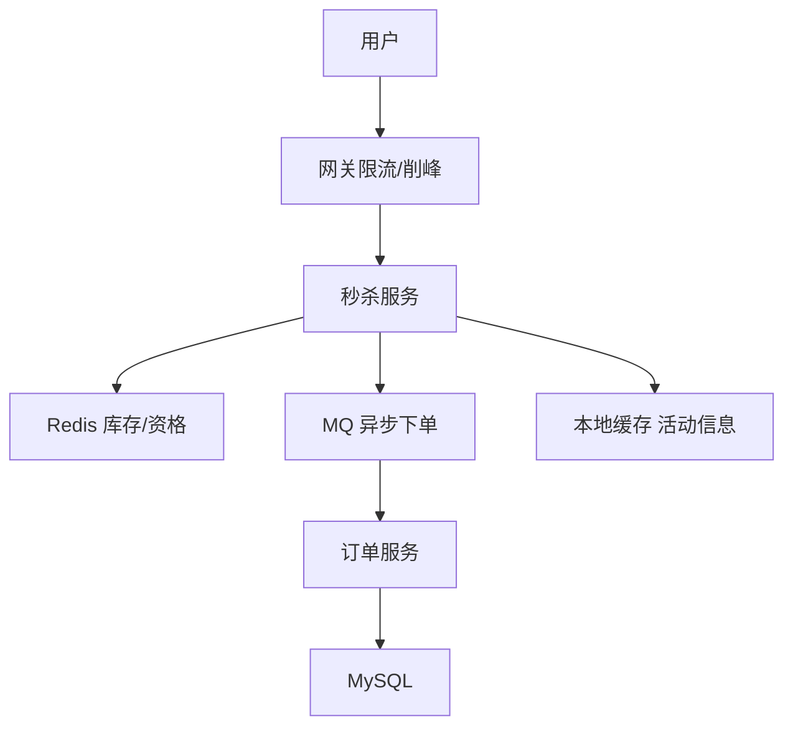

# Redis · 16-秒杀系统设计

> 高频场景题。目标：库存不超卖、扛住高峰、链路可降级。可与 [[05-分布式锁]]、[[17-查漏补缺]] 联读。

---

### Q1. 如果让你设计一个高并发秒杀系统，Redis 会怎么用？怎么防止超卖？

#### 一、要解决的痛点

1. 瞬时高 QPS 打爆应用和 DB  
2. **库存超卖**  
3. 重复下单 / 黄牛  
4. 缓存击穿、热点 key  
5. 下单后链路长（扣减、订单、支付）要异步化  

#### 二、推荐架构（口述版）



分层：

| 层 | 做法 |
| --- | --- |
| 入口 | 验证码、排队、网关限流、答题/令牌 |
| 热点数据 | 活动页静态化 / CDN；商品信息本地缓存 |
| 库存 | **Redis 预扣**，再异步落库 |
| 下单 | MQ 削峰，最终一致性写订单 |
| 兜底 | 降级、熔断、库存校验对账 |

#### 三、防超卖核心（Redis）

**方案 A：Lua 原子扣减（首选讲）**

```lua
-- 伪代码
local stock = redis.call('GET', KEYS[1])
if tonumber(stock) <= 0 then return 0 end
redis.call('DECR', KEYS[1])
return 1
```

或 `DECR` 后判断：若 `<0` 再 `INCR` 回滚并返回失败（仍建议 Lua 一步完成）。

**方案 B：分布式锁**

锁商品维度再读改写——能防超卖，但锁粒度粗、吞吐差，秒杀主路径不如原子 DECR/Lua。

**方案 C：分段库存**

`stock:item:1 .. stock:item:n` 打散热点，汇总逻辑在活动配置时拆好。

#### 四、防重复下单

- 用户维度：`SET order:uid:item nx ex` 成功才有资格  
- 或令牌：先抢到「扣减成功凭证」再下单  

#### 五、热点与穿透

- 活动未开始：按钮不可点 + 接口直接拒  
- 缓存空对象 / 布隆：防乱 ID 穿透  
- 单 key 过热：库存分片、本地缓存只读信息  

#### 六、和 DB 的一致性

1. Redis 预扣成功 → 发 MQ  
2. 消费者扣 DB 库存、写订单（DB 层仍要用条件更新：`WHERE stock>0`）  
3. 失败则回补 Redis 或进补偿盘点  
4. 活动结束对账：Redis 剩余 vs DB  

**不要只靠 Redis 最终账**；DB 条件更新是最后防线。

#### 七、面试收口一句话

> 入口限流削峰 → Redis Lua 原子扣库存防超卖 → MQ 异步落单 → DB 条件更新兜底 → 分片热点 + 降级对账。

---

### Q2. 秒杀为什么不建议「先查库存再 DECR」分两步？

非原子：两请求都读到 stock=1，都以为能买 → 超卖。  
必须用单命令原子或 Lua，把判断与扣减放同一临界区。

---

### Q3. 秒杀里 Redis 挂了怎么办？

- 主从/哨兵/集群高可用  
- 降级：停止秒杀或只读静态页  
- 本地库存令牌发完即止（极端）  
- 绝不在无保护下把洪峰切回 MySQL  

---

## 关联

- [[05-分布式锁]] · [[03-缓存问题与双写一致性]] · [[09-Memcached对比与HotKey]] · [[17-查漏补缺]]
