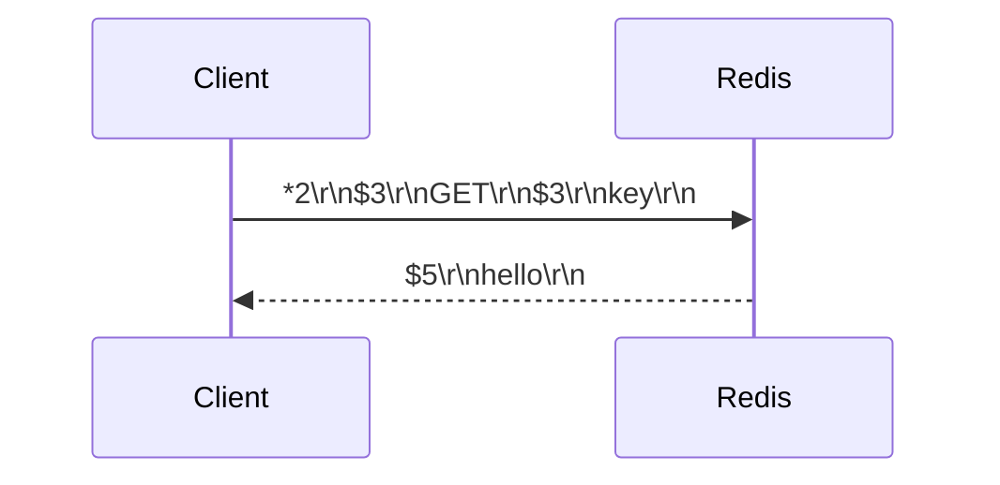
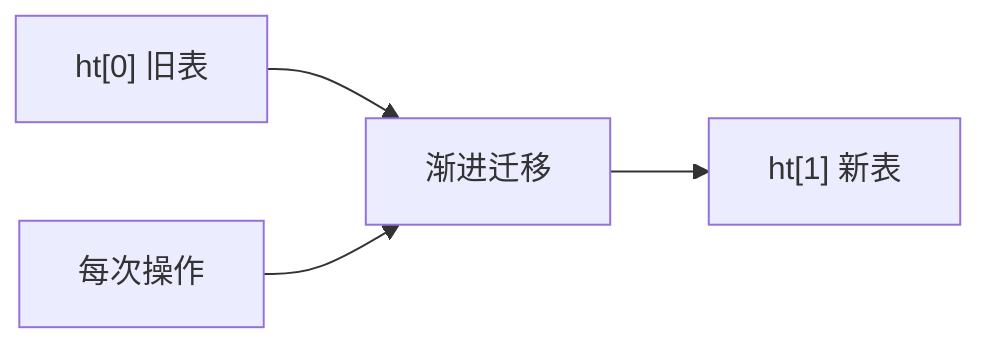
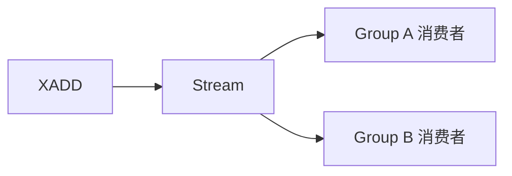
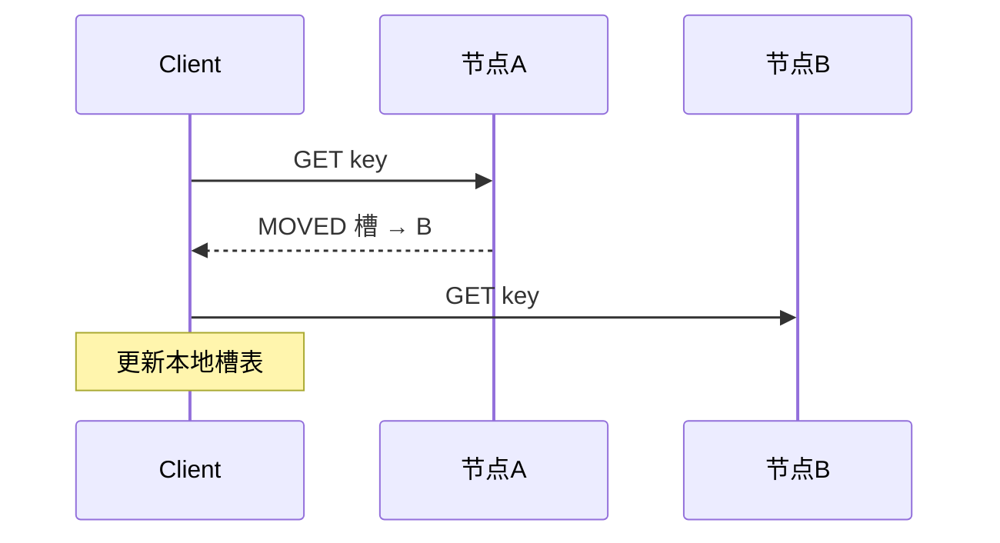
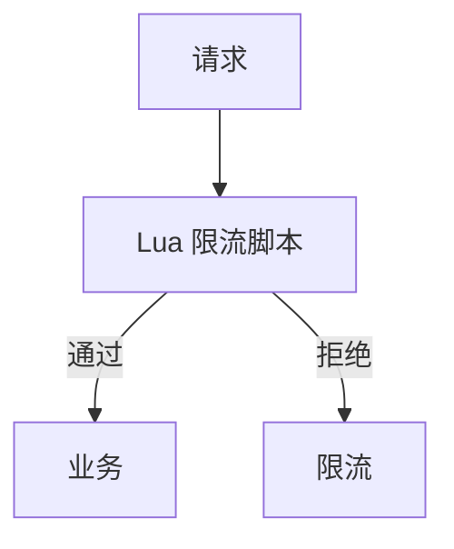

# Redis · 17-查漏补缺（高频补充）

> 对照现有 01～16 节点后，补上仍常考但原文覆盖不足的题目。复习时和对应节点一起看。

---

## 协议与线程模型

### Q1. 什么是 RESP 协议？

RESP（REdis Serialization Protocol）是 Redis 客户端与服务端的文本通信协议。

常见类型前缀：

| 前缀 | 含义 |
| --- | --- |
| `+` | 简单字符串 |
| `-` | 错误 |
| `:` | 整数 |
| `$` | 批量字符串 |
| `*` | 数组 |

特点：简单、可解析、对人友好（可用 telnet/redis-cli 看）。Pipeline 就是客户端一口气发多条 RESP 命令。

---

### Q2. Redis 6 的多线程 IO 具体做了什么？和「核心仍是单线程」怎么统一说？

- **命令执行仍是单线程**（无锁、无命令并发竞争）  
- **网络读写可多线程**：读 socket → 解析 → 交给主线程执行 → 多线程写回  
- 适合：高网络带宽、大包、高连接数场景  
- 配置：`io-threads`、`io-threads-do-reads`  

口述：**「执行单线程保简单正确；IO 多线程扛网络瓶颈。」**

---

### Q3. Redis 字典（dict）和渐进式 rehash 是什么？

底层哈希表（数组 + 链表/冲突链）。扩容时不是一次搬完，而是：

1. 同时保留 ht[0]、ht[1]  
2. 之后每次增删改查顺带迁移一部分桶  
3. 搬完后用新表  

避免一次性 rehash 造成长时间阻塞。

---

## 数据类型与编码（易漏）

### Q4. String 的 embstr 和 raw 有什么区别？

| | embstr | raw |
| --- | --- | --- |
| 适用 | 较短字符串 | 较长或需修改 |
| 分配 | 一次分配（对象头+SDS 连续） | 对象头与 SDS 分开 |
| 修改 | 一般改为 raw | 可原地扩展 |

还有 **int 编码**：内容是整数时直接存 long，省内存。

---

### Q5. Hash / Set / ZSet 常见底层编码切换？

| 类型 | 小对象常见编码 | 变大后 |
| --- | --- | --- |
| Hash | listpack/ziplist | hashtable |
| Set | intset（纯整数） | hashtable |
| ZSet | listpack/ziplist | skiplist + dict |
| List | quicklist（listpack 节点） | — |

面试抓一句：**小用紧凑编码省内存，大了换随机访问更好的结构。**

---

### Q6. Redis Stream 是什么？和 Pub/Sub 有何区别？

Stream：消息队列型结构，支持持久、**消费者组**、ACK、追赶消费。

| | Pub/Sub | Stream |
| --- | --- | --- |
| 持久化 | 不存历史，不在线就丢 | 可保留消息 |
| 消费模型 | 发布即忘 | 消费者组、pending、ACK |
| 场景 | 简单通知 | 更像轻量 MQ |

Pub/Sub 不够可靠时，优先 Stream 或上 Kafka/RocketMQ。

---

### Q7. Bitmap / GEO 常见面试场景？

- **Bitmap**：签到、活跃位图、布尔统计（`SETBIT/GETBIT/BITCOUNT`），省内存  
- **GEO**：附近的人、附近门店（底层其实是 ZSet + GeoHash）  

注意：Bitmap 偏移过大可能浪费；GEO 精度与场景匹配即可。

---

## 持久化加深

### Q8. AOF 重写（rewrite）原理是什么？

AOF 会越来越大，重写用更少命令还原相同数据：

1. `BGREWRITEAOF` fork 子进程  
2. 子进程读当前数据集写新 AOF  
3. 重写期间新写命令进 **aof rewrite buffer**  
4. 完成后把增量追加进去再替换旧文件  

混合持久化：RDB 快照开头 + AOF 增量，兼顾恢复速度与丢数据窗口。

---

### Q9. fork / COW 对 Redis 有什么影响？

RDB、AOF 重写都要 fork：

- 子进程共享父进程页，写时复制（COW）  
- 重写期间父进程写越多，拷贝页越多 → 内存短暂上涨、延迟抖动  
- 大实例要监控 fork 耗时、避免高峰做重写  

---

### Q10. 同时开 RDB 和 AOF，重启加载谁？

**优先加载 AOF**（通常更新更完整）。  
生产常见：AOF everysec + 混合持久化，或云厂商托管默认策略。

---

## 集群与路由加深

### Q11. 为什么 Cluster 用 16384 槽而不是一致性哈希？

- 槽固定 16384，迁移、统计、Gossip 消息更简单  
- 节点增减时按槽迁移，语义清晰  
- 16384 是权衡：消息体积 vs 扩展性（官方解释过为什么不更大）  

客户端算：`CRC16(key) % 16384` → 槽 → 节点。

---

### Q12. MOVED 和 ASK 有什么区别？

| | MOVED | ASK |
| --- | --- | --- |
| 含义 | 槽已经长期归属目标节点 | 槽正在迁移，先问目标节点这一次 |
| 客户端 | 应更新槽映射缓存 | 不更新永久映射，下次仍问原节点 |
| 场景 | 稳定重定向 | 迁移过程中 |

---

### Q13. Cluster 里跨槽事务 / 多 key 操作有什么限制？

- 多 key 必须落在**同一槽**（可用 hash tag：`{user:1}:name` 与 `{user:1}:age`）  
- 否则事务、Lua、`MGET` 等会失败或受限  
- 设计 key 时提前考虑聚合维度  

---

### Q14. 读写分离要注意什么？

- 从节点有**复制延迟** → 读可能脏旧  
- 强一致读走主；可接受最终一致再读从  
- 主从断连、积压缓冲区溢出可能全量同步，从库短暂不可用  

---

## 缓存与架构补充

### Q15. 缓存预热、缓存降级是什么？

- **预热**：上线/大促前把热点灌进 Redis，防一开始打穿 DB  
- **降级**：Redis 挂了或超时，返回默认值/本地缓存/熔断，保主链路  

和穿透/击穿/雪崩一起构成完整「缓存治理」答案。

---

### Q16. 旁路缓存（Cache Aside）为什么最常用？读/写怎么做？

- **读**：先 Redis → 未命中再 DB → 回写 Redis  
- **写**：先更新 DB → **删缓存**（或延迟双删），而不是先更新缓存  

原因：更新缓存易并发脏写；删除更简单，下次读重建。  
详见 [[03-缓存问题与双写一致性]]。

---

### Q17. Redis 能做分布式 Session 吗？

可以：Session 存 Redis，多机共享；设 TTL；登出删 key。  
注意：大 Session 变 BigKey；序列化格式统一；安全与续期策略。

---

## 限流、延迟队列、幂等

### Q18. 如何用 Redis 做分布式限流？

常见：

1. **固定窗口** `INCR + EXPIRE`（简单，边界突刺）  
2. **滑动窗口** ZSet 存时间戳，清窗口外再计数  
3. **令牌桶/漏桶** Lua 保证原子  

---

### Q19. 如何用 Redis 实现延迟队列？

1. **ZSet**：score=执行时间戳，轮询 `ZRANGEBYSCORE` 取到期任务  
2. **Redis 4+**：可配合 Key 过期监听（不保证及时，生产慎用）  
3. 更稳：时间轮 / RocketMQ 延时消息  

面试答 ZSet 方案即可，并提「要有抢占防重复消费（Lua）」。

---

### Q20. Redis 怎么做接口幂等？

- 请求带唯一 `idempotentKey`，`SET key nx ex` 成功才处理  
- 或存「已处理结果」便于重试返回同一结果  
- 和分布式锁区别：幂等强调同一业务结果，不只互斥  

---

## 安全、运维、客户端

### Q21. Redis 安全要注意什么？

1. 别裸奔公网；改默认端口意义有限，关键靠网络隔离  
2. `requirepass` / ACL（Redis 6+）最小权限  
3. 禁用危险命令：`FLUSHALL`、`KEYS`、`CONFIG`（rename-command）  
4. 定期备份；防未授权访问写 crontab（历史上的矿机事件）  

---

### Q22. KEYS 为什么有害？用什么替代？

`KEYS` 全表扫描阻塞主线程。  
生产用 **`SCAN` 游标迭代**（count 可控）；运维统计用大数据/离线 RDB 分析。

---

### Q23. 慢查询怎么查？

- 配置 `slowlog-log-slower-than`  
- `SLOWLOG GET` 看慢命令  
- 关注：大 key、复杂聚合、`KEYS`、全量 `HGETALL`、过多 Lua  

---

### Q24. Jedis 和 Lettuce 有什么区别？

| | Jedis | Lettuce |
| --- | --- | --- |
| 连接 | 传统同步，池化 | 基于 Netty，可异步 |
| 线程安全 | 单实例不安全，靠池 | 连接可共享 |
| Spring Boot | 老项目多 | 默认客户端常见 |

面试：说清线程模型与连接池即可。

---

### Q25. Redis 键设计有哪些规范？

1. 可读：`业务:对象:id:字段`  
2. 控制长度，避免过大 value  
3. 用 hash tag 控制同槽  
4. 设置 TTL，防永久垃圾  
5. 避免大 key、热 key 设计缺陷  

---

### Q26. Watch + Multi 能当乐观锁吗？

可以：`WATCH key` → 读 → `MULTI/EXEC`，若被改则 EXEC 失败。  
局限：事务能力弱、集群受限；复杂原子逻辑更常用 **Lua**。

---

## 和现有节点的关系

| 补充题 | 建议联读 |
| --- | --- |
| RESP / IO 多线程 | [[01-基础与特性]] |
| 编码 / Stream / GEO | [[12-数据结构底层详解]] |
| AOF 重写 / COW | [[04-持久化]] |
| MOVED/ASK / 跨槽 | [[08-主从哨兵与分片集群]] [[14-复制哨兵Cluster原理]] |
| 限流 / 延迟队列 / 幂等 | [[07-缓存方案与业务应用]] [[16-秒杀系统设计]] |
| 安全 / SCAN / 慢查询 | [[15-内存排查与故障定位]] |
