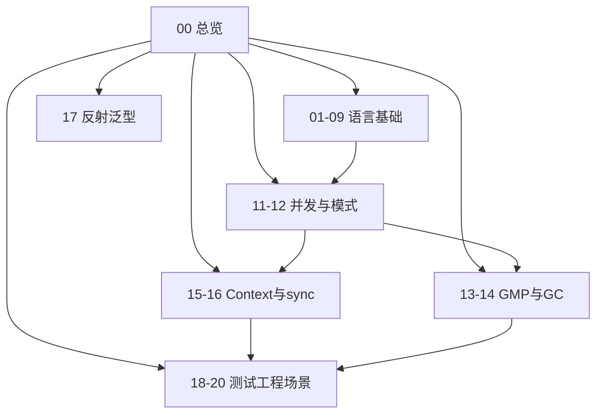

# Go 基础 · 知识总览

Go 面试专题（加厚口述版）：语言基础 + 并发原理 + **工程/测试/场景题**。  
查题见 [[10-题单总索引]]。与 [[../Java基础/00-知识总览|Java基础]]「Java vs Go」互补。

## 一分钟心智模型

> **值与引用**打底 → **接口**做抽象 → **goroutine + channel/锁**做并发 → **GMP/GC** 解释运行与内存 → **Context** 串取消 → **测试/pprof/场景题** 落到工程。

## 知识地图

## 建议精读顺序（面试权重）

| 优先级 | 节点 | 为什么 |
| --- | --- | --- |
| P0 | [[11-Goroutine与Channel]] → [[12-Select与并发模式]] | 几乎必问 |
| P0 | [[13-GMP调度器]] → [[14-GC与内存逃逸]] | 原理区分度高 |
| P0 | [[03-数组与切片]] → [[04-Map与引用类型]] → [[06-接口与类型断言]] | 基础高频坑 |
| P1 | [[15-Context]] → [[16-sync包与原子操作]] | 工程并发 |
| P1 | [[07-defer-panic-error]] → [[20-场景题与踩坑清单]] | 错误模型 + 临场 |
| P1 | [[18-测试竞态与基准]] → [[19-工程实践与性能排查]] | 加分「能落地」 |
| P2 | [[01-变量常量与基础类型]] → [[02-指针与内存]] → [[05-函数方法与闭包]] → [[08-字符串与拷贝]] → [[09-结构体语法与其它]] | 补齐语法 |
| P2 | [[17-反射与泛型]] | 边界题 |

## 节点一览

| 节点 | 你会讲到 |
| --- | --- |
| [[01-变量常量与基础类型]] | :=、缺省值、rune/byte、常量、枚举 |
| [[02-指针与内存]] | 栈堆、方法集、逃逸入口、私有成员 |
| [[03-数组与切片]] | 扩容、三下标、删除、泄漏 |
| [[04-Map与引用类型]] | 并发安全、delete、遍历、无序 |
| [[05-函数方法与闭包]] | 闭包、接收者、options |
| [[06-接口与类型断言]] | iface、typed nil、组合 |
| [[07-defer-panic-error]] | defer、error 链、panic 边界 |
| [[08-字符串与拷贝]] | 拼接、不可变、rune |
| [[09-结构体语法与其它]] | 嵌入、JSON tag、make/new |
| [[11-Goroutine与Channel]] | channel 语义、关闭、泄漏 |
| [[12-Select与并发模式]] | select、池化、扇入扇出 |
| [[13-GMP调度器]] | G/M/P、偷工、抢占 |
| [[14-GC与内存逃逸]] | 三色、逃逸、GOGC |
| [[15-Context]] | 取消超时、WithValue |
| [[16-sync包与原子操作]] | Mutex、WG、Map、atomic |
| [[17-反射与泛型]] | 反射代价、泛型选型 |
| [[18-测试竞态与基准]] | 表驱动、`-race`、Benchmark |
| [[19-工程实践与性能排查]] | module、pprof、优雅退出 |
| [[20-场景题与踩坑清单]] | 限流、死锁、十坑速记 |
| [[10-题单总索引]] | 题目对照 |

## 口述开场模板（综合题）

「讲讲 Go 并发」90 秒：

1. goroutine 轻量，**GMP** 多路复用到线程（抢占防调度饥饿）  
2. 编排用 **channel + select**，护状态用 **Mutex/atomic**  
3. 提到公平性：**RWMutex 写者饥饿 / 禁止锁升级**、select 多就绪随机  
4. **Context** 做超时取消，防泄漏；问题用 **pprof / -race** 验证  

饥饿专题串讲：[[20-场景题与踩坑清单#Q12]] · 冲刺：[[20-场景题与踩坑清单]] · 全表：[[10-题单总索引]]。
