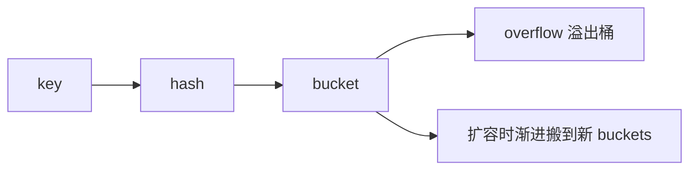

# 04 · Map 与引用类型

---

## 面试题

### Q1. 引用类型有哪些？和指针有何不同？

常说的「引用类型」：`slice`、`map`、`channel`、`function`、`interface`（有时也提）。

更准确说法：它们作为变量时，变量里存的是**描述符/头**（小值），指向堆上共享结构。

| | 「引用类型」 | 指针 `*T` |
| --- | --- | --- |
| 本质 | 内建描述符 | 地址 |
| 赋值 | 拷贝描述符，共享底层 | 拷贝地址 |
| nil | 有 nil 状态 | 有 nil |
| 运算 | 不能当指针乱算 | `&` `*` |

切片头可拷贝；指针明确指向单一 `T`。

---

### Q2. map 如何实现两种 get？如何判断 key 是否存在？

```go
v := m[k]           // 不存在时返回零值（无法区分「值就是零」）
v, ok := m[k]       // comma-ok：ok 表示是否存在
```

判断包含：`_, ok := m[k]; ok`。

---

### Q3. map 的 key 为什么无序？

实现是哈希表；遍历顺序**刻意随机化**（从 Go 1 起），防止依赖顺序的 bug、一定程度缓解哈希碰撞攻击。  
**需要有序：** 取出 key 排序后再读，或用有序结构。

---

### Q4. 如何顺序读取 map？

```go
keys := make([]string, 0, len(m))
for k := range m { keys = append(keys, k) }
sort.Strings(keys)
for _, k := range keys {
    fmt.Println(k, m[k])
}
```

---

### Q5. map 底层与扩容机制？

可把 map 想成：`hmap` 头 + **桶数组 buckets**（每个桶固定装若干 key/value，冲突用 **溢出桶 overflow** 串起来）。

触发扩容的常见原因（口述）：

1. **装载因子过高**（元素太多相对桶数）→ 往往 **2 倍**扩桶  
2. **溢出桶太多**（碰撞/删改留下碎片）→ 可能 **等量扩容**（桶数不变，重摆元素，清溢出）  

搬迁特点：

- **渐进式 rehash**：不是一次搬完；在后续赋值/删除等操作里 **增量搬迁**  
- 扩容期间短暂存在旧桶 + 新桶；查找会照顾两边  
- 所以「扩容时 map 操作变慢一点」是正常的  



细节随版本变；面试抓：**桶 + 溢出桶、装载因子/溢出触发、渐进搬迁**。并发写仍直接禁止（见 Q11）。

---

### Q6. map 不初始化 / nil map 会怎样？

```go
var m map[string]int // nil
_ = m["a"]           // 读：OK，得零值
m["a"] = 1           // 写：panic: assignment to entry in nil map
```

必须先 `make` 或字面量初始化再写。

---

### Q7. nil 的 slice 和 map 使用差异？

| 操作 | nil slice | nil map |
| --- | --- | --- |
| 读 / range | OK | OK（零值） |
| 写 / 赋值 | append OK；下标写需有 len | **写 panic** |
| len | 0 | 0 |

---

### Q8. 如何实现 set？

```go
set := make(map[string]struct{})
set["a"] = struct{}{}
_, ok := set["a"]
delete(set, "a")
```

用 `struct{}` 省内存。

---

### Q9. map 值不可寻址，如何改值的属性？

```go
type User struct{ Age int }
m := map[string]User{"u": {Age: 1}}
// m["u"].Age = 2  // 编译错误：不可寻址

// 做法1：取出改再放回
u := m["u"]
u.Age = 2
m["u"] = u

// 做法2：存指针
mp := map[string]*User{"u": {Age: 1}}
mp["u"].Age = 2
```

---

### Q10. make 创建 map/channel 参数？

```go
make(map[K]V)           // 无提示
make(map[K]V, hint)     // 容量提示，减少扩容
make(chan T)            // 无缓冲
make(chan T, n)         // 缓冲大小 n
```

slice 见 [[03-数组与切片]]。

---

### Q11. map 能并发读写吗？

**不能**（无同步时）。运行时检测到并发写会直接 **`fatal error: concurrent map writes`**（或 read/write 竞争）。

做法：

1. `sync.Mutex` / `RWMutex` 包一层  
2. 读多写少且键稳：`sync.Map`  
3. 分片 map（高并发库常见）  
4. 单一 goroutine 拥有 map，其它通过 channel 通信  

见 [[16-sync包与原子操作]]。

---

### Q12. `delete` 后内存会立刻还给系统吗？

不一定。`delete` 去掉键值，桶可能复用；**map 整体占用不一定缩小**。  
若 map 曾涨得很大、后来几乎清空，长期占内存：可新建小 map 拷贝剩余键，旧 map 丢弃给 GC。

---

### Q13. map 遍历时增删安全吗？

- 遍历中 **delete 当前键** 是允许且常见的  
- 遍历中 **插入新键** 可能出现、也可能不出现在本次遍历（不确定）  
- 不要依赖「边遍历边加能扫全」  

需要稳定快照：先拷 key 列表再处理。

---

### Q14. 为什么 map 不能保证顺序？和「每次不同」有什么关系？

为防依赖顺序的 bug，运行时在 **range 时故意随机起始位置**（面试常说「故意打乱」）。  
底层桶有序存储，但语言语义：**不保证顺序**。要有序：取出 key 排序再访问。

---

## 关联

- [[03-数组与切片]] · [[02-指针与内存]] · [[16-sync包与原子操作]] · [[01-变量常量与基础类型]]
