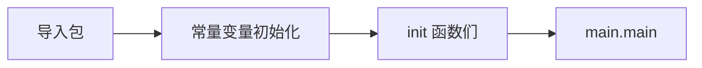

# 05 · 函数、方法与闭包

---

## 面试题

### Q1. 怎么实现闭包？主要应用场景？

闭包是一个函数值，可以引用外部作用于的变量
闭包 = **函数 + 其引用的外部变量环境**。

```go
func counter() func() int {
    n := 0
    return func() int {
        n++
        return n
    }
}
c := counter()
c() // 1
c() // 2
```

`n` 逃逸到堆，多次调用共享同一 `n`。

**场景：**
- 工厂函数、配置捕获  
- HTTP middleware、装饰器  
- 回调、延迟计算  
- Functional Options  

注意循环变量捕获（`go func` 里用旧 loopvar 问题；Go 1.22+ per-iteration）。

---

### Q2. 多值返回有什么用？

惯用：`(result, error)`，强制处理错误，无需异常栈乱飞。  
也可返回多结果：`f(), ok := m[k]`、`x, y := foo()`。

---

### Q3. `init()` 何时执行？



1. 依赖包先初始化  
2. 包内：按文件名顺序等规则初始化全局变量，再跑所有 `init`  
3. 同一文件多个 `init` 按声明顺序  
4. **在 `main` 之前**，不能显式调用  

用于注册驱动、插件、校验配置（勿放重逻辑）。

---

### Q4. 无默认/可选参数（回顾）

不支持；用 options 模式或配置 struct。见 [[01-变量常量与基础类型]]。

---

### Q5. T 与 `*T` 方法集（回顾）

见 [[02-指针与内存]] Q7：值类型方法集不含指针接收者；指针包含两者。接口赋值看方法集。

---

### Q6. 值接收者 vs 指针接收者怎么选？

| 选指针接收者 | 选值接收者 |
| --- | --- |
| 方法要改接收者状态 | 小对象、不可变语义 |
| 大结构体避免拷贝 | 基本类型、小 struct |
| 类型有同步字段等不能拷贝 | 需要值语义、可比较场景 |

一致性：同一类型方法接收者尽量统一，免接口实现时踩方法集坑。

---

### Q7. 什么是 Functional Options 模式？

用可变「选项函数」配置可选参数，替代一长串参数或巨大配置字面量：

```go
type Opt func(*Server)

func WithPort(p int) Opt { return func(s *Server) { s.Port = p } }

func NewServer(opts ...Opt) *Server {
    s := &Server{Port: 8080}
    for _, o := range opts { o(s) }
    return s
}
```

面试常问「Go 没有默认参数怎么办」——答 options / 配置 struct。

---

### Q8. `defer` 在有名返回值上如何改返回值？

有名返回值是函数局部变量，defer 闭包可改它们：

```go
func f() (err error) {
    defer func() {
        if err != nil {
            err = fmt.Errorf("wrap: %w", err)
        }
    }()
    return do()
}
```

匿名返回值则不能靠 defer 直接改「即将返回的那份」，除非用命名返回。详见 [[07-defer-panic-error]]。

---

### Q9. 函数作一等公民体现在哪？

函数可赋值给变量、作参数/返回值、匿名函数、闭包——支撑中间件、策略、回调。  
方法表达式：`Type.Method` / `(*Type).Method` 得到普通函数。

---

## 关联

- [[06-接口与类型断言]] · [[07-defer-panic-error]] · [[02-指针与内存]] · [[17-反射与泛型]]
