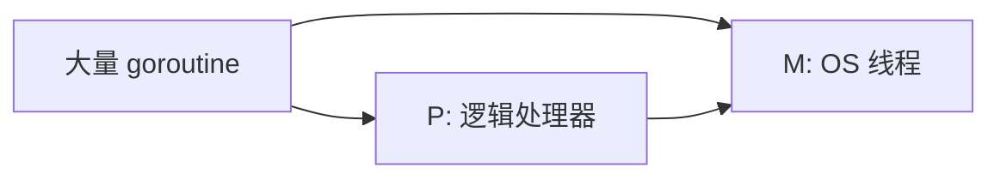

# 11 · Goroutine 与 Channel

> 面试权重最高的 Go 并发入门：轻量线程、通信顺序进程（CSP）、channel 语义与坑。

---

## 面试题

### Q1. goroutine 是什么？和线程有什么区别？

goroutine 是 Go 运行时调度的**用户态轻量并发单元**，由 `go` 关键字启动。

|      | OS 线程       | goroutine                         |
| ---- | ----------- | --------------------------------- |
| 创建成本 | 较重（MB 级栈常见） | 很轻（初始栈约 2KB 级，可增长）                |
| 调度   | 内核调度        | **Go runtime（GMP）** 多路复用到少量 OS 线程 |
| 切换   | 内核态切换贵      | 用户态切换相对便宜                         |
| 数量   | 不宜过多        | 可轻松成千上万（仍受业务/内存约束）                |

口述：**「用写同步的风格写异步」**——大量 goroutine + channel/同步原语，而不是一人手搓线程池回调。



详见 [[13-GMP调度器]]。

---

### Q2. 如何优雅退出一个 goroutine？

常见手段（按推荐度）：

1. **`context` 取消**（推荐，可下传）  
2. **关闭 / 监听「结束 channel」**（`done`、`stop`）  
3. 用 `select` 同时听业务 channel 与退出信号  
4. 自然返回（函数结束 goroutine 结束）

```go
func worker(ctx context.Context, in <-chan Job) {
    for {
        select {
        case <-ctx.Done():
            return
        case j, ok := <-in:
            if !ok {
                return
            }
            do(j)
        }
    }
}
```

不要用「共享 bool 标志」且不加同步——有可见性问题。详见 [[15-Context]]。

---

### Q3. channel 的底层是什么？有缓冲 / 无缓冲区别？

可把 channel 想成带锁与等待队列的结构（口述点到即可）：

- 环形缓冲区（有缓冲时）  
- 发送/接收等待队列  
- `mutex` 等同步字段  
- 关闭标志  
```go
type hchan struct {
	qcount   uint           // 当前队列中元素总数
	dataqsiz uint           // 环形缓冲区容量（缓冲channel >0，无缓冲=0）
	buf      unsafe.Pointer // 环形缓冲区数组，存放元素
	elemsize uint16         // 每个元素大小
	closed   uint8          // 是否关闭 0未关闭，1关闭
	elemtype *_type         // 元素类型
	sendx    uint           // 环形缓冲区：下一个发送位置索引
	recvx    uint           // 环形缓冲区：下一个接收位置索引
	recvq    waitq          // 等待接收的goroutine队列（G链表）
	sendq    waitq          // 等待发送的goroutine队列（G链表）
	lock     mutex          // 互斥锁，保护所有字段并发访问
}
```

核心要点：

1. 所有 channel 操作都要先拿锁；
2. `recvq`：**没数据可读**，阻塞的 G 挂在这里；
3. `sendq`：**缓冲区满**，阻塞的发送 G 挂在这里；
4. 关闭只是修改`closed`标记，不会释放 G。

| | 无缓冲 `make(chan T)` | 有缓冲 `make(chan T, n)` |
| --- | --- | --- |
| 同步性 | **同步**：发送与接收要握手 | 缓冲区未满发送不阻塞 |
| 容量 | 0 | n |
| 用途 | 确认对方已收到（会合） | 削峰、解耦生产消费速率 |

```go
ch := make(chan int)    // 无缓冲
ch := make(chan int, 8) // 缓冲 8
```

发送数据 `ch <- v` 完整逻辑

1. 加锁
2. 如果 channel **已关闭** → panic
3. 存在等待接收的 goroutine（`recvq`不为空）
    - 直接取出一个等待的 G，把数据**直接复制给接收 G**，不走缓冲区；唤醒接收 G，解锁返回
4. 没有等待接收 G
    - 缓冲 channel：缓冲区**未满** → 数据拷贝进环形 buf，sendx++，qcount++，解锁返回（非阻塞）
    - 缓冲 channel：缓冲区**已满** / 无缓冲 channel → 当前发送 G 加入`sendq`，休眠，释放锁；被唤醒后完成数据传递

接收数据 `v := <-ch` 完整逻辑

1. 加锁
2. 存在等待发送的 goroutine（`sendq`不为空）
    - 两种情况：
        - 有缓冲 channel：缓冲区已满 → 先从 buf 头部取出一个元素；再把发送 G 的数据放入 buf 尾部；唤醒发送 G
        - 无缓冲 channel：直接接收发送 G 的数据
    - 拷贝数据，唤醒发送 G，解锁返回
3. 没有等待发送 G
    - 缓冲 channel：缓冲区**有数据** → 从 buf 取出数据，recvx++，qcount--，解锁返回
    - 缓冲 channel 空 / 无缓冲 channel
        - channel 已关闭且无数据 → 返回元素零值，不阻塞
        - 否则：当前 G 加入`recvq`，休眠等待唤醒

##### 延伸：为什么 channel 要用 mutex？

多个 G 同时 send/recv，竞争缓冲区、sendq/recvq 队列，必须锁保证并发安全； Go channel**不是无锁实现**，很多人误区以为 channel 无锁，底层是有 mutex 的！

无缓冲 Channel（同步 channel） `ch := make(chan int)`

`dataqsiz = 0`，没有环形缓冲区。

关键特性：

**发送和接收必须同时就绪，否则阻塞**

- 先执行发送 `ch <- 1`：没有接收 G → 当前 G 阻塞
- 先执行接收 `<-ch`：没有发送 G → 当前 G 阻塞
- 只有两边 goroutine 同时到位，数据**直接拷贝，不经过缓冲区**

通俗理解：打电话，必须双方同时在线才能通话。

#### 典型用途：goroutine 同步、信号通知（等待另一个协程就绪）

有缓冲 Channel `ch := make(chan int, N)`

`dataqsiz = N`，存在环形缓冲区，可以暂存 N 个元素。
关键特性：

1. **缓冲区未满时，发送不会阻塞**；
2. **缓冲区有数据时，接收不会阻塞**；
3. 只有缓冲区满，发送阻塞；缓冲区空，接收阻塞。

通俗理解：信箱，可以先放 N 封信；信箱满了，送信的人要等；信箱空了，取信的人等待。

有缓冲区的 channel，缓冲区满了继续发数据会怎么样，既然是环形缓冲区，那么满了之后应该要覆盖初始数据不？
1. **带缓冲 channel，缓冲区满了继续发送：当前 goroutine 阻塞，不会覆盖旧数据！**
2. **hchan 的 buf 是环形队列，但只是「存储结构是环形」，不自带覆盖策略；Go 标准 channel 没有环形缓冲区覆写机制。**


---

### Q4. 向 channel 发送 / 接收会在什么情况下阻塞？关闭后呢？

| 操作 | 阻塞条件 | 关闭后 |
| --- | --- | --- |
| 发送 `ch <- v` | 无缓冲且无接收方；或缓冲已满 | **panic** |
| 接收 `<-ch` | 无数据且未关闭 | 立刻返回零值；`v, ok := <-ch` 中 `ok==false` |
| `close(ch)` | — | 重复 close → **panic**；close nil → panic |

口诀：

- **只由发送方 close**（多个发送方要协调好）  
- 接收方用 `range ch` 或 `ok` 判断结束  
- 不要向已关闭 channel 发送  

---

### Q5. `for range` 遍历 channel 什么时候结束？

`for v := range ch` 会一直收到值，直到 **channel 被关闭且缓冲排空** 后结束。

未关闭则可能**永久阻塞**在 range 上。  
关闭后继续 `range` 是安全的；发送方负责 close。

---

### Q6. 单向 channel 有什么用？

用于在 API 上**限制方向**，防止误用：

```go
func produce(out chan<- int) { out <- 1 } // 只能发
func consume(in <-chan int)  { <-in }     // 只能收
```

双向 channel 可自动转为单向传参。编译期约束，面试加分点。

---

### Q7. nil channel 上操作会怎样？有什么妙用？

对 **nil channel**：

- 发送 / 接收都会**永久阻塞**  
- `close(nil)` → panic  

妙用：在 `select` 里把某个 case 的 channel 置 `nil`，可**动态禁用**该分支，避免忙等。

```go
var ch <-chan int // nil
select {
case <-ch: // 永不选中
default:
}
```

---

### Q8. 如何判断 channel 是否关闭？能「安全发送」吗？

- **接收侧：** `v, ok := <-ch`；`ok==false` 表示已关闭且无数据  
- **发送侧：** 语言没有「试探发送是否关闭」的无痛 API；应靠协议保证不向关闭 channel 发（或 recover，不推荐当常态）

因此设计上：**关闭权单一、发送方关闭、接收方感知**。

---

### Q9. goroutine 泄漏常见原因？怎么查？

常见：

1. channel 发送/接收永久阻塞（无人对接、缓冲不合理）  
2. `select` 缺少退出分支  
3. `WaitGroup` Add/Done 不匹配导致一直等  
4. HTTP/RPC 请求未设超时，goroutine 挂起  
5. 定时器 / `time.After` 在热路径滥用（旧代码泄漏）  

排查：`pprof` 的 goroutine profile、`runtime.NumGoroutine()` 监控、代码审查退出路径。

---

### Q10. 「不要通过共享内存通信，而要通过通信共享内存」怎么理解？

Go 箴言强调：**优先用 channel 传递所有权/事件**，减少锁保护的共享状态。

实际工程：

- 流水线、扇入扇出、任务分发 → channel 很合适  
- 共享缓存、计数、连接池 → `sync`/`atomic` 往往更直接  

**不是禁用锁**，而是先想清楚所有权与边界。选型见 [[12-Select与并发模式]]、[[16-sync包与原子操作]]。

---

### Q11. 多个 goroutine 发送，谁负责 close？

原则仍是：**关闭权唯一**。常见做法：

1. 单一「closer」goroutine：用 `WaitGroup` 等所有 sender 结束后由它 `close`  
2. 用 `sync.Once` 包住 close（仍要保证之后无人再发）  
3. 换用 Context 取消 + 不依赖 close 传结束（接收侧听 `Done`）  

多个 sender 各自 close → 必 panic。

---

### Q12. channel 传递的是值还是引用？

发送时对元素做**赋值拷贝**进缓冲区/对方。  

- 传 `struct` 值 → 拷贝一份  
- 传指针 / 内含 slice、map 的头 → 拷贝的是指针或头，**底层仍共享**  

大对象建议传指针并约定所有权；需要隔离就深拷贝。

---

### Q13. 无缓冲 channel 能当「同步点」吗？

能。发送方与接收方在交接时会合（handshaking），可确认对方已执行到接收处。  
有缓冲则只保证「放进缓冲区」，不保证对方已处理完——别误用有缓冲当同步屏障。

---

### Q14. channel 上会不会「饥饿」？和调度饥饿有何不同？

会，但是 **同步语义上的饿等**，不是 GMP 不给 CPU：

| 场景 | 谁饿着 | 原因 |
| --- | --- | --- |
| 只有发送、无人接收 | 发送 G 堵在 `sendq` | 对接缺失 / 接收方死了 |
| 缓冲长期满 | 发送方饿等 | 消费者太慢，要扩容、限产或丢弃策略 |
| 缓冲长期空 | 接收方饿等 | 生产者太慢或已退出未 close |
| 多路 `select` 偏科 | 某 case 很少被选中 | 见 [[12-Select与并发模式]] 公平性 |

channel 内部对 **同一等待队列** 大体 FIFO 唤醒（先等待先被服务），所以「同方向多个 waiter」相对公平；  
更常见的不公平来自 **业务结构**（只 close 不消费、select 总有一个 case 就绪）。

和 [[13-GMP调度器#Q6b]] 对比记忆：

- **调度饥饿：** 可运行却上不了 CPU  
- **channel 饥饿：** 不可运行，一直等在 send/recv 条件上  

---

### Q15. 关闭 channel 时，卡在发送/接收队列里的 G 会怎样？

`close` 会把等待中的接收方唤醒（读到零值 + `ok=false`），等待中的发送方则 **panic**（向已关闭 channel 发送）。  
所以关闭协议必须保证：close 之后没有发送者还活着还在发——这也是「发送方关闭 / Once 关闭」的根因。

---

### Q16. 大对象经 channel 传递要注意什么？

发送是元素赋值拷贝。大 struct 频繁 `ch <- big` 会拷贝贵、压力大。  

- 传 `*T` 并约定所有权（谁发谁不再写 / 谁收谁负责）  
- 或对象池 + 回收协议  
- 有缓冲时缓冲区里会持有多份拷贝/指针，注意生命周期与 GC  

---

## 关联

- [[12-Select与并发模式]] · [[13-GMP调度器]] · [[15-Context]] · [[16-sync包与原子操作]] · [[00-知识总览]]
