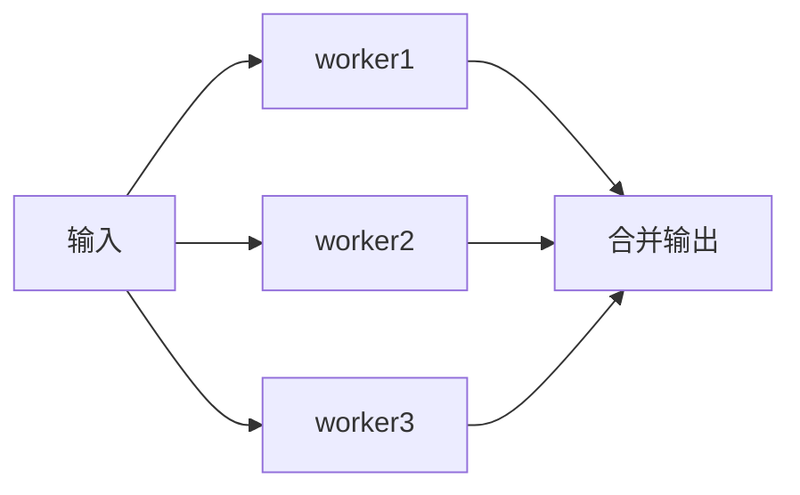

# 12 · Select 与并发模式

> 把 channel 用成「可组合的并发原语」：select、超时、扇入扇出、worker pool。

---

## 面试题

### Q1. select 的语义是什么？case 随机吗？

`select` 同时等待多个 channel 操作，**就绪哪个就执行哪个**；多个同时就绪时**伪随机选一个**（防饥饿偏向）。

```go
select {
case v := <-ch1:
    _ = v
case ch2 <- x:
case <-ctx.Done():
    return
default:
    // 非阻塞分支（可选）
}
```

无 `default` 且所有 case 未就绪 → **阻塞**。  
有 `default` → 立刻走 default（非阻塞探测）。

---

### Q2. 如何给 channel 操作加超时？

```go
select {
case v := <-ch:
    use(v)
case <-time.After(time.Second):
    // 超时
}
```

注意：热循环里反复 `time.After` 会造很多定时器；应复用 `time.NewTimer` 并 `Stop`/`Reset`。  
更常见：用 `context.WithTimeout` 统一取消。见 [[15-Context]]。

---

### Q3. 什么是扇出（Fan-Out）/ 扇入（Fan-In）？

- **扇出：** 一个输入分给多个 worker 并行处理  
- **扇入：** 多个结果 channel 合并到一个输出  



合并时常用：每个输入起一个 goroutine 往共享 out 转发，再用 `WaitGroup` 在全部结束后 `close(out)`。

---

### Q4. 如何实现一个简单的 worker pool？

要点：任务 channel + 固定数量 worker + 结果 channel / 回调 + 退出信号。

```go
func pool(ctx context.Context, n int, jobs <-chan Job, results chan<- Result) {
    var wg sync.WaitGroup
    for i := 0; i < n; i++ {
        wg.Add(1)
        go func() {
            defer wg.Done()
            for {
                select {
                case <-ctx.Done():
                    return
                case j, ok := <-jobs:
                    if !ok {
                        return
                    }
                    results <- handle(j)
                }
            }
        }()
    }
    go func() {
        wg.Wait()
        close(results)
    }()
}
```

口述参数：并发度 n、队列容量、超时/取消、错误如何汇聚。

---

### Q5. 如何控制并发度（限流）？

1. **worker 数量固定**（池）  
2. **带缓冲 channel 当信号量**：`sem := make(chan struct{}, N)`，进入前 `sem<-struct{}{}`，结束 `<-sem`  
3. `golang.org/x/sync/semaphore`  
4. 令牌桶 / 漏桶（业务限流，常配合中间件）

```go
sem := make(chan struct{}, 8)
for _, t := range tasks {
    sem <- struct{}{}
    go func(t Task) {
        defer func() { <-sem }()
        do(t)
    }(t)
}
```

---

### Q6. or-done / 退出模式怎么写才不容易泄漏？

原则：**每个 goroutine 都有退出条件**；下游取消时上游别堵在发送上。

```go
func orDone(ctx context.Context, in <-chan T) <-chan T {
    out := make(chan T)
    go func() {
        defer close(out)
        for {
            select {
            case <-ctx.Done():
                return
            case v, ok := <-in:
                if !ok {
                    return
                }
                select {
                case out <- v:
                case <-ctx.Done():
                    return
                }
            }
        }
    }()
    return out
}
```

发送也包一层 `select + ctx.Done()`，避免下游不收导致泄漏。

---

### Q7. channel 能用来实现锁 / 信号量吗？和 Mutex 怎么选？

可以：`make(chan struct{}, 1)` 当互斥；缓冲 N 当信号量。

| 场景 | 更合适 |
| --- | --- |
| 临界区短、共享状态清晰 | `sync.Mutex` / `RWMutex` |
| 传递数据、编排流水线、超时取消 | channel + select |
| 限流并发度 | 缓冲 channel 或 semaphore |

口诀：**传数据用 channel，护状态用锁**（可混用）。

---

### Q8. 并发下「先关闭 jobs，再 Wait，再关 results」顺序为什么重要？

典型收尾：

1. 生产者发完 → `close(jobs)`  
2. worker `range jobs` 结束后 Done  
3. `wg.Wait()`  
4. 再 `close(results)`  

若先关 results 而 worker 仍在发送 → panic。  
若从不关 jobs → worker 永不退出 → Wait 死锁。

---

### Q9. 有哪些经典坑（口述清单）？

1. 向关闭 channel 发送 / 重复 close  
2. 无缓冲 channel 双方未就绪死锁  
3. `select` + 全局 `time.After` 热路径泄漏  
4. 只 listen 业务 channel，不听取消  
5. 在持锁时做 channel 阻塞操作 → 易死锁  
6. `go` 出去的闭包捕获循环变量（Go 1.22 前经典坑；现在 for 变量语义已变，仍要说清版本）  

---

### Q10. `select` 会不会饿死某个 case？伪随机够用吗？

规则回顾：多个 case **同时就绪** 时，Go **伪随机**挑一个，避免永远偏向源码书写顺序（老问题）。

仍可能「像饿死」：

1. **某个 case 几乎总是就绪**（如不停有数据的 channel / 总是可走的 `default`）→ 其它 case 很少被执行到  
2. 这不是 bug，是 **就绪集合不均衡**；随机只能公平分「同时就绪」的票，不能把「从不就绪」变就绪  

缓解：

- 去掉盲目 `default` 热循环（会变成自旋空转）  
- 关键通道用限流，别让一条路打爆  
- 关键路径拆成独立 goroutine，而不是和低优先 case 挤一个 select  
- 禁用分支：把暂时不关心的 channel 置 `nil`（见 [[11-Goroutine与Channel#Q7]]）  

---

### Q11. `default` 忙等造成的「饥饿/空转」？

```go
for {
    select {
    case v := <-ch:
        handle(v)
    default:
        // 一直打转，占满 CPU，其它 G 受影响
    }
}
```

没有阻塞点 → 当前 G 疯狂空转，同进程延迟变差，像把别人「饿」慢。  
正确：去掉 `default` 让出调度；或 `runtime.Gosched()`（少用）；更好是阻塞在 channel/timer/ctx 上。

---

### Q12. 公平性相关：锁、调度、select 怎么串着讲？

| 层面 | 机制 | 防的是什么 |
| --- | --- | --- |
| GMP | 抢占、work stealing、handoff | 可运行 G 长期上不了 CPU |
| Mutex | 自旋 + 饥饿模式 | waiter 长期抢不到锁 |
| RWMutex | 写者等待时阻挡新读者 | **写者饥饿** |
| select | 多就绪时随机 | 固定偏向第一个 case |
| channel 队列 | 等待队列大致 FIFO | 同方向 waiter 插队 |

面试官问「协程饥饿」时，先问清指哪一层，再对表回答。详见 [[13-GMP调度器#Q6b]]、[[16-sync包与原子操作#Q1b]]。

---

### Q13. `Timer` / `Ticker` / `time.After` 泄漏与重置？

| API | 注意 |
| --- | --- |
| `time.After(d)` | 每次调用可能对应底层 timer；**热路径循环里用**易堆积 |
| `time.NewTimer` | 用完 `Stop()`；`Stop` 返回 false 时可能还需排空 `t.C`（视版本/用法） |
| `time.NewTicker` | **必须 `Stop()`**，否则 ticker 一直调度；`range t.C` 前要有退出条件 |
| `Reset` | 在活跃 timer 上 Reset 要按文档来，常先 Stop 再 Reset |

```go
t := time.NewTimer(time.Second)
defer t.Stop()
select {
case <-ctx.Done():
    return ctx.Err()
case <-t.C:
    // timeout
}
```

超时优先 `context.WithTimeout`，把生命周期绑在调用树上。见 [[15-Context]]。

---

## 关联

- [[11-Goroutine与Channel]] · [[15-Context]] · [[16-sync包与原子操作]] · [[13-GMP调度器]]
