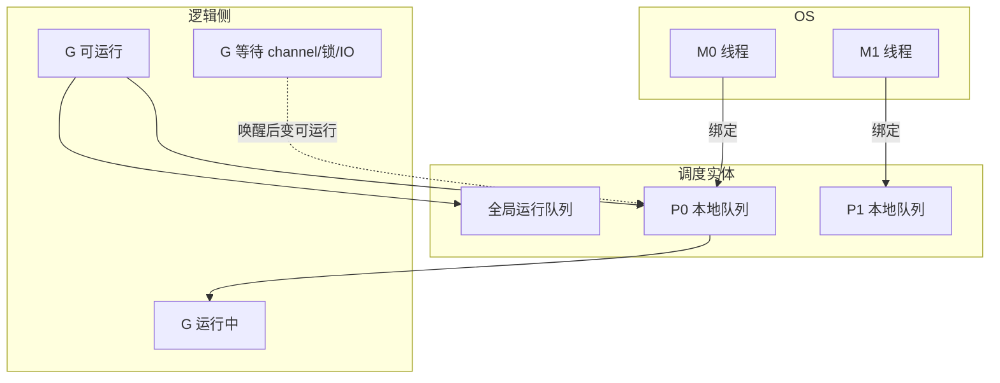
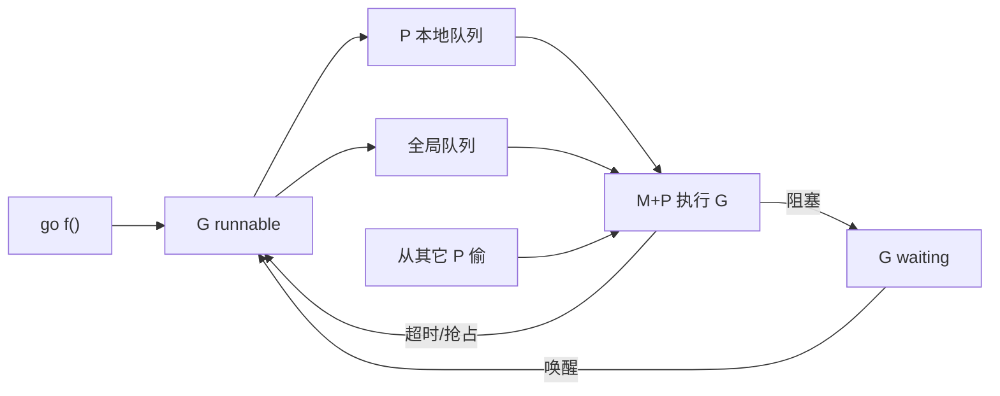
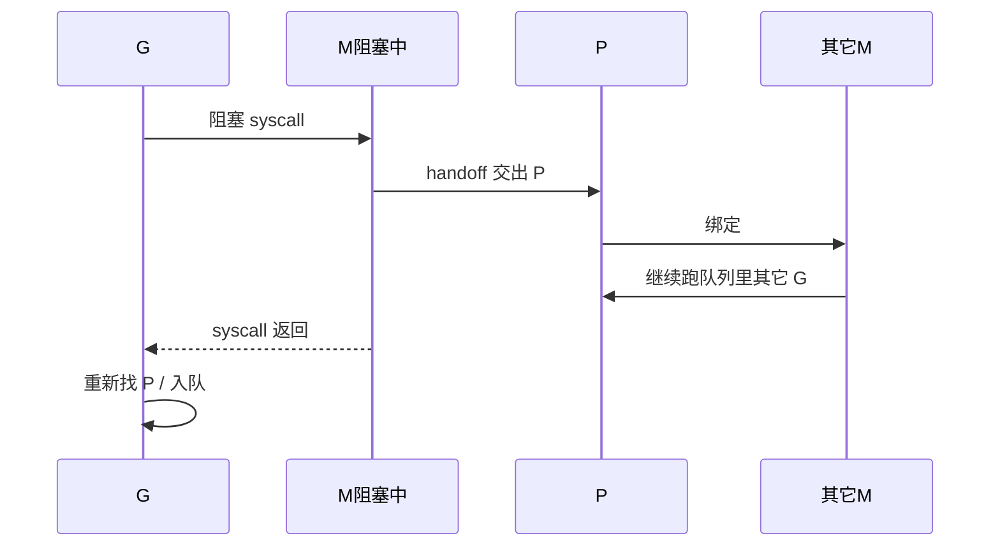
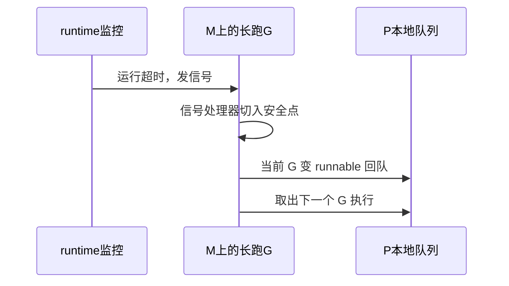

# 13 · GMP 调度器

> 讲清 Go 如何把成千上万 goroutine 跑在少量 OS 线程上——面试高频原理题。  
> 本章按「能从头讲到尾」写：结构 → 排队执行 → 阻塞/handoff → **抢占与饥饿分层** → 调参与排查。

---

## 面试题

### Q1. 什么是 GMP 模型？各自干什么？

Go 用 **M:N 调度**：把大量用户态 goroutine（G）多路复用到少量 OS 线程（M）上；中间再引入 **P（Processor）** 作为「执行配额 + 本地队列」。

| 符号 | 全称直觉 | 到底是什么 | 关键字段/职责（口述） |
| --- | --- | --- | --- |
| **G** | Goroutine | 要跑的一段 Go 代码 + 自己的栈 | 状态（_Grunning / _Grunnable / _Gwaiting…）、栈界、当前指令 |
| **M** | Machine | 真正的 **OS 线程** | 能上 CPU 执行机器码；可绑一个 P 才跑 Go 代码 |
| **P** | Processor | **逻辑处理器** | 本地可运行队列、内存分配缓存、是否允许执行 Go 代码的「门票」 |

关系一句话：

> **M 必须持有（绑定）P，才能执行 Go 代码；G 跑在「M+P」这个组合上。**

`GOMAXPROCS` ≈ **P 的个数**（默认约等于 CPU 核数），限制的是「同时执行 Go 代码的并行度」，**不是** M 的硬上限（M 在阻塞时可更多）。



**状态流转（极简）：**

1. `go f()` → 新建 G，通常变 **_Grunnable**，入某 P 本地队列（或全局队列）  
2. M 绑着 P，从队列取出 G → **_Grunning**，在该 M 上执行  
3. G 阻塞（chan/锁/netpoll）→ **_Gwaiting**，M 可去跑同 P 其它 G（视阻塞类型）  
4. 条件满足被唤醒 → 再变 runnable，重新入队  

完整执行流程：创建 G → 调度运行

1. 执行 `go func(){}`，runtime 创建一个 **G**，状态 `Gnew`。
2. 尝试把 G 放到**当前 P 的 runnext**；runnext 有任务，则放入 P 本地队列 localQueue。
3. 如果 P 本地队列满了，放到**全局队列 globalQueue**。

> 接下来看 M 如何拿到 G 执行：

4. OS 线程 M 绑定 P，P 驱动 M 寻找可运行的 G，寻找顺序： ① runnext（最高优先级） ② P 本地队列 localQueue ③ 全局队列 globalQueue ④ 从其他 P**偷 G（work stealing 工作窃取）** ⑤ 找不到 G → M 和 P 解绑，M 进入休眠

5. M 拿到 G 之后，切换上下文，开始执行 G 的函数。

G 几种关键状态（简单记）

- **Grunnable**：就绪，等待被调度
- **Grunning**：正在 M&P 上运行
- **Gwaiting**：阻塞（chan、sleep、网络 IO、锁）
- **Gsyscall**：M 进入系统调用
- **Gdead**：执行结束

两个最重要场景（面试官最爱追问）

场景 1：G 遇到阻塞（channel 收发 /time.Sleep/sync 锁）
1. G 状态变成 **Gwaiting**，从 M 上剥离
2. **M 与 P 解绑**
3. P 不能空闲！P 立刻去找一个新的 M（空闲 M 或者新建 M），继续执行队列里其他 G
4. 当前阻塞的 G 挂到对应等待队列（sudog）等待唤醒；
5. 当条件满足，G 被唤醒，变为 Grunnable，重新放入队列等待调度。

> 重点区别于线程模型：**协程阻塞，线程不卡住，P 换线程继续跑别的任务，这是 GMP 高效的关键！**

场景 2：G 发起系统调用 syscall（文件读写等阻塞 syscall）
1. G 进入 Gsyscall 状态
2. M 和 P **分离**
3. P 寻找新 M，继续运行其他 G
4. syscall 返回后：
    - 如果原来的 M 还能拿到 P：继续执行 G
    - 如果 P 已经被别的 M 占用：G 变为 Grunnable，放入队列，M 休眠归还

当一个 P 本地没有 G 可以运行：

1. 先尝试从全局队列拿 G
2. 随机挑选另一个繁忙的 P，**偷对方本地队列一半的 G**到自己本地队列执行 目的：均衡各个 P 任务量，充分利用多核，降低全局锁竞争。

---

### Q2. 为什么需要 P？只有 G 和 M 不够吗？

早期调度更接近 **GM**：多个 M 抢全局资源，扩展时锁竞争重，也难干净地表达「并行度」。

引入 P 之后：

1. **本地队列**：每个 P 自带可运行 G 队列，日常入队/出队少抢全局锁 → 多核更香  
2. **并行度旋钮**：P 数量由 `GOMAXPROCS` 定；想限制同时跑 Go 代码的核数，调 P 即可  
3. **阻塞时的手递手（handoff）**：M 陷入阻塞 syscall 时，可以把 P **转交**给别的 M，让队列里其它 G 继续跑，而不是「线程一睡，整串活都停」  
4. **资源归属**：像小对象分配缓存等可以挂在 P 上，减少跨核争用（实现细节口述到这层即可）  

没有 P：很难同时做到「本地化排队 + 可控并行度 + 阻塞不拖死整队」。

---

### Q3. goroutine 从创建到被执行的完整路径？

以 `go f()` 为起点，逐步讲：

**① 创建 G**  
运行时分配 G 对象、准备初始栈（很小，约 2KB 量级，可增长）、入口函数指向 `f`。

**② 变成可运行并入队**  

- 优先：放到 **当前正在跑的这颗 P 的本地运行队列**（同线程局部性好）  
- 本地队列满：放到 **全局运行队列**（所有 P 共享，取时要协调）  
- 也可能直接把手头 G 交接/插入等（实现优化，面试抓「本地优先、满了上全局」）

**③ M 找活干（schedule 循环）**  
某个 M 绑定着 P，在调度循环里反复：

1. 优先从 **自己 P 的本地队列** 取 G  
2. 本地空 → 按策略看 **全局队列**（会做一定公平，避免全局饿死）  
3. 还空 → **work stealing**：去别的 P 本地队列偷约一半  
4. 再空 → 可能去 **netpoll** 看看有没有就绪的网络 G，或休眠等唤醒  

**④ 执行**  
取到 G 后，切换到该 G 的栈与上下文，状态变 running，开始跑用户代码。

**⑤ 停下来的几种原因**  

- 主动阻塞：channel、锁、select、系统调用…  
- 被抢占：跑太久，调度器要求让出（见 Q6）  
- 函数返回：G 结束，资源回收路径走退出逻辑  



---

### Q4. 什么是 work stealing？为什么要偷「大约一半」？

当某个 P 本地队列空、自己闲着，却发现别的 P 堆了很多可运行 G：

1. 锁定/协调对方队列（实现有细节）  
2. 从对方本地队列 **拿走大约一半** runnable G  
3. 放到自己这边执行  

**目的：**

- 多核负载均衡，避免「一核累死、多核围观」  
- 减少空转：闲 P 不去睡觉前先尝试偷活  

**为什么偷一半而不是偷一个？**  
偷太少 → 马上又空，反复偷，开销大；偷太多 → 伤害对方局部性、一次搬迁成本高。「一半」是经验折中。

**和饥饿的关系：**  
work stealing 解决的是 **「有的 P 有活、有的 P 没活」的空间不均**；  
**解决不了**「某个 G 卡在 channel 上没人理」——那是阻塞型饿等，见 Q6。

---

### Q5. 系统调用 / 网络阻塞时调度器怎么办？（含 netpoll 与 handoff）

这里必须拆成两类阻塞，面试最爱挖：

---

#### A. 网络 IO（netpoll 友好阻塞）

Go 的 net 库把 socket 做成 **非阻塞**，真正「等数据」时：

1. 当前 G 在 netpoller 注册「等可读/可写」  
2. G 状态改为 waiting，**从 M 上摘下来**  
3. **同一个 M 仍握着 P**，立刻去跑本地队列里下一个 G  
4. 内核事件到来（epoll/kqueue/IOCP…）→ runtime 把对应 G 标回 runnable，丢回某 P 队列  

所以：成千上万连接等待时，主要占的是 **G + netpoll 结构**，不是「一连接一线程」。

---

#### B. 可能卡住整条 OS 线程的阻塞（同步 syscall / cgo 等）

例如某些文件 IO、阻塞 syscall、长时间 cgo：

1. G 在 M 上调用进入内核，**M 真的可能睡在内核里**  
2. 若仍占着 P，本地队列里其它 G 都会被拖死 → 典型「连带饥饿」  
3. 于是 runtime 做 **handoff（转交 P）**：  
   - 把 P 从阻塞的 M 上摘掉  
   - 交给其它空闲 M（或新建 M）  
   - 新 M+P 继续消化原本地队列  
4. 原 M 从 syscall 返回后：发现 P 没了，再去抢一个 P（或把 G 放回队列等调度）



**对比口述：**  
- 网络等：G 睡、M 不陪睡（尽量）  
- 重 syscall：M 可能陪睡，但靠 handoff 不让 P 上的其它 G 陪葬  

---

### Q6. 什么是抢占式调度？从协作式到异步抢占，和「协程饥饿」到底什么关系？

先给定义，再讲演进，再讲和饥饿的因果关系，最后分层（别混谈）。

---

#### 6.1 两种调度哲学

| | 协作式（cooperative） | 抢占式（preemptive） |
| --- | --- | --- |
| 谁决定让出 CPU | 运行中的 G **自己走到检查点**才肯让 | 运行时/ OS 信号 **强制打断** |
| Go 早期 | 主要靠函数调用间隙检查 | — |
| Go 现代 | 仍有协作检查点 | **异步抢占**为主力补丁 |

---

#### 6.2 早期：协作式检查 → 典型「调度饥饿」

调度器会在某些安全点问：「你跑很久了吗？该换人吗？」  
安全点常见于：**函数调用** 进入 runtime 可插桩的路径。

于是出现经典反例：

```go
// 纯计算紧循环，没有函数调用
for {
    sum += 1
}
```

这个 G 一直 _Grunning，同 P 绑定的 M 被它占死：

- 本地队列里其它 **已经 runnable** 的 G 上不了这颗核  
- 看起来像「协程饿死了」——更准确叫 **调度饥饿（scheduling starvation）**：  
  **不是条件没就绪，而是有资格跑却长时间分不到 CPU。**

旧缓解手段（了解即可）：

- 指望循环里偶尔调用别的函数  
- `runtime.Gosched()` 主动让出  
- 靠系统调用/IO「顺便」进调度点  

这些都脆：库代码一个紧循环就能拖垮延迟。

---

#### 6.3 现代：异步抢占（signal-based preemption）在干什么？

从 Go 1.14 起（口述记「有异步抢占」即可），大致机制：

1. runtime 认为某个 G **运行太久**（超过时间片量级，常被说成 ~10ms 量级，具体实现可调/演进）  
2. 向执行该 G 的 **M（OS 线程）发信号**（如 Unix 上的 signal）  
3. 线程进入信号处理路径，在 **安全点** 把当前 G 的执行挂起  
4. 将该 G 重新标为 runnable，放回队列；M+P 去取下一个 G  

这样：**即使是无函数调用的紧循环，也会被打断**，同 P 上其它 G 有机会跑。



**注意边界（面试加分）：**

- 抢占发生在 **运行时能处理的安全点**；不是任意机器指令中间乱撕（否则栈/指针扫描不安全）  
- 某些特殊状态（如持有运行时内部锁、做 GC STW 相关临界）会推迟抢占  
- 异步抢占 **大幅缓解** 调度饥饿，但 **不保证** 实时系统那种硬期限  

---

#### 6.4 「协程饥饿」为什么容易答混？——必须分层

很多人把下面四件事都叫「饥饿」，面试要先定层：

| 层级 | 名字 | G 的状态本质 | 调度器有没有亏待它？ | 典型原因 | 主要解药 |
| --- | --- | --- | --- | --- | --- |
| L1 | **调度饥饿** | 已是 **runnable**，却迟迟变不成 running | 旧版是；现代靠抢占+窃取大幅缓解 | 紧循环占核；P 不均 | 异步抢占、work stealing、合理 GOMAXPROCS |
| L2 | **阻塞型饿等** | **waiting**，条件不满足 | 否，它本就不能跑 | channel 没人对接；锁被长持有 | 修协议/超时/Context；缩短临界区 |
| L3 | **逻辑饿死** | 多路等待里某分支长期不走 | 否（或公平性在 select 语义内） | select 某 case 总就绪挤掉其它；`default` 空转 | 见 [[12-Select与并发模式]] |
| L4 | **资源锁饿死** | 等在锁上 | 锁策略问题 | RWMutex 写者被读者续杯 | 见 [[16-sync包与原子操作#Q1b]] |

**口诀：**

> 调度器只对 **可运行（runnable）** 的 G 谈「公不公平」。  
> 卡在 channel/锁上的 G 是 **条件不满足**，别骂 GMP「饿死它」——要骂业务同步设计。

---

#### 6.5 和抢占的直接因果关系（答面试官追问）

- **问：没有抢占会怎样？**  
  → 一个 runaway G 可占死 M+P，同队列 runnable G 调度饥饿。  

- **问：有了抢占还会饿吗？**  
  → L1 大幅少见；L2/L3/L4 照样存在。CPU 全被合法重任务占满时，延迟敏感任务仍会「排队等核」（这是容量问题，不是紧循环 bug）。  

- **问：抢占和 handoff 啥区别？**  
  → 抢占：G **还能跑**，但被强制换下，把 CPU 让给其它 runnable G。  
  → handoff：M **卡住了**，把 P 交给别人，避免整队陪葬。  

---

### Q6b. 各层饥饿的具体场景、现象、缓解（展开讲）

---

#### L1 调度饥饿 / CPU 公平问题

**场景 1：历史紧循环（无抢占时）**  
现象：其它请求延迟爆炸；`goroutine` profile 里一个 G 长期 running。  
缓解：升级到有异步抢占的版本；仍建议别写无暂停的死循环占核。

**场景 2：CPU 密集打满所有 P**  
`GOMAXPROCS=N`，N 个核都在做重计算；延迟敏感 G 虽 runnable，却要排队。  
这是 **算力不够 + 无优先级队列**（Go 调度器不提供业务优先级）。  
缓解：

- 限制重任务 worker 数（别 `go` 出几万个算死循环）  
- 业务侧分池：重计算池 / 延迟敏感池  
- 水平扩容；别指望「再调大 GOMAXPROCS」无限救命  

**场景 3：本地队列短暂倾斜**  
大量 `go` 从同一请求路径打到同一 P，本地队列暴涨；其它 P 靠 stealing 拉平。  
一般可自愈；若仍不均，检查是否不必要地串行创建、是否该用池化限流。

---

#### L2 阻塞型饿等（最常见，却常被误叫「协程饥饿」）

**场景：**

- 发送到无接收者的无缓冲 channel  
- `select` 不听 `ctx.Done()`，下游已取消仍堵着  
- 持锁做慢 IO，其它 G 全部卡在 `Lock`  

现象：`NumGoroutine` 上涨；profile 栈顶是 `chanreceive` / `chansend` / `semacquire`。  
缓解：超时、Context、关闭协议、锁外 IO——见 [[11-Goroutine与Channel]]、[[15-Context]]、[[16-sync包与原子操作]]。

---

#### L3 select / default 逻辑问题

- 某 channel 一直有数据，另一 case 很少同时就绪 → 伪随机也很少抽到它  
- `default` 忙轮询：当前 G 狂空转，**副作用**是让同进程其它 G 变慢（像把别人饿慢）  

见 [[12-Select与并发模式#Q10]]、[[12-Select与并发模式#Q11]]。

---

#### L4 RWMutex 写者饥饿

读者不断 `RLock`，写者一直等 readerCount 归零。  
Go 用「有写者等待则阻挡新读者」缓解——见 [[16-sync包与原子操作#Q1b]]。

---

#### 排查顺序（建议背）

1. `pprof goroutine`：看是 **runnable 堆积** 还是 **堵在 chan/锁**  
2. runnable 堆积 + CPU 打满 → L1 容量/抢占/GOMAXPROCS  
3. 栈在 `chan`/`mutex` → L2 业务同步  
4. `GODEBUG=schedtrace=1000`（了解）：看调度器是否在空转、是否有 P 闲死  

---

### Q7. `GOMAXPROCS` 调大一定更快吗？

先回顾：它近似决定 **P 数量 = 可同时执行 Go 代码的并行度**。

| 负载 | 调大 P | 可能结果 |
| --- | --- | --- |
| CPU 密集 | 超过物理核 | 更多调度/缓存竞争，未必更快，可能更慢 |
| CPU 密集 | 约等于核数 | 通常合理起点 |
| IO 密集 | 适度增大 | 有时有用，但更关键的是 G 并发与 netpoll，不是无限加 P |
| 容器 | 大于 cgroup CPU 限额 | 假象多核，实际过度订阅，延迟抖动 |

实践：容器里用 automaxprocs 一类库把 `GOMAXPROCS` 对齐 CPU quota。  
**加 P ≠ 加吞吐的充分条件**；先 profile。

---

### Q8. goroutine 的栈如何增长？会「泄漏」吗？

- 初始栈很小（约 2KB 量级）  
- 不够用时：**连续栈**策略——申请更大栈，把旧栈内容拷过去，修正指针，换成新栈（不是老式分段栈的「分裂栈」主流叙事）  
- 栈缩小：在合适时机可缩，避免只涨不跌占内存  

「泄漏」常见不是栈本身坏了，而是：

- G 泄漏（永远 waiting）带走栈  
- 或栈上指针逃逸到堆，堆对象被错误长持有——见 [[14-GC与内存逃逸]]  

---

### Q9. 调度相关怎么排查？（把方法和判据写全）

| 手段 | 看什么 | 如何解读 |
| --- | --- | --- |
| `runtime.NumGoroutine()` | G 数量曲线 | 持续上涨 → 先怀疑泄漏（L2） |
| `pprof goroutine` | 每种栈的 G 数 | `chan`/`mutex` → L2；大量 runnable 文案/等待调度 → L1 |
| `pprof cpu` | 谁占核 | 紧循环/重计算占满 |
| `pprof threadcreate` | M 是否暴涨 | 过多阻塞 syscall/cgo |
| `GODEBUG=schedtrace=...` | P/M/G 调度摘要 | 是否闲 P、是否疯狂 schedule |
| 延迟指标 + CPU | 容量否 | CPU 满且延迟差 → 扩容或限流重任务 |

口诀：

- 栈顶 **`chan` / `semacquire`** → 先查同步协议  
- **CPU 满 + runnable 多** → 查抢占/GOMAXPROCS/任务拆分  
- **M 很多** → 查阻塞 syscall 与 handoff 是否跟得上  

---

### Q10. handoff 再完整讲一遍：步骤、目的、和抢占的对比

**目的：** 防止「M 因阻塞睡死 → 仍占着 P → 本地队列里其它 runnable G 连带调度饥饿」。

**步骤展开：**

1. G 在某 M 上进入可能久阻塞的 syscall  
2. runtime 检测到需要脱离：执行 **handoff**  
3. P 从该 M 解绑，状态变为可被其它 M 获取  
4. 另一个 M（空闲或新建）绑定该 P  
5. 新 M 继续 schedule：跑原 P 队列中下一个 G  
6. 老 M 从内核返回后，再参与抢 P 或进入自旋/休眠逻辑  

**对比抢占：**

| | 异步抢占 | handoff |
| --- | --- | --- |
| 触发 | G 跑太久 | M 卡住（syscall 等） |
| G 是否还能继续跑 | 能，只是被换下 | 当前 G 卡在 syscall 里 |
| 主要保护谁 | 同 P 其它 runnable G 的时间片 | 同 P 队列不被阻塞 M 拖死 |
| 属于哪类饥饿防御 | L1 时间片公平 | 阻塞导致的连带 L1 |

---

### Q11. 90 秒串讲稿（GMP + 抢占 + 饥饿）

1. Go 是 M:N：G 是协程，M 是线程，P 是并行度与本地队列。  
2. `go` 出来先入本地队列，空了偷别人的，全局队列兜底。  
3. 网络等走 netpoll，G 睡 M 不陪；真阻塞 syscall 就 handoff P，别让整队陪葬。  
4. 以前协作式紧循环会调度饥饿；现在异步信号抢占，可运行 G 不易被一个 runaway 永久占死。  
5. 仍要把饥饿分层：runnable 分不到 CPU 才是调度问题；channel/锁上等是业务就绪问题。  

---

## 关联

- [[11-Goroutine与Channel]] · [[12-Select与并发模式]] · [[14-GC与内存逃逸]] · [[16-sync包与原子操作]] · [[15-Context]] · [[00-知识总览]]
