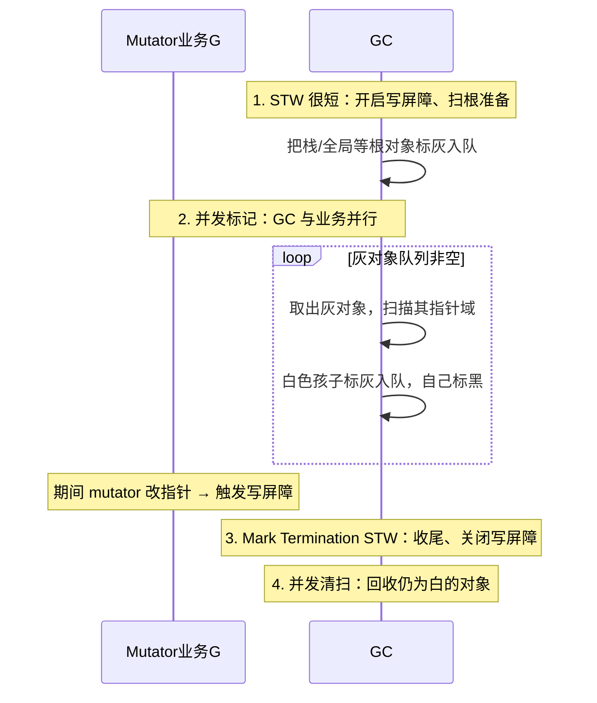
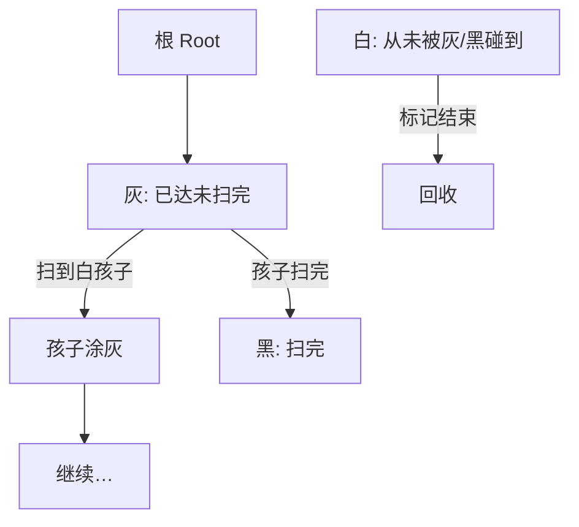
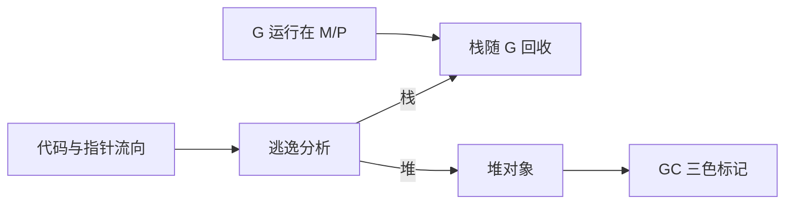

# 14 · GC 与内存逃逸

> Go 面试常问：三色标记、混合写屏障、逃逸分析、如何降 GC 压力。

---

## 面试题

### Q1. Go 的 GC 是什么算法？一轮 GC 完整流程？

现代 Go：**并发三色标记-清除** + **写屏障**，目标低延迟（STW 通常很短），不是追求绝对最高吞吐。

**一轮 GC 口述流程：**



阶段要点：

| 阶段 | STW？ | 干什么 |
| --- | --- | --- |
| Mark Setup | 是（极短） | 打开写屏障；准备根 |
| Concurrent Mark | **否** | 三色标记；业务还在跑 |
| Mark Termination | 是（极短） | 处理剩余、关屏障 |
| Concurrent Sweep | 否 | 按需清扫白色垃圾（也可惰性扫） |

面试别背死「STW=xxμs」；强调：**标记主体与业务并发，正确性靠写屏障，调优靠少分配。**

---

### Q2. 三色标记完整流程怎么讲？三色不变式是什么？

把堆对象抽象成三种颜色（只是逻辑，实现上用标记位）：

| 颜色 | 含义 |
| --- | --- |
| **白 White** | 还没证明存活；标记结束仍白 → **垃圾** |
| **灰 Grey** | 已确认存活，但**指向的孩子还没扫完**（工作集） |
| **黑 Black** | 已确认存活，且**它的直接引用都已处理过** |

**单线程、无并发时的标准流程：**

1. 全部对象先视为白  
2. 从 **根**（全局变量、各 G 的栈、寄存器能碰到的对象等）出发：根引用到的对象 **涂灰**，丢进灰色队列  
3. while 灰色队列非空：  
   - 取出一个灰对象 `O`  
   - 扫描 `O` 的每个指针字段：若指向白对象 `C`，把 `C` **涂灰**入队  
   - `O` 全部指针看完 → `O` **涂黑**  
4. 队列空：所有能从根到达的都已黑；剩下白色即不可达 → 回收  



**三色不变式（别漏标的关键）：**

并发标记时，若允许业务改指针，可能破坏安全。经典危险是：

> **黑色对象直接指向白色对象，且那条「本来能从灰到达白」的路径被掐断** → 白对象既没进灰队，又被黑直接指着 → **漏标活对象（被当垃圾回收）**。

示意图：

```text
标记前：  黑(父) → 灰(中) → 白(孩)     // 灰还没扫到孩
业务改成：黑(父) → 白(孩) ，且 灰(中) 不再指向孩
若无屏障：黑以为自己扫完了，白永远进不了灰队 → 孩被误回收
```

所以并发 GC 必须在 **指针写入** 时插入 **写屏障**，维持不变式（强三色 / 弱三色等变体，面试说清「防黑→白漏标」即可）。

---

### Q3. 写屏障是什么？插入屏障、删除屏障分别怎么操作？

**写屏障（write barrier）：** 编译器/运行时在「对象里某个指针字段被改写」时，插入一小段额外代码，把这次指针变化告诉 GC（通常是把相关对象 **标灰/入队**）。

抽象成赋值：

```text
*slot = ptr   // 把 slot 里的指针改成 ptr
```

屏障会看到：**写之前的旧值 old**、**新值 ptr**、以及 **被写的对象 slot 的所属对象颜色**。

---

#### 1）Dijkstra 插入屏障（Insertion barrier）

思想：**「新插进去的指针」要被照顾到**——若你往一个（可能已黑的）对象里写入指向白对象的指针，就把 **新指向的对象标灰**。

伪代码直觉：

```text
writePointer(slot, new):
    shade(new)        // 插入屏障：新指针目标涂灰（或条件涂灰）
    *slot = new
```

效果：即使出现「黑 → 白」的写入，白也会立刻变灰，进入待扫队列 → **强三色不变式**更好维护（不允许黑指向白长期存在）。

缺点（历史痛点）：

- 屏障主要护「堆上的写」；**栈上的指针写往往不设屏障**（太热、太频繁）  
- 于是标记结束前，常要再 **STW 把各 goroutine 栈重新扫描一遍**，把栈上新挂上的白对象捞回来 → **STW 偏长**

---

#### 2）Yuasa 删除屏障（Deletion barrier）

思想：**「即将被覆盖掉的旧指针」不能假装没存在过**——覆盖前先把 **旧指向的对象标灰**。

```text
writePointer(slot, new):
    shade(*slot)      // 删除屏障：旧指针目标涂灰
    *slot = new
```

效果：即使业务把「灰/黑 → 白」的路径改掉，旧白孩子也已被 shade，不会因为路径删除而漏掉。  
偏向 **弱三色不变式**：允许黑临时指向白，但靠「删路径时保护旧孩子」保证可达对象最终仍被标到。

优点：对栈的待遇更友好时，可以减轻「结束时整栈重扫」压力。  
代价：可能把更多对象标活（偏保守），或与具体实现组合时有不同 tradeoff。

---

#### 对比一口说清

| | 插入屏障 | 删除屏障 |
| --- | --- | --- |
| 保护时机 | 写入 **新** 指针时 | 覆盖掉 **旧** 指针时 |
| 核心动作 | `shade(new)` | `shade(old)` |
| 防的漏标套路 | 黑对象新挂上白孩子 | 通向白孩子的路径被删掉 |
| 经典代价 | 栈无屏障 → 结束要重扫栈 | 实现与保守标活的权衡 |

---

### Q3b. Go 的混合写屏障具体怎么做？解决了什么？

Go 1.8 起用 **混合写屏障（hybrid write barrier）**，把插入/删除思想组合进标记期，并配合「栈与堆不同策略」，核心工程目标：

> **尽量避免 Mark Termination 时大规模 STW 重扫所有 goroutine 栈。**

**混合规则口述版（抓住精神，不必背源码行号）：**

标记期间，对堆上指针写大致遵循：

1. **shade(旧值)** —— 带删除屏障味道：路径删掉前先保护旧对象  
2. **shade(新值)** —— 带插入屏障味道：新挂上的对象也进灰色工作集  
3. 再配合「**黑色对象的指针写**」等条件，保证并发下不出现「活对象既不灰也不黑、最后被当白垃圾」  

（实现细节/条件分支随版本演进；面试用上面两条 + 目标即可。）

**和栈的配合（常考点）：**

- GC 开始扫描某个 G 的栈时，可把该栈视为扫描快照；混合屏障让堆上的并发修改自己「补课」  
- 从而 **不必在结束阶段再 STW 把全部栈扫第二遍**（这是相对早期「只有插入屏障」方案的最大收益）  
- Mark Setup / Mark Termination 仍可能有短 STW，但重活在并发标记阶段

**解决了什么问题？——对照答：**

| 问题 | 混合屏障的回答 |
| --- | --- |
| 并发修改导致漏标 | 写指针时 shade 相关对象，维持可达对象进灰/黑 |
| 插入屏障导致结束 STW 扫栈太久 | 混合策略 + 栈扫描时机调整 → **显著缩短 STW** |
| 只删或只插一种不够贴合 Go | 堆写上组合旧/新都保护，适配 mutator 行为 |

**90 秒口述模板：**

1. 三色：白未访问，灰待扫，黑扫完；结束白回收  
2. 并发时怕「黑指向白且灰路径断了」漏标  
3. 写屏障在赋值指针时介入：插入护 new，删除护 old  
4. Go 用混合屏障，堆上写同时照顾新旧，并优化栈扫描，换来 **并发标记 + 短 STW**  
5. 业务侧降 GC 压力仍靠少分配，不是调玄学参数优先  

---

### Q3c. 用一个具体赋值例子串起来？

假设并发标记中：

```text
// 对象 P 已是黑色（扫完过）
// 对象 C 仍是白色
P.child = C   // 业务执行这次堆指针写
```

若 **无屏障**：P 黑且认为孩子都处理过，C 又白 → 可能漏标。

有 **插入屏障**：写时 `shade(C)` → C 变灰入队 → 稍后被扫 → 变黑。  

若同时是「改写」：

```text
// P.child 原先指向 O（可能灰/白）
P.child = C
```

**删除屏障**会先 `shade(O)`，防止「唯一通向 O 的路径被改掉」导致 O 漏标。  
**混合屏障**则新旧都可能 shade，更保守地保证正确性，换 STW 体验。

栈上 `localVar = C` 又是另一套：Go 用混合方案避免「每次栈写都屏障」同时避免「结束时全栈重扫」——这就是它比裸插入屏障更适合 Go 的原因。

---

### Q4. 什么是内存逃逸？常见逃逸场景？

**逃逸：** 编译器判定对象不能只活在栈上 → 分配到**堆**，由 GC 管理。

常见场景：

1. 指针被返回 / 泄漏到外部  
2. 发给 `interface{}` 且运行时不够确定  
3. 闭包捕获并逃出函数  
4. 栈上放不下的过大对象  
5. 发送指针到 channel 且生命周期超出栈帧  
6. 切片/`append` 后底层数组在堆上（很常见）  

查看：`go build -gcflags="-m"`（或 `-m -m` 更详细）。

```go
func f() *int {
    x := 1
    return &x // x 逃逸到堆
}
```

---

### Q5. 逃逸一定坏吗？和性能关系？

- 栈分配：**函数返回即回收**，无 GC 压力  
- 堆分配：增加 GC 扫描与清扫成本  

但为「避免逃逸」牺牲可读性通常不值。优化顺序：

1. 先 profile（`pprof` alloc / heap）  
2. 减少不必要堆分配（复用 buffer、`sync.Pool`、预分配切片）  
3. 再看热点函数的 `-m` 输出  

---

### Q6. 如何降低 GC 压力？（工程清单）

1. 少分配：对象复用、`sync.Pool`、预 `make` 容量  
2. 避免频繁小对象 + `interface{}` 装箱  
3. 字符串拼接用 `strings.Builder`  
4. 大 map 不用时置 nil 或重用并谨慎 `delete` 碎片问题  
5. 控制 goroutine / 缓存无限增长  
6. 必要时调 `GOMEMLIMIT` / 了解 `GOGC`（默认 100 表示双倍堆触发相关策略，具体以版本为准）  

口述优先级：**先改代码分配，再动 GOGC。**

---

### Q7. `GOGC` 和 `GOMEMLIMIT` 区别？

- **`GOGC`：** 控制 GC 触发的「增长率」相关策略（默认 100）。调大 → GC 更少但堆更大；调小 → GC 更勤、堆更紧。  
- **`GOMEMLIMIT`（较新）：** 软内存上限，帮助在容器限内存时更积极回收，减少被 OOMKill。  

容器化部署面试常问：对齐 cgroup limit + `GOMEMLIMIT`。

---

### Q8. 堆、栈、逃逸、GMP 怎么串成一条线？



调度管「谁在跑」，逃逸/GC 管「内存活在哪、何时回收」。

---

## 关联

- [[02-指针与内存]] · [[13-GMP调度器]] · [[16-sync包与原子操作]] · [[03-数组与切片]]
