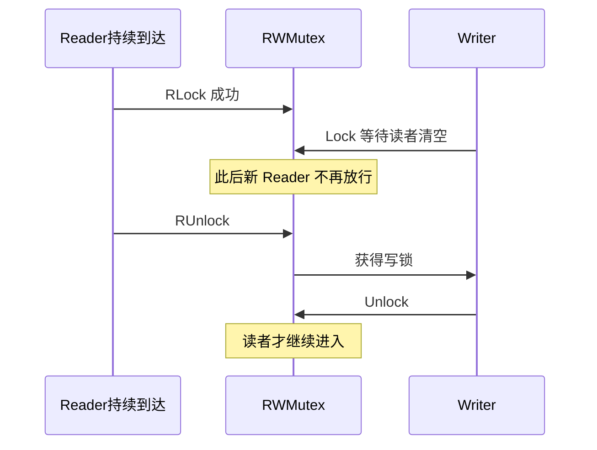

# 16 · sync 包与原子操作

> Mutex / RWMutex / WaitGroup / Once / Map / Pool / atomic——和 channel 互补的共享内存工具箱。

---

## 面试题

### Q1. `Mutex` 和 `RWMutex` 区别？怎么选？

| | `Mutex` | `RWMutex` |
| --- | --- | --- |
| 模式 | 互斥 | 多读单写 |
| 读多写少 | 可用但不最优 | **更合适** |
| 写多 / 临界区极短 | 通常 Mutex 更简单 | 见 Q1b/Q1c：读者饥饿、锁升级 |

规则：

- `RLock` 可并发；`Lock` 排他  
- **同一 goroutine 不要重入**（不是可重入锁）  
- 禁止复制已使用的 Mutex（应传指针）  
- `defer Unlock` 防遗漏  

选型别只会背「读多写少用 RWMutex」——还要会讲 **写者会不会饿死、能不能锁升级**（下面两题）。

---

### Q1b. 什么是读者饥饿 / 写者饥饿？`RWMutex` 怎么处理？

**饥饿：** 某个角色一直抢不到锁，延迟无限恶化。

| 现象 | 典型原因 |
| --- | --- |
| **写者饥饿** | 读者源源不断进来，写锁一直等「读者清零」 |
| **读者饥饿** | 写锁频繁拿到，读者长期排后面（相对少见，但高写压时有） |

Go 的 `sync.RWMutex` 策略（口述版，1.9+ 写者优先思路）：

1. 有写者在等（`Lock` 阻塞中）时，**后来的新读者会被挡住**，不能再插队 `RLock`  
2. 这样避免「读者无限续杯 → 写者永远等不到」的**写者饥饿**  
3. 代价：突发写时，读者可能多等一会儿（用吞吐换公平）  



对比：若实现成「读者绝对优先」，读多场景写者可能饿死——这正是表里那句「要小心」的来源。

**和 Mutex 比：** 临界区极短、读写比没那么夸张时，Mutex 更简单，也没有读写两类饥饿叙事。

---

### Q1c. 什么是锁升级？Go 的 `RWMutex` 能从读锁升写锁吗？

**锁升级（lock upgrade）：** 已经持有读锁，想在不释放的情况下变成写锁（常见诉求：先查再改，避免中间被别人改）。

```go
mu.RLock()
// 看一眼数据
mu.Lock()   // ❌ 死锁：自己还占着读锁，写锁要等读者清零
```

Go **不支持** `RLock → Lock` 升级：

1. `RWMutex` 不可重入；写锁要等 **readerCount 归零**  
2. 自己正是那个读者 → 永远等自己 → **死锁**  
3. 也没有 `Upgrade` API（对比某些语言的读写锁）  

正确姿势：

```go
mu.RLock()
needWrite := check(state)
mu.RUnlock()

if needWrite {
    mu.Lock()
    // 重新检查（双重检查），再改
    if check(state) { modify(state) }
    mu.Unlock()
}
```

或一开始就用写锁（临界区必须短）；或拆成「读锁复制快照 → 锁外算 → 写锁提交」。

**降级**（写锁 → 读锁）也不是官方一等能力：通常 `Unlock` 再 `RLock`，中间有空隙，别假设原子降级。

---

### Q2. `WaitGroup` 常见坑？

```go
var wg sync.WaitGroup
wg.Add(1)
go func() {
    defer wg.Done()
    work()
}()
wg.Wait()
```

坑：

1. `Add` 必须在 `Wait` 之前，且最好在启动子 goroutine **之前**  
2. `Add` 总数与 `Done` 次数不一致 → 死锁或提前结束  
3. **禁止复制** WaitGroup  
4. 不要在每个任务里 `Add(1)` 却漏 Done（用 defer）  

---

### Q3. `sync.Once` 做什么？能重置吗？

保证 **函数只执行一次**（并发安全），常用于单例初始化。

```go
var once sync.Once
once.Do(func() { initConfig() })
```

标准 `Once` **不能重置**。若初始化失败要重试，需自己设计或看社区方案；也可在 `Do` 里不要吞掉需要重试的错误（失败也算「做过」）。

---

### Q4. `sync.Map` 适用场景？普通 map + 锁呢？

`sync.Map` 适合：

- **键稳定、读多写少**  
- 多个 goroutine 读写，键集合很少变化  

不适合：

- 频繁写入、遍历删除为主 → 往往 `map + RWMutex` 更清晰可控  

API：`Store/Load/Delete/LoadOrStore/Range`。  
`Range` 中途改 map 有约定行为，不要假设强一致快照。

---

### Q5. `sync.Pool` 是什么？要注意什么？

对象池，降低 GC 压力：`Get` / `Put` 复用临时对象（如 `[]byte` buffer）。

注意：

1. **随时可能被 GC 清空**——不能当可靠缓存  
2. Put 前要重置对象状态，防脏数据  
3. 池中对象大小差异大时效益差  
4. 适合「生命短、分配频」的热点路径  

---

### Q6. `atomic` 和 Mutex 怎么选？

`sync/atomic`：对整数/指针做原子读写、CAS，无锁或少锁。

| 场景 | 选择 |
| --- | --- |
| 计数器、标志位、单一热变量 | atomic |
| 多字段不变量、临界区复杂 | Mutex |
| 读多写少的大结构 | RWMutex / 复制副本策略 |

```go
var cnt atomic.Int64 // Go 1.19+
cnt.Add(1)
```

口述：**atomic 管「一个字」的原子性；业务不变量仍可能要锁。**

---

### Q7. CAS 是什么？有什么问题？

Compare-And-Swap：值仍是预期旧值才换成新值，否则失败重试。

问题：

- **ABA：** 值从 A→B→A，CAS 以为没变（指针场景可用版本号）  
- 高竞争下空转；可退避  
- 只保证单变量原子，不组合多变量  

---

### Q8. `Cond` 用在什么场景？

`sync.Cond` 基于 Mutex 的条件等待：`Wait` / `Signal` / `Broadcast`。  
适合「等某个条件成立」且不想用 channel 时。

现代代码更多用 channel / Context；Cond 要小心 **Wait 时的锁语义** 与虚假唤醒（循环检查条件）。

---

### Q9. 通道、锁、原子——面试怎么一句话选型？

1. **传递数据 / 所有权 / 编排** → channel  
2. **保护共享结构不变量** → Mutex / RWMutex（想清饥饿与升级）  
3. **热点计数/状态位** → atomic  
4. **取消与超时** → Context  

详见 [[11-Goroutine与Channel]]、[[12-Select与并发模式]]。

---

### Q10. `Mutex` 饥饿吗？自旋又是什么？

现代 `sync.Mutex` 有正常模式 / 饥饿模式（口述即可）：

- 竞争不重：往往先 **自旋（spin）** 一小会，盼持锁方快释放，避免睡眠切换  
- 某个 waiter 等太久：进入更偏向公平的路径，让队头更容易拿到，缓解 **waiter 饥饿**  
- 细节随版本变，面试抓：「有自旋、有防饥饿，不是简单的纯互斥队列」  

和 RWMutex 的「读者挡写者」是不同层面的公平性故事。

---

### Q11. 持锁时调用可能阻塞的函数有什么问题？

持 `Lock`/`RLock` 时做：

- channel 收发（无缓冲或满/空）  
- 再去抢另一把锁  
- 同步 RPC / sleep  

轻则吞吐崩，重则 **死锁**（ABBA、自死锁）。  
原则：**锁内只碰内存，IO/编排放到锁外**；必须 IO 就缩短临界区或换 actor/channel 模型。

---

### Q12. Go 内存模型 / happens-before 面试怎么讲？

一句话：Go **不保证**普通共享变量的可见性与有序，除非用同步事件建立 **happens-before**。

常见同步点（建立 hb 后，之前的写对之后的读可见）：

| 同步手段 | 口述 |
| --- | --- |
| `Mutex`/`RWMutex` Unlock → 另一 G Lock | 临界区写对下一持锁者可见 |
| channel 发送成功 → 对应接收完成 | 发送前的写，接收后能看见 |
| `atomic` 操作 | 原子变量上的顺序/可见（按文档模型） |
| `WaitGroup` Wait 返回 | Done 之前的工作对 Wait 之后可见 |
| `Once.Do` 结束 | 初始化对后续 Do 可见 |

反例：只写共享 `bool done` 不加同步就 spin 等 → 可能永远看不见（或需 race detector 打出来）。  
正确：用 channel、条件变量、atomic、Mutex，或 `context`。

和 Java JMM 对比：思想类似（可见性/有序靠同步），Go 文档更短，工程上 **「别裸奔共享变量」** 即可。

---

## 关联

- [[11-Goroutine与Channel]] · [[13-GMP调度器]] · [[14-GC与内存逃逸]] · [[15-Context]] · [[02-指针与内存]] · [[18-测试竞态与基准]]
