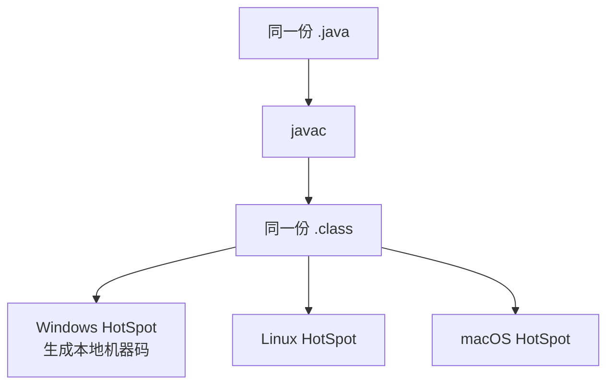

# 01 · JVM 组成与执行流程

---

## 面试题

### Q1. 什么是 JVM？和 JRE、JDK、Java 语言什么关系？

**JVM（Java Virtual Machine）** 是一套**规范**，也指具体实现（最常见 Oracle/OpenJDK 的 **HotSpot**）。它的职责是：把符合规范的字节码变成在当前 OS/CPU 上可运行的行为。

可以把它理解成「在真实机器上的软件机器」：有自己的指令集（字节码）、自己的「寄存器/栈」模型、自己的内存管理和执行引擎。

JVM 是 Java 实现跨平台特性的关键。Java 程序通过“一次编译，到处运行”的方式，确保 Java 程序可以在不同操作系统上运行，而无需修改代码。
这种跨平台性使得 Java 程序能够在不同的硬件和操作系统上无缝运行。

| 概念           | 关系                             |
| ------------ | ------------------------------ |
| Java 语言      | 一种可编译成字节码的语言                   |
| 字节码 `.class` | JVM 的输入，语言无关                   |
| JVM          | 执行字节码的引擎 + 运行时——Java虚拟机        |
| JRE          | JVM + 标准类库（运行所需）——Java运行时环境    |
| JDK          | JRE + 开发工具（javac 等）——Java开发工具包 |

**加分点：**

- Kotlin/Scala/Groovy 也能生成 class，跑在同一 JVM 上  
- 还有其它 JVM：OpenJ9、GraalVM 的 JVM 模式等；面试默认 HotSpot  
- 「Write Once, Run Anywhere」靠的是字节码+各平台 JVM，不是靠 Java 语法本身  

---

### Q2. Java 如何实现跨平台？有什么做不到跨的？

**跨得了：** 业务逻辑字节码、标准库抽象（集合、并发、大部分 IO）。  

**仍可能踩平台差异：**

1. 路径分隔符、换行、文件系统大小写  
2. JNI 本地库必须按平台编译  
3. 字符编码默认值、时区  
4. 文件锁、信号、部分 NIO 行为  

所以工程上仍要「多平台测」，但比维护三套 C++ 代码轻得多。

---

### Q3. JVM 由哪些部分组成？运行流程是什么？

#### 3.1 架构分块（务必能画）
![[lFCt5qVH_image_mianshiya.png]]

1. **类加载子系统**
负责加载`.class` 文件 。采用双亲委派模型进行类加载。其工作过程是，当一个类加载器收到类加载请求时，它首先会把请求委派给父类加载器去完成，只有当父类加载器无法完成这个加载请求（也就是在它的搜索范围中找不到对应的类）时，子加载器才会尝试自己去加载该类。这样的设计保证了Java类随着它的类加载器一起具备了一种带有优先级的层次关系，确保了类的加载安全和稳定。
2. **运行时数据区间**
包括堆（Heap）、方法区（Method Area）、Java栈（Java Stack）、本地方法栈（Native Method Stack）、程序计数器（PC Register））【可问：JVM的内存区域是如何划分的？】
3. **字节码执行引擎**
负责执行字节码，包括解释器和即时编译器（JIT）主要包含解释器和即时编译器（JIT）。解释器会逐行解释字节码文件，将字节码指令转换为对应的机器指令来执行，执行效率相对较低，但启动速度快，适合一些简单、执行次数少的代码。而JIT编译器则会对热点代码（即那些被频繁调用的代码片段）进行编译，将其直接编译成机器码，存储在内存中，后续再次执行到这些热点代码时，就可以直接执行机器码，大大提高了执行效率
4. **本地方法接口**
如果需要调用C++之类的外部代码,比如访问硬件,JNI就来帮忙桥接

| 子系统       | 干什么                       | 面试怎么说       |
| --------- | ------------------------- | ----------- |
| 类加载子系统    | 把 class 变成内存中的 Class，并初始化 | 「进门安检+落户」   |
| 运行时数据区    | 堆栈方法区等存放运行数据              | 「JVM 的内存账本」 |
| 字节码执行引擎   | 解释/JIT 执行字节码；GC 回收堆       | 「干活的引擎」     |
| JNI本地方法调用 | 调 C/C++                   | 「通往本地世界的门」  |
|           |                           |             |
**提问:方法区和堆有什么区别?为什么JDK8要把永久代换成Metaspace?**
回答:堆存对象实例,方法区存类的元数据和常量池。永久代有两个问题:
一是大小固定,类加载多了容易00M;
二是FullGC时才回收,回收效率低。Metaspace用本地内存,默认不设上限,可以动态扩展,而且元数据回收更及时。Spring这类大量使用动态代理的框架,用Metaspace稳定性好很多。

**提问:JIT编译器是怎么判断哪些代码是热点代码的?**
回答:靠计数器。每个方法有个调用计数器,每调一次加一;还有个回边计数器,循环体每执行一轮加一。两个计数器的值加起来超过阈值就触发JIT编译。默认阈值C1是1500次,C2是10000次。可以用-XX:CompileThreshold调整。

#### 3.2 端到端执行流程（综合口述题「说说 Java 执行流程」）

1. **开发编译：** `.java` → `javac` → `.class`（含常量池、方法字节码）  
2. **启动：** `java Main`，创建 JVM，解析参数（堆大小、GC 等）  
3. **加载主类：** 双亲委派找到 `Main`，链接并初始化，执行 `main`  
4. **运行：**  
   - 方法调用推栈帧  
   - `new` 在堆（TLAB）分配对象  
   - 字节码由解释器执行；热点方法/循环被 JIT 编译  
5. **GC：** 堆不够或条件触发时回收不可达对象  
6. **结束：** 非守护线程结束或 `System.exit`，JVM 退出  

---

### Q4. 编译执行与解释执行区别？JVM 用哪种？

| 维度   | 解释    | 编译（JIT）            |
| ---- | ----- | ------------------ |
| 时机   | 边读边执行 | 先变机器码再执行           |
| 启动   | 快     | 编译本身耗 CPU/时间       |
| 峰值性能 | 较低    | 高（可内联、逃逸分析等）       |
| 信息   | 少     | 可基于 profiling 激进优化 |

**HotSpot = 解释 + JIT（分层编译）：**

- 刚启动：解释执行，快速开始  
- 方法/循环变「热」：C1（快速编译）→ C2（深度优化）  
- 优化假设失败可 **去优化（Deoptimization）** 回解释或重新编译  

>HotSpot 是 **Oracle JDK / OpenJDK 默认的虚拟机实现**
>**热点代码探测**：自动统计代码执行次数，只对高频代码做编译优化（不用全部编译，节省启动时间）
>**分层编译架构（C1 + C2 编译器 + 解释器协同工作）**，也就是你写的这套执行体系

不要答「JVM 只解释」或「只编译」——标准答案是**混合模式**。

>这里会涉及到一个问题，也就是编译和解释的部分,完整流程是.java文件通过javac编译为.class文件，然后由JVM解释运行,“那这里不就是javac这个java编译器进行编译，JVM进行解释么”，实际上这里JVM是解释和编译都有，也就是解释器加上JIT这个即使编译器
>也就是字节码文件
>1.冷代码：解释器逐条解释执行
>2.热点代码：JIT编译为本地机器码执行

---

## 关联

- [[02-运行时数据区]] · [[11-JIT-AOT与逃逸分析]] · [[04-类加载与双亲委派]]
