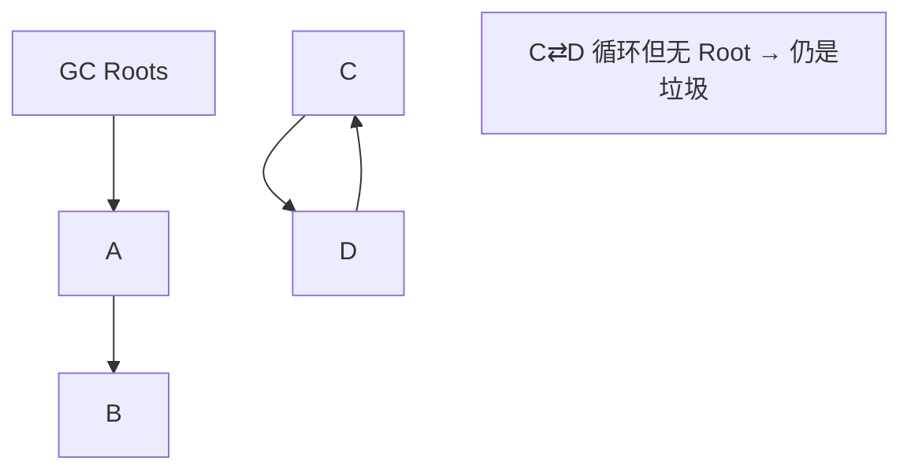
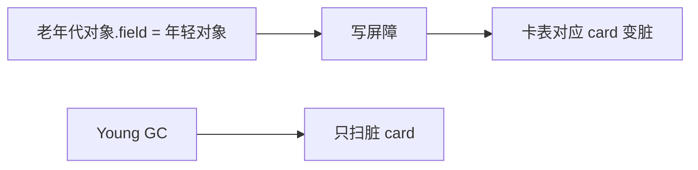

# 05 · GC 基础与算法（详解）

---

## 面试题

### Q1. GC 是什么？为什么要 GC？

**Garbage Collection：** 自动找出不再使用的对象，释放其堆内存（及可卸载的类元数据等）。

**要 GC 的原因：**

1. 手工管理易悬空指针、重复释放、泄漏  
2. 提升生产力，让开发者聚焦业务  
3. 与语言安全模型匹配（内存安全）  

**代价：** Stop-The-World 停顿、CPU、调优复杂；实时性场景要选低延迟收集器或换技术栈。

---

### Q2. 对象何时可回收？如何找垃圾？引用计数 vs 可达性分析

**判定（HotSpot）：可达性分析。**  
从 GC Roots 出发能走到的对象为存活；走不到的视为可回收（还可能经 finalize 队列，现代应避免依赖 finalize）。

**引用计数：** 每个对象记被引用次数，0 则回收。实现简单，但**循环引用**无法回收（A→B→A）。Java 主方案不用它。

| | 引用计数 | 可达性分析 |
| --- | --- | --- |
| 循环引用 | 失败 | 正确 |
| 实时性 | 可即时回收 | 批量 STW/并发标记 |
| Java | 否 | 是 |

---

### Q3. 哪些可以作为 GC Roots？

枚举常见根（答题列全）：

1. **虚拟机栈**局部变量表中的引用  
2. **本地方法栈**中的引用  
3. **方法区静态属性**引用的对象  
4. **方法区常量**引用的对象（如字符串池里的、字面量常量引用）  
5. **同步锁**持有的对象（监视器）  
6. **JNI** 本地引用  
7. 未结束的线程对象等（实现相关，可提「活跃线程」）  

---

### Q4. 垃圾回收算法有哪些？适用哪里？

#### 标记-清除 Mark-Sweep

标记存活 → 清除未标记。  
**优点：** 简单。  
**缺点：** 空间碎片；清除阶段可能慢。  
**用处：** CMS 老年代清除阶段思想。
![[Pasted image 20260821171648.png]]
#### 标记-复制 Mark-Copy

内存分两块，存活对象拷到另一块，清空原块。  
**优点：** 无碎片；吞吐好（存活少时）。  
**缺点：** 浪费一半空间（或按比例）。  
**用处：** **新生代**（Eden+Survivor）。
![[Pasted image 20260821171702.png]]
#### 标记-整理 Mark-Compact

标记后把存活对象向一端滑动，清理边界外。  
**优点：** 无碎片。  
**缺点：** 移动对象成本高，要更新引用。  
**用处：** 老年代 Serial Old、Parallel Old、Full GC 压缩。
![[Pasted image 20260821171711.png]]

![[Pasted image 20260821171726.png]]

**提问:CMS和G1分别用的什么算法?**
回答:CMS老年代用标记-清除,所以会有碎片问题,碎片太多会触发Full GC用Serial Old做标记-整理。G1整体上是基于Region的复制算法,回收时把存活对象复制到空闲Regior,所以没有碎片问题。

**提问:为什么老年代不用复制算法?**
回答:老年代对象存活率高,复制算法要复制大量对象,效率太低。新生代98%的对象活不过一次GC,复制的少,才适合用复制算法。

**提问:标记-整理为什么比标记-清除慢?**
回答:标记-整理需要移动对象,移动意味着要更新所有指指向这些对象的引用,还要保证移动过程中对象的一致性。标记-清除只是把对象标记为可回收,加到空闲链表里,不需要移动任何东西。

**提问:什么是保守式GC,为什么它不能用复制算法?**
回答:保守式GC没有精确的类型信息,不确定一个值到底是指针还是普通数字,只能保守地认为所有看起来像指针的值都是是指针。复制算法要移动对象、更新引用,但保守式GC不敢更新那些"可能是指针"的值,万一改错了就出大问题。所以只能用标记-清除这种不移动对象的算法。

#### 分代收集算法 Generational

不同代不同算法，见 [[06-分代与GC类型]]。

---

### Q5. 三色标记算法详解

并发标记时对象颜色：

| 颜色 | 含义 |
| --- | --- |
| 白 | 尚未访问到，结束后仍白 → 当作垃圾 |
| 灰 | 已访问到自身，但至少一个引用还没扫 |
| 黑 | 自身与直接引用都处理完，视为存活 |

**并发问题：**

- **多标：** 本该死的被标活 → 可容忍（浮动垃圾，下次再收）  
- **漏标：** 本该活的被当死 → **致命**（用已回收内存）  

漏标发生条件（经典）：黑色对象指向白色对象，且灰色到白色的引用被删除——发生在并发用户线程改指针时。

**对策：**

1. **增量更新（Incremental Update）：** 黑→白时记录，事后再扫（CMS 思路）  
2. **原始快照 SATB：** 强调删除引用时把「旧引用」入队，保证标记开始时的图不漏（G1 思路）  
3. 都配合 **写屏障** 在赋值时插入记录逻辑  

---

### Q6. Write Barrier / logging write barrier？卡表如何避免 Young GC 全堆扫？

**写屏障：** 在 `obj.field = ref` 这类写引用字节码处，JIT/解释器插入额外代码。

用途：

1. 维护 **卡表/RSet**（记录跨代/跨 Region 引用）  
2. 维护 SATB/增量更新所需的标记队列  

**Young GC 为何不用扫整个老年代：**  
老年代划成卡片（如每 512B），若某页存在「老→年轻」引用，写屏障把对应 **card 标脏**。Minor GC 只扫描脏卡片里的老年代对象，大幅减少扫描量。

这就是「新生代回收避免全堆扫描」的标准答案。

---

### Q7. CMS/G1 如何维持并发正确性？（收口）

- 三色标记 + 写屏障  
- CMS：增量更新 + 短暂重新标记 STW  
- G1：SATB + 最终标记  
- 浮动垃圾留给下一轮  

详见 [[08-CMS-G1-ZGC详解]]。

---

## 关联

- [[06-分代与GC类型]] · [[07-垃圾收集器总览]] · [[08-CMS-G1-ZGC详解]]
