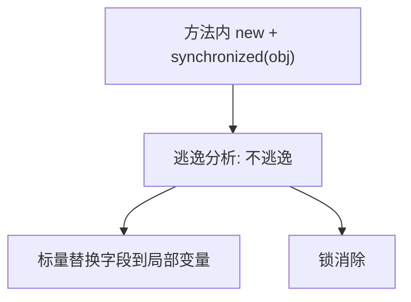

# 11 · JIT / AOT 与逃逸分析（详解）

---

## 面试题

### Q1. 什么是 JIT？如何判断热点？编译后代码放哪？

**JIT（Just-In-Time Compilation）：** 程序运行过程中，把「热」的字节码编译成本地机器码，之后直接执行机器码。

#### 热点探测（HotSpot）

1. **方法计数器：** 调用次数累计，超过阈值 → 请求方法编译  
2. **回边计数器：** 循环跳转次数，超过阈值 → **OSR（On-Stack Replacement）**，循环中途换机器码版本  

计数在方法元数据/ MDO（Method Data）中维护；还有热度衰减等策略。

#### 分层编译（典型）

- **C1：** 编译快，优化浅，适合快速升温  
- **C2：** 编译慢，优化猛（内联、逃逸分析、循环优化…）  

#### 机器码存放：**Code Cache**

- 有大小上限；满了会影响后续 JIT（日志可见 CodeCache）  
- `-XX:ReservedCodeCacheSize` 等可调  

---

### Q2. 解释执行 vs 编译执行？JVM？

| | 解释 | JIT 编译 |
| --- | --- | --- |
| 启动 | 立刻跑 | 需编译时间 |
| 优化 | 弱 | 强，且可基于运行信息 |
| 内存 | 不占 Code Cache | 占 Code Cache |

JVM：**混合**。见 [[01-组成与执行流程]]。

---

### Q3. 什么是 AOT？和 JIT 对比？

**AOT（Ahead-of-Time）：** 在运行前把程序编成本地镜像（如 GraalVM Native Image）。

| | JIT | AOT |
| --- | --- | --- |
| 时机 | 运行中 | 构建期 |
| 启动 | 相对慢（要预热） | 极快 |
| 峰值优化 | 可极致（有 profile） | 缺运行 profile，部分优化受限 |
| 反射/动态代理 | 自然支持 | 需配置闭包/可达性 |
| 场景 | 传统长跑服务 | Serverless、CLI、快速启动容器 |

AOT主要是针对Oracle推出的GraalVM这个JDK，他会在构建/打包阶段编译代码，从而将其编译为独立的二进制可执行文件，相比于JIT是在JVM运行的时候进行编译，AOT是在编译得到.class文件的时候进行编译的，编译出的产物冷启动极快，内存占用低；适合 Serverless、云原生、CLI。
构建慢；动态特性受限；缺少运行时 profile，峰值性能一般弱于充分预热的 JIT。

---

### Q4. 逃逸分析详解

**定义：** 分析对象生命周期是否「逃出」方法或线程。

| 逃逸程度 | 含义 | 可做优化 |
| --- | --- | --- |
| 不逃逸 | 仅方法内 | 栈分配 / 标量替换 / 锁消除 |
| 方法逃逸 | 返回给调用者等 | 优化受限 |
| 线程逃逸 | 被其它线程看见 | 几乎不能按线程局部优化 |

**三种经典优化：**

1. **栈上分配：** 方法结束自然灭，减轻堆与 GC  
2. **标量替换：** 对象拆成几个局部原始变量，连对象头都不要  
3. **锁消除：** 线程封闭对象上的 `synchronized` 去掉  

**注意：** 必须是服务端编译模式且开启逃逸分析；调试/某些参数会关闭；不能在业务上假设「一定栈分配」。

---

### Q5. 和对象创建、TLAB 的关系（串题）

1. 解释期/未优化：堆上 TLAB 分配  
2. JIT + 不逃逸：可能不再真正 new 堆对象  
3. 面试串：`new` 字节码还在，优化在编译后机器码层面「抵消」  

---

## 关联

- [[01-组成与执行流程]] · [[09-引用与对象创建存储]] · [[03-堆栈与直接内存]]
