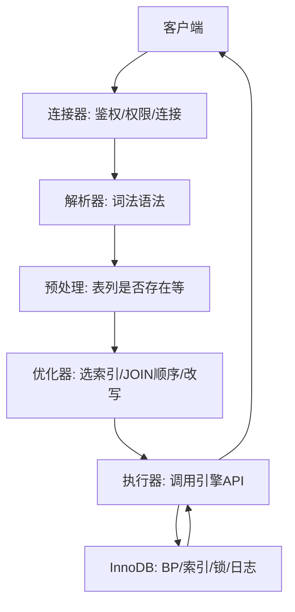

# 01 · SQL 执行与优化器（详解）

一条 SQL 从连接到返回，要按 **Server 层 → 优化器 → 执行器 → 引擎** 讲清楚，并挂上排序与慢查询排查。

---

## 面试题

### Q1. 详细描述一条 SQL 在 MySQL 中的执行过程



**分步口述：**

MySQL架构分两层:Server层负责连接管理、SQL解析、查询优化这些逻辑处理,存储引擎层负责数据的实际存取。一条SQL从发出到拿到结果,大概经过这么几步:
1. 客户端先跟MySQL建立连接,连接器负责验证账号密码和权限,确认你能对哪些库表做什么操作。
2. 老版本会先查查询缓存,看有没有一模一样的SQL缓存过结果。MySQL 8.0把这个功能砍了,因为表一更新缓存就全失小效,命中率太低。
3. 分析器对SQL做词法分析和语法分析。先把字符串拆成一个个token,识别出SELECT、表名、列名、WHERE条件这些元素;再按语法规则检查SQL写得对不对,最后生成一棵抽象语法树。
4. 优化器拿到语法树后,决定用哪个索引、多表JOIN时先查听那张表、子查询要不要改写成JOIN,最终生成一个执行计划。
5. 执行器按照执行计划,调用存储引擎的接口一行一行一行地读数救据,做条件过滤,最后把结果集返回给客户端。

连接器建连、分析器解析、优化器决策、执行器调度、存储引擎存取,这就是完整的流程。
![[Pasted image 20260811093637.png]]

**写操作额外：** undo → 改页 → redo → 提交时 binlog 与 redo 两阶段。见 [[04-事务与MVCC]]、[[06-日志与WAL]]。

**注意：** MySQL 8.0 **已移除查询缓存**；老版本答「中间可能有 query cache」即可，并说明为何被弃用。

提问:分析器和优化器有什么区别?感觉都是处理SQL的。

回答:分析器只管SQL写得对不对,不管怎么执行最快。它把SQL字符串拆成token,检查语法,生成一棵描述SQL结构的语法树。优化器拿到这棵树后,要决定具体怎么执行:用哪个索引、表连接顺序、子查询要不要改写。同一条SQL,语法树是固定的,但执行计划可能有很多种,优化器负责挑一个成本最低的。

提问:为什么MySQL8.0把查询缓存砍掉了?

回答:查询缓存的失效策略太激进了,只要表有任何写操作,这张表相关的所有缓存全部失效。高并发写的场景下,缓存几乎没有命中的机会,反而增加了维护缓存的开销。读多写少的场景用Redis这种专业缓存更靠谱,MySQL自己的查询缓存属于鸡肋功能,干脆砍了省事。

提问:执行器调用存储引擎接口,这个接口大概是什么样的?

回答:存储引擎提供的是Handler API,是一套统一的接口规范。主E要的方法有:ha_open打开表,ha_rnd_next全表扫描读下一行,ha_index_read索引定位读取,ha_write_row写入一行,ha_delete_row删除一行。不同的存储引擎实现这套接口,Server层不用关心底层是InnoDB还是MyISAM,代码一样调。这也是MySQL能支持多种存储引擎的原因。

提问:EXPLAIN看到执行计划走了索引,但查询还是很慢,可能是什么原因?

回答:几种常见情况。
第一,回表次数太多,二级索引命中了几十万行,每行都要回表查完整数据,随机IO拉垮了。
第二,索引选择性太差,比如在性别字段上建索引,过滤效果很差。
第三,返回字段太多,不是覆盖索引,大量数据传输耗时。
第四,索引树太大内存装不下,频繁从磁盘读取。看EXPLAIN重重点关注rows估算值和Extra列有没有Using filesort、Using1
temporary这些。

---

### Q2. SELECT 各子句逻辑执行顺序？

**书写顺序：**

```sql
SELECT … FROM … JOIN … ON … WHERE … GROUP BY … HAVING … ORDER BY … LIMIT …
```

**逻辑执行顺序（面试口径）：**

```text
FROM → ON → JOIN → WHERE → GROUP BY → HAVING → SELECT → DISTINCT → ORDER BY → LIMIT
```

含义：先确定行集并过滤，再聚合，再选列与去重，最后排序分页。  
因此 `WHERE` 不能引用 `SELECT` 别名；`HAVING` 可以过滤聚合结果。

---

### Q3. MySQL 中数据排序是怎么实现的？

`ORDER BY` / `GROUP BY` 可能触发排序
MySQL的排序主要有两条路，利用索引排序或者自己进行文件排序
如果`ORDER BY`正好有索引，并且排序方向一致，MySQL直接用索引排序，非常高效
如果没有命中索引或者索引顺序不对，就走文件排序，这里数据比较小就在内存中排序，数据比较大就直接在磁盘中排序，
内存中排序又分为单路排序和双路排序
- 单路排序:把所有SELECT字段都放进sort_buffer排,排完直接返回
- 双路排序:只放排序字段和行ID,排好序之后再根据row_id去读其他字段
![[Pasted image 20260811093248.png]]
提问:强行用单路排序一定比双路排序快吗?
回答:不一定。单路排序省了再根据row_id去读其他字段那次RIO,但它把所有字段都放进sort_buffer,占用内存大。如果SELECT字段很多,sort_buffer装不下,数据就得溢出到磁盘做外部排序,这时候可能反而比双路排序慢。所以字段少用单路快,字段多可能双路更合适。

提问:怎么判断一条SQL的排序是不是在内存里完成的?
回答:看sort_merge_passes这个状态变量。执行SQL前后分别:SHOW STATUS LIKE 'sort_merge_passes',如果数值增加了说明发生了磁盘外部排序,因为归并排序才会增加这个计数。也可以开启 optimizer_trace,能看到排序用了多少内存、有没有溢出。

提问:ORDERBY和GROUPBY的排序有什么区别?
回答:GROUPBY在MySQL 5.7及之前版本默认会对分组字段排序,相当于隐式加了ORDERBY。如果不需要排序可以加ORDER BY NULL去掉。MySQL 8.0改了这个行为,GROUPBY不再隐式排序,需要排序得显式写ORDERBY。另外GROUP BY可能会用到临时表,Extra里会显示Using temporary。

提问:MySQL8.0的降序索引解决了什么问题?
回答:以前索引只能升序存储,如果ORDER BY a ASC,bDEESC这种混合排序,就没法完全利用索引,b这列得filesort。
MySQL8.0支持在建索引时指定排序方向,比如CREATE INDEX idx ON t(a ASC,b DESC),这样混合排序也能直接走索引ー
了。对于分页查询场景尤其有用,比如按时间降序取最新数据。。

**优化方向：** 让排序字段走索引；减小排序行宽度（避免选大 TEXT）；控制返回量。

---

### Q4. 查询优化器如何选择执行计划？

**代价优化（CBO）：** 估算扫描行数 × 访问代价 + CPU/临时表/排序代价，取较小者。

**输入信息：**

- 表统计、索引区分度、直方图（8.0）  
- 谓词选择性、是否可覆盖、JOIN 算法（主要 Nested Loop）  

**常见改写/策略：** 条件下推、子查询物化/转 JOIN、ICP、MRR、常量折叠等。

验证：`EXPLAIN`、`EXPLAIN ANALYZE`、`optimizer_trace`。

---

### Q5. 如何用 EXPLAIN 做查询分析？

**核心列：**

| 列 | 怎么读 |
| --- | --- |
| `id` | 越大越先执行（同 id 从上到下） |
| `select_type` | SIMPLE / SUBQUERY / DERIVED… |
| `type` | 从优到劣：`system > const > eq_ref > ref > range > index > ALL` |
| `possible_keys` / `key` | 候选 vs 实际 |
| `key_len` | 用了多长索引（联合索引用了几列可估） |
| `rows` | 估计扫描行 |
| `filtered` | 过滤后剩余比例 |
| `Extra` | `Using index` 覆盖；`Using filesort`；`Using temporary`；`Using index condition`；`Using where` |

**坏味道：** 大表 `ALL`、巨大 `rows`、`Using temporary`+`filesort` 叠加、明显该用的 `key` 为 NULL。

---

### Q6. 如何定位慢查询？这条 SQL 很慢你怎么分析？

**定位来源：**

- `slow_query_log` + `long_query_time`  
- `performance_schema` / `sys` schema  
- APM、云 DAS、中间件 SQL 审计  

**分析套路（场景题按序说）：**

1. 拿完整 SQL 与执行计划：`EXPLAIN ANALYZE`  
2. 是不是索引没命中/选错？最左、隐式转换、函数？  
3. 是不是回表过多、深分页 OFFSET、JOIN 放大？  
4. 是不是锁等待、磁盘 IO、BP 命中差、实例打满？  
5. 改写 / 加索引 / 归档 / 缓存 / 读写分离 —— 改完用慢日志与计划验证  

---

### Q7. 什么是索引？（引入）

帮助快速定位数据的结构；InnoDB 以 B+ 树为主。详细见 [[03-索引与B+树]]。

---

### Q8. 什么是批量数据入库?相比单条插入有什么优势?

批量数据入库就是把多条数据攒一起,用一条SQL或一》次数据库交互一口气插进去,不是一条一条慢慢insert。

它的优势集中在两点:
1. 减少网络往返。单条插入每条数据都要客户端和数据库握一次手,10万条就是10万次RTT。批量插入一次发过去,网络开销直接降到原来的几百分之一。
2. 摊薄数据库开销。每条SQL执行都要走解析、编译、写日志这套流程,批量操作把这些固定成本分摊到几千上万条数据上,单条成本可以忽略不计。

### Q9. 什么是游标Cursor分页?相比传统LIMITOFFSET分页有什么优势?

游标分页是一种基于位置标记的分页方式,每次请求带上上一页最后一条数据的标识作为游标,直接定位到下一页的起点。传统LIMIT OFFSET分页则是从头开始数,跳过前N条再取M条。

游标分页的核心优势在两点:
1. 性能稳定:传统分页OFFSET10000要先扫描前10000条再丢弃,页码越深越慢。游标分页直接用WHERE条件跳到记点,不管第几页查询速度都差不多
2. 数据一致性好:传统分页在翻页过程中如果有新数据插入,可能出现同一条数据在不同页重复出现或者漏掉的情况。游标分页是基于固定位置往后取,不会受新增数据影响

![[Pasted image 20260811101532.png]]


### Q10. MySQL中DELETE、DROP和TRUNCATE的区别是什么?

三个命令的作用完全不同:
1. DELETE删除行数据,表结构保留。支持WHERE条件过滤,可以只删一部分。会记录日志,能回滚。
2. DROP直接把整张表干掉,数据、结构、索引全没了。不可回滚。
3. TRUNCATE清空表数据,但保留表结构。相当于DROP+CREATE,不可回滚。
从执行速度看:DROP > TRUNCATE>DELETE。DELETE最慢是因为要逐行处理并记录日志。


## 关联

- [[03-索引与B+树]] · [[08-SQL语法与调优]] · [[02-存储引擎与内存结构]]
