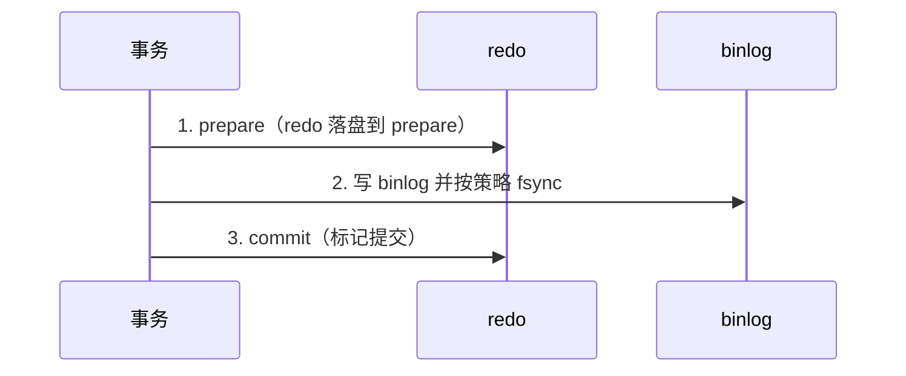

# 04 · 事务与 MVCC（详解）

事务题要把 **ACID ↔ undo/redo/锁/MVCC ↔ 隔离级别 ↔ 快照读/当前读** 串成一条链。

---

## 面试题

### Q1. MySQL 如何实现事务？ACID 各自靠什么？

InnoDB 事务不是「一个开关」，而是多组件协作：

| 特性              | 含义          | 主要实现                          |
| --------------- | ----------- | ----------------------------- |
| **Atomicity**   | 全成或全撤       | **undo log** 回滚               |
| **Consistency** | 约束与业务不变量    | 原子+隔离+约束+应用正确性                |
| **Isolation**   | 并发互不干扰到约定程度 | **锁 + MVCC**                  |
| **Durability**  | 提交后掉电不丢     | **redo log**（+ doublewrite 等） |

MySQL实现事务靠四个核心组件:Redo Log、UndoLog、锁、MVCC,它们分别对应事务ACID特性的不同方面。
1. Redo Log保证持久性。事务提交时,修改先写到redolog再写磁盘数据页。就算写数据页时宕机了,重启后通过重放redo log就能恢复数据。这就是经典的WAL机制。
2. Undo Log保证原子性。每次修改数据前,先把原值存到undolog里。事务回滚时,按undolog反向操作把数据恢复回去。要么全做完,要么全撤销,不会出现改了一半的中间状态。。
3. 锁机制(行锁、间隙锁等等)保证隔离性。两个事务同时改同一行,必须一个等另一个释放锁。InnoDB的锁粒度精确到行级,还有间隙锁防止幻读。
4. MVCC保证隔离性的读写并发。读操作不加锁,通过undo log里的版本链找到自己应该看到的数据版本。写的时候别人照样羊能读,读的时候别人照样能写,并发度直接拉满。
5. 一致性不是单独实现的,它是原子性、隔离性、持久性共同作用的结果。数据从一个正确状态转移到另一个正确状态,中间不会出现不一致。

提交还要保证 **redo 与 binlog 一致** → 内部 XA 式 **两阶段提交**。见 [[06-日志与WAL]]。

**一次更新的微观路径（口述）：**

1. 开事务，记 undo（旧值），方便回滚与 MVCC  
2. 改 Buffer Pool 中的数据页，写 redo（可先在 log buffer）  
3. 提交：redo prepare → 写 binlog → redo commit  
4. 脏页稍后刷盘；崩溃靠 redo 恢复  

提问:MVCC能解决幻读问题吗?

回答:能解决快照读的幻读,解决不了当前读的幻读。快!照读就是普通的select,走MVCC版本链,事务开始时的ReadView定死了能看到哪些数据,后面别人插入的新行看不见。但当前读比如select...for update,读的是最新数据,这时候要靠间隙锁来防幻读,锁住查询范围内的间隙不让别人插入。

---

### Q2. 隔离级别？脏读/不可重复读/幻读？默认？为什么？

**级别（弱→强）：**

MySQL事务隔离级别一共4种,隔离性从低到高分别是:读未提交、读已提交、可重复读、串行化。
1. 读未提交READ UNCOMMITTED:事务能看到别的事务还没提交的数据,等于毫无隔离可言。典型问题就是脏读,你读倒的数据可能人家一会儿就回滚了,压根没落地。
2. 读已提交READ COMMITTED:只能看到别的事务已经提交的数据,脏读问题没了,但同一个事务里两次查同一条数据,结果可能不一样,这就是不可重复读。Oracle、PostgreSQL、SQLServer默认都是这个级别。
3. 可重复读REPEATABLEREAD:事务开始后,不管别的事务怎么改数据,你看到的永远是开始那一刻的快照。MySQL InnoDB默认就是这个级别,用MVCC实现。不过标准SQL定义里,这个级别还是会有幻读问题,就是两次范围查询返回的行数不一样。
4. 串行化SERIALIZABLE:最严格的级别,相当于事务一个一个一个排队执行,等于把并发关了。InnoDB在这个级别下会把普通SELECT自动加上共享锁,能彻底杜绝所有并发问题,但性生能基本废了,实际项目很少用。

| 现象 | 定义 | 典型 |
| --- | --- | --- |
| 脏读 | 读到别的事务未提交修改 | RU |
| 不可重复读 | 同一行两次读到不同已提交值 | RC 下他事务 UPDATE |
| 幻读 | 范围结果集「多出行/少出行」 | 他事务 INSERT |

**InnoDB 对 RR 的加强：**

- **快照读**（普通 SELECT）：Read View，主要靠 MVCC，解决不可重复读；幻读在快照语义下也不见新插行  
- **当前读**（`FOR UPDATE` / UPDATE / DELETE）：加 **记录锁 + 间隙锁（Next-Key）**，阻止间隙插入，从而在当前读路径抑制幻读  

**默认 RR 的原因：** 对多数业务提供更强一致性体验，且快照读并发好。  
**有人改 RC：** 间隙锁更少，死锁率可能下降；接受「语句间可见性变化」。面试说清你们业务取舍即可。
![[Pasted image 20260811113616.png]]

主流大厂为啥选读已提交？
互联网公司基本都把隔离级别调成读已提交。原因很直接:
1. 可重复读级别下InnoDB要维护更多的undolog版本链,长事务跑起来内存消耗大
2. 可重复读的间隙锁范围更大,容易造成锁等待甚至死锁
3. 业务上大多数场景其实不需要"同一事务内数据不变"这种保证,代码层面处理好就行
阿里内部规范明确要求用读已提交,美团、字节基本也是这个套路。

InnoDB怎么解决幻读
严格来说MySQL可重复读级别没有完全消灭幻读,但InnoDE3用了两招大幅缓解:
1. 快照读走MVCC:普通SELECT读的是事务开始时的快照,别的事务新插入的行你看不到
2. 当前读加间隙锁:SELECT...FOR UPDATE这类加锁读,会锁住索引记录之间的间隙,别的事务想往这个范围插数据直接被阻塞
但有个坑:如果你先快照读,再当前读,两次结果可能不一样。这是因为快照读不加锁,当前读能看到最新提交的数据。

提问:如果我把隔离级别从可重复读调成读已提交,业务作代码需要注意什么?
回答:主要注意两点。一是同一事务里多次查询同一数据可能拿到不同结果,如果业务逻辑依赖"读到的数据在事务内不变"这个假设,就要重新审视。二是间隙锁没了,UPDATE、DELETE三的锁范围变小,并发插入的幻读问题要靠业务层或唯一索引来兜底。

提问:可重复读级别下两个事务同时SELECT...FOR UPDATE「同一行,会怎么样?
回答:先拿到锁的事务正常执行,后面那个阻塞等待。如果两个个事务互相持有对方想要的锁,就会触发死锁检测,InnoDB会回滚其中代价小的那个事务,另一个继续执行。

提问:读未提交这个级别有什么实际使用场景吗?
回答:极少,但不是完全没有。比如做大批量数据统计的离线任务,对数据一致性要求不高,只要个大概数字就行,用读未提交可以减少锁竞争提升吞吐。不过实际生产环境基本不会这么干,风险太大。

提问:为什么MySQL不把默认值改成读已提交?
回答:向前兼容。很多老系统依赖可重复读的行为,贸然改默认值会出问题。MySQL官方的态度是让用户自己根据场景选择,不替用户做决定。

---

### Q3. MVCC 是什么？Read View 怎么判可见？二级索引有快照吗？没有 MVCC 会怎样？

**MVCC = Multi-Version Concurrency Control：** 一行保留多个版本（当前页 + undo 链），读不加锁也能拿到「对自己可见」的版本。

**行隐藏列关键：**

- `DB_TRX_ID`：最后修改该行的事务 ID  
- `DB_ROLL_PTR`：指向 undo 中上一个版本  
- （无主键时还有 `DB_ROW_ID`）

**快照读 vs 当前读：**

| | 快照读 | 当前读 |
| --- | --- | --- |
| 语句 | 普通 SELECT | SELECT…FOR UPDATE / 锁读 / 改删 |
| 机制 | MVCC + Read View | 读最新版本并加锁 |
| 目的 | 读写并发 | 要最新并互斥 |

**Read View 可见性（口述版，不背源码细节）：**

创建视图时记录「活跃事务列表」等；判断某版本的 `trx_id`：

- 比自己还早且已提交 → 可见  
- 自己未开始就活跃、或未提交 → 不可见，沿 `roll_ptr` 找更旧版本  
- RC：每个 SELECT 新建 Read View；RR：事务中第一个快照读创建，后续复用（简化口径）

**二级索引有没有「MVCC 快照」？**

- 二级索引记录同样有删除标记/事务信息，可见性判断也会做  
- **不是**另建一套完整「二级快照库」；版本链主体仍在聚簇记录 + undo  
- 覆盖索引的快照读可以只扫二级；需要完整行仍回表，回表时再按可见性取版本  

**如果没有 MVCC：**

- 要隔离就只能靠锁：读阻塞写或写阻塞读，OLTP 并发崩  
- 或者牺牲隔离出现脏读  
→ MVCC 是 InnoDB 「读多写多」能扛住的核心。

![[Pasted image 20260811112226.png]]

MVCC全称Multi-Version Concurrency Control,多版本并发控制制。核心思想是让读写操作互不阻塞。
写操作修改数据时,MySQL不会立即覆盖原有数据,而是生成我新版本的记录。每个记录都保留了对应的版本号或时间戳。多版本之间串联起来就形成了一条版本链。
读操作(普通读)就可以无锁地根据事务启动时间去版本链上找到属于自己的那个版本,此时读(普通读)写操作不会阻塞。
具体实现是:InnoDB里每条记录都有两个隐藏字段
- trx_id记录最后修改这条数据的事务ID,也就是当前事务ID
- roll_pointer指向undo log的指针。
每次UPDATE不会覆盖原数据,而是把旧值写到undolog里,新值写到数据页,roll_pointer指向旧版本,这样就串成了一条版本链。
普通SELECT走的是快照读,不加锁,直接顺着版本链找找到对自己可见的那个版本返回。写操作该怎么写怎么写,读写各走各的,并发性能直接拉满。

提问:MVCC能不能解决写写冲突?
回答:不能。MVCC解决的是读写冲突,让普通读不阻塞写、写不阻塞普通读。写写冲突还是要靠锁来解决。两个事务同时UPDATE同一行,后执行的那个要等先执行的提交或回滚才能拿到锁。

提问:为什么ReadView里要记max_trx_id?只用m_ids不行吗?
回答:不行。m_ids只记录了生成ReadView那一刻的活跃事务,但事务ID是递增的,之后新启动的事务ID肯定比 m_ids里的都大。如果只用m_ids判断,新启动事务修改的数据就可能被当成已提交的看到。max_trx_id就是用来挡住这些后来者的,trx_id>=max_trx_id一律不可见。

提问:只读事务的creator_trx_id是0,那它自己修改的数救据怎么判断可见?
回答:只读事务不会有修改操作,所以不存在"自己修改的数据"这个场景。一旦有写操作,InnoDB会给这个事务分配一个真正的事务ID,creator_trx_id就不是0了。

---

### Q4. 长事务会导致哪些问题？如何治理？

1. **undo 不能 purge** → 历史版本膨胀，查询变慢、磁盘涨  
2. **锁持有时间长** → 阻塞、死锁概率升  
3. **binlog / 复制**：大事务导致主从延迟、切换风险  
4. **闪回、备份恢复** 变重；连接占用久  

**治理：** 业务拆短事务；禁止用户交互夹在事务中间；批量改分批提交；监控 `information_schema.innodb_trx` / `sys`；设置告警阈值。

---

### Q5. 事务的二阶段提交是什么？为什么需要？

目标：避免 **redo 与 binlog 不一致**（例如崩溃后引擎认为提交了但 binlog 没有 → 主从丢数；或反过来）。

崩溃恢复：

- 有完整 binlog 且 redo prepare → **提交**  
- 否则 **回滚**  

参数：`innodb_flush_log_at_trx_commit`、`sync_binlog` 影响「每次提交刷盘强度」与性能权衡（双 1 最安全）。

---

### Q6. 你们生产用什么隔离级别？为什么？

**模板答法：**

- 默认跟随 InnoDB：**RR**，业务要「同一事务多次读同一结果稳定」  
- 若观测到大量间隙锁死锁，且业务可接受语句间看见新提交，评估 **RC**，并保证关键更新靠 `WHERE` 版本号/主键精确命中  
- 无论哪级：短事务 + 合适索引 + 避免长间隙扫描更新  

---

### Q7. MySQL中长事务可能会导致哪些问题?

长事务在MySQL中会带来一系列问题,核心就是资源占用时间过长,影响整个系统的稳定性和性能。
1. 锁竞争严重,容易引发连锁反应。事务持有行锁、间隙锁的时间越长,其他事务等待的时间就越久。业务线程被阻塞后,连接池被占满,上游服务超时,搞不好就雪崩了。之前我们线上有个定时任务跑了个大事务,30秒没提交,直接把连接池打爆,整个服务挂了5分钟。
2. 死锁风险增加。事务执行时间越长,持有的锁越多,和其他事务产生循环等待的概率就越大。InnoDB虽然有死锁检测机制,但检测本身也消耗资源,而且检测到了只能回滚其中一个事务,业务还是要受影响。
3. undolog膨胀。InnoDB的MVCC机制需要保留事务开始时的数据版本,长事务不提交,这个版本链就一直不能清理。一个跑了几个小时的事务,可能导致undolog从几百MB涨到几十GB,磁盘空间告警不说,回滚段查询的性能也会变差。
4. 主从延迟。主库执行一个大事务要10分钟,binlog传到从库后,从库也要重放10分钟。这期间主从数据不一致,读从库的业务拿到的都是脏数据。
5. 回滚代价大。事务执行了20分钟,突然报错要回滚,之前的活全白干了。更惨的是回滚本身也要时间,可能又要等20分钟。
![[Pasted image 20260811111244.png]]

提问:长事务导致undolog膨胀,具体是什么原理?

回答:InnoDB用MVCC实现事务隔离,每次更新数据时会把旧版本存到undolog里,形成版本链。purge线程会定期清理不再需要的旧版本,但清理的前提是没有活跃事务需要读这些旧版本。长事务的ReadView一直不释放,它开始时刻之后产生的所有版本都不能清理,这些undolog就一直堆积。事务跑得越久,堆积得越多。

提问:怎么避免业务代码里产生长事务?

回答:几个关键点。第一,事务里不要有RPC调用或者外部1O,这些操作耗时不可控。第二,能异步的就异步,比如发消息、写日志这些可以放到事务外面。第三,大批量数据操作要分批提交,不要一个事务处理几十万条数据。第四,Spring的@Transactional注解要注意作用范围,别把整个方法都色包进去了。

提问:如果线上已经出现长事务把数据库打挂了,怎么处理?

回答:先止血再排查。
第一步用 select*from information_schema.innodb_trx找到长事务的线程ID,然后 kill掉。如果事务太大kill不掉,回滚也要时间,可能要等。
第二步检查连接池状态,必要时重启应用释放连接。
第三步看监控和慢查询日志,定位是哪个业务搞出来的长事务,从代码层面修复。

### Q8. MySQL二级索引有MVCC快照吗?

MVCC 到底存在于哪里？
MySQL InnoDB 的 **MVCC 是行级存储结构 + Read View（读视图）共同实现**，存在两处载体：

1. **聚簇索引的每条数据行（隐藏列）** 每行记录自带三个隐藏字段：
    - `DB_TRX_ID`：最后修改该行的事务 ID
    - `DB_ROLL_PTR`：回滚指针，指向 **undo log（回滚日志）** 旧版本链
    - `DB_ROW_ID`：无主键时生成行 ID
2. **Undo Log（回滚日志段）** 所有历史快照版本**不存放在索引页上**，全都串成版本链放在 undo log。

二级索引本身没有MVCC快照。
原因是二级索引条目只存了索引列值和主键值,不包含InnoDB的隐藏列trx_id和roll_ptr。没有这两个字段,就没法判断这条记录属于哪个事务版本、在undolog里往哪找历史版本。
所以当二级索引项被修改或者打了删除标记时,InnoDB必须回表到刂聚簇索引,通过聚簇索引上的trx_id和undolog版本链来判断当前事务能看到哪个版本。
一个容易踩的坑是:即使你的查询走了覆盖索引,只要涉及到版本判断,覆盖索引也会失效,还是得回表。
不过,也不是每次都会需要回表,二级索引每个页上记录了最后修改这个索引页的最大事务ID,当前事务启动时的最小活跃事务ID大于最大事务ID,则不用回表。

> 重点：**聚簇索引、二级索引的数据页只存当前最新版本，历史版本一律在 undo log。**

### Q9. 如果MySQL中没有MVCC,会有什么影响?
没有MVCC的话,读写操作就得靠加锁来保证数据一致性,这套方案叫LBCC,Lock-Based Concurrency Control。读要等写完,写也要等读完,系统吞吐量直接腰斩。
![[Pasted image 20260811113051.png]]
具体来说,事务A正在改某条记录还没提交,事务B想读这条条记录,因为没有历史版本可用,事务B只能干等着事务A提交或回滚。要是事务A执行时间长,事务B就一直卡在那部。高并发场景下锁竞争严重,性能基本废了。

MVCC的价值就在这:写操作产生新版本,读操作去版本链上找属于自己的那个版本,读写各走各的互不干扰。普通SELECT压根不加锁,并发能力直接拉满。

提问:MVCC是万能的吗?有没有MVCC也搞不定的场景景?
回答:MVCC只解决读写冲突,写写冲突还是要靠锁。两个事务同时UPDATE同一行,后来的那个必须等先来的提交或回滚。另外当前读场景,比如SELECT...FOR UPDATE,也不走MVCC,直接读最新版本加锁。

提问:如果长事务一直不提交,MVCC会有什么问题?
回答:undo log会堆积。长事务的ReadView很早,它可能需要的为历史版本就一直不能清理。极端情况下undolog占用几个G甚至几十个G。这就是为什么阿里规范里要求单个事务不不要超过5秒。

提问:LBCC就没有任何优点吗?
回答:实现简单是它最大的优点。MVCC要维护版本链、ReaddView,逻辑复杂不少。对于并发不高的场景,LBCC足够用,代码还好维护。早期很多嵌入式数据库就是纯LBCC,跑得也挺稳。

### Q10. 脏读/不可重复读/幻读？

这三个都是并发事务带来的数据一致性问题,严重程度递减。
1. 脏读:读到了别的事务还没提交的数据。万一那个事务回滚了,你读到的数据压根不存在,就像读了个"脏"数据。
2. 不可重复读:同一个事务里两次读同一行数据,结果不一样。因为中间有别的事务改了这行数据并提交了。强调的是数据内容变了。
3. 幻读:同一个事务里两次执行同样的范围查询,返回的行数不一样。因为中间有别的事务插入或删除了符合条件的数据。强调的是数据行数变了。

InnoDB怎么解决这些问题
1. 脏读:MVCC天然解决。读的是快照,没提交的数据版本不可见
2. 不可重复读:可重复读级别下,ReadView在事务开始时就固定了,后续查询复用同一个ReadView,所以同一行数据读出来永远一样
3. 幻读:快照读走MVCC看不到新插入的行;当前读用间隙锁锁住范围,别的事务插不进来
但有个坑:先快照读再当前读,当前读能看到最新数据,可能比快照读多出几行,这算幻读。

提问:不可重复读和幻读都是两次查询结果不一样,区别到底在在哪?
回答:关键看变化的是行内容还是行数量。不可重复读是同一行数据的某个字段值变了,由UPDATE或DELETE引起。幻读是符合查询条件的行数变了,由INSERT引起。从解决方案看,不可重复读靠MVCC快照就能解决,幻读还得加间隙锁才能防住。

提问:读已提交级别为什么解决不了不可重复读?
回答:读已提交级别下每次SELECT都生成新的ReadView。事务B修改数据提交后,事务A第二次查询会拿到新的ReadView,这时候事务B的修改已经提交了,对事务A可见,所以读到的值变了。可重复读级别复用第一次的ReadView,事务B提交了也看不到。

提问:既然MVCC能解决幻读,为什么还需要间隙锁?
回答:MVCC只能解决快照读的幻读,当前读还是能看到最新数据。比如SELECT...FOR UPDATE,必须读最新版本才能正确加锁。这时候要防止别的事务插入,就得靠间隙锁把范围锁住。

## 关联

- [[05-锁与并发]] · [[06-日志与WAL]] · [[02-存储引擎与内存结构]]
