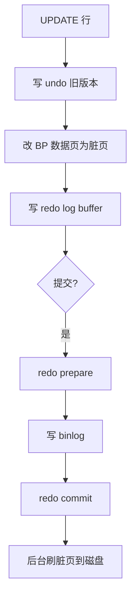

# 06 · 日志与 WAL（详解）

日志题要分清 **谁产生、记什么、干什么、刷盘策略**，并能和事务提交、主从串起来。

---

## 面试题

### Q1. MySQL 日志类型？binlog / redo / undo 区别？

**分层记忆：**

| 日志 | 层级 | 记什么 | 主要干什么 |
| --- | --- | --- | --- |
| **redo log** | InnoDB | 页级物理修改（怎么改页） | 崩溃恢复、支撑持久性（WAL） |
| **undo log** | InnoDB | 反向操作 / 旧版本 | 回滚、MVCC |
| **binlog** | Server | 逻辑（语句/行/混合） | 主从复制、时间点恢复、审计 |
| relay log | 从库 | 主库 binlog 的拷贝 | 从库重放 |
| 慢查询 / error / general | Server | 诊断信息 | 运维 |

**redo vs binlog 对比（高频）：**

| 维度 | redo | binlog |
| --- | --- | --- |
| 内容 | 物理（偏页） | 逻辑（SQL 或行前后镜像） |
| 写入时机 | 事务执行中可持续写 | 提交时 |
| 文件 | 固定大小循环写 | 追加，可归档清理 |
| 用途 | 崩溃后把页救回来 | 复制与备份恢复 |
| 引擎 | 仅 InnoDB | 所有引擎 Server 层 |

三者配合：**原子靠 undo，持久靠 redo，复制靠 binlog，提交靠二者两阶段。**

MySQL有三种核心日志,各司其职:
binlog负责主从复制和数据恢复,redolog保证崩溃后数据不丢,undolog支撑事务回滚和MVCC。
1. binlog是Server层的日志,记录的是逻辑操作,也就是原始SQL或者行变更前后的值。它的核心场景是主从同步,从库拉取主库的binlog重放一遍就能保持数据一致。另外做数据恢复的时候,也是靠binlog配合全量备份回放到指定时间点。
2. redolog是InnoDB引擎独有的,记录的是物理变更,具体就是是"某个数据页的某个偏移量改成了什么值"。它的作用是crash-safe,MySQL挂了重启后,InnoDB会用redolog把没来得及刷盘的脏页恢复出来。redolog是循环写的,空间固定,写满了就得等checkpoint推进才能继续。
3. undolog也是InnoDB的,记录的是数据修改前的旧值。事务回滚的时候,就靠undolog把数据改回去。另外MVCC的快照读也依赖它,别的事务要读历史版本,顺着undolog链往前找就行。

提问:redolog写满了会怎么样?
回答:MySQL会阻塞所有更新操作,强制推进checkpoint,把一部分脏页刷到磁盘,腾出空间后才能继续写。这时候数据库会出现明显的抖动,TPS断崖式下降。生产环境要监控redolog的使用率,发现经常接近写满就得调大innodb_log_file_size,比如从默认的48MB调到1-2GB。

提问:为什么redolog要设计成循环写?直接追加写不行吗?
回答:追加写意味着空间无限增长,磁盘迟早撑爆。redolog的目的的只是保证crash-safe,只要脏页刷盘了,对应的redo log就没用了,所以设计成固定大小循环覆盖写。checkpoint往前推进就是在标记哪些redolog已经没用了、可以被覆盖。
binlog之所以追加写,是因为它还要用来做主从复制和历史数据恢复,得长期保留。

提问:binlog有哪几种格式?各有什么优缺点?
回答:三种格式:
1. statement格式记录原始SQL,日志量小但可能导致3主从不一致,比如now()函数在主从执行时间不同
2. row格式记录行变更前后的完整数据,日志量大但绝对安全全,生产环境基本都用这个
3. mixed格式自动判断,普通语句用statement,有风险的月row,实际很少用因为判断逻辑不够智能

提问:undolog什么时候会被清理?
回答:当没有任何事务需要用到这个版本的undo log时才能清理。具体来说,就是所有活跃事务的ReadView都不需要看这个旧版本了。InnoDB有个purge线程专门干这事,它会定期扫描,把没人用的undolog回收掉。如果有长事务一直不提交,undolog就会堆积,回滚段撑爆,这就是为什么要避免大事务和长事务。

---

### Q2. 插入一条 SQL，redo 记录的是什么？

**不是**整条 `INSERT` 文本，而是对该表相关 **数据页 / 索引页** 的修改描述（页号、位置、变更内容等物理重做信息）。

可能涉及：聚簇索引页插入、二级索引页维护、undo 页本身变更等也会进 redo。

刷脏页前只要 redo 在，崩溃就能重放到一致状态（配合 checkpoint）。

---

### Q3. 什么是 WAL？优点？MySQL 用到了吗？

**Write-Ahead Logging：** 修改数据前，先保证日志持久（或按策略持久），再刷脏页。

**优点：**

1. 日志多 **顺序写**，吞吐远好于大量随机刷脏页  
2. 崩溃可用日志恢复，允许脏页晚刷  
3. 在「持久性」和「性能」之间用刷盘策略调节  

**MySQL：**

- InnoDB **redo = 经典 WAL**  
- binlog 在提交路径上同样「先落日志再认为事务成功对外可见」（与 redo 两阶段绑定）  

`innodb_flush_log_at_trx_commit`：

- `1`：每次提交 redo fsync（最安全）  
- `2`：提交写 OS 缓存，OS 刷盘  
- `0`：周期性刷（性能好、掉电风险大）  

---

### Q4. 事务日志与恢复机制怎么讲？

**崩溃恢复（实例重启）：**

1. 从 checkpoint 推进，用 **redo** 重做需要的页修改  
2. 未提交事务用 **undo** 回滚  
3. 处于 prepare 的事务看 **binlog 是否完整** 决定提交或回滚（两阶段）  

**时间点恢复（误删等）：**

全量备份 + 从备份点重放 **binlog** 到指定时刻。

**主从：**

主库 binlog → 从库 relay → SQL/并行 worker 应用。见 [[09-高可用主从读写分离]]。

---

### Q5. 口述一条更新从执行到刷盘的日志视角

脏页刷盘前进程崩：靠 redo 救；未提交：靠 undo 回滚。

---

## 关联

- [[04-事务与MVCC]] · [[02-存储引擎与内存结构]] · [[09-高可用主从读写分离]]
