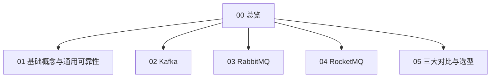

# 消息队列 · 知识总览

消息队列面试专题（详细口述版），按 **通用问题 + Kafka / RabbitMQ / RocketMQ** 分册。  
查题：[[06-题单总索引]]

## 知识地图

## 建议精读顺序

1. **[[01-基础概念与通用可靠性]]**（必问：丢失/幂等/顺序/堆积/推拉）  
2. 按岗位深挖：**[[02-Kafka]]** 或 **[[03-RabbitMQ]]** 或 **[[04-RocketMQ]]**  
3. [[05-三大对比与选型]] 收口场景题  

## 节点一览

| 节点 | 你会讲到 |
| --- | --- |
| [[01-基础概念与通用可靠性]] | 是什么、为什么、模型、术语、推拉、不丢、幂等、有序、堆积 |
| [[02-Kafka]] | 高性能、事务、索引、时间轮、ZK/KRaft、请求与控制器流程 |
| [[03-RabbitMQ]] | AMQP、交换机、确认、死信、延迟、集群、镜像/Quorum、流控 |
| [[04-RocketMQ]] | NameServer、事务消息、延迟消息、与 Kafka 差异 |
| [[05-三大对比与选型]] | 场景选型对比表 |
| [[06-题单总索引]] | 全量题对照 |
