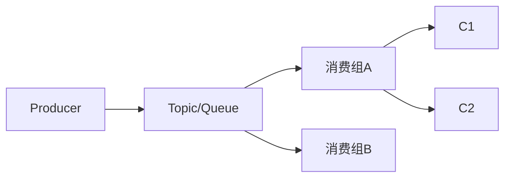
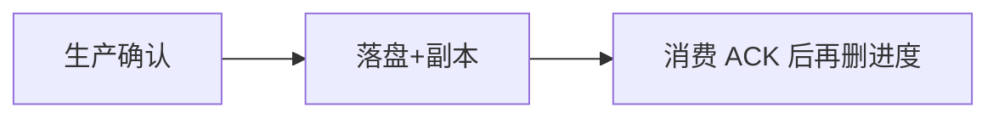

# 01 · 基础概念与通用可靠性

三大中间件细节见分册；本章是 **跨 MQ 必答题**，面试先把这套口径讲顺。

---

## 面试题

### Q1. 什么是消息队列？

**消息队列（Message Queue）：** 在应用之间传递消息的中间件，发送方把消息放入队列/主题，接收方异步消费。  
本质是 **异步解耦的缓冲通道**：削峰、解耦、最终一致、广播/订阅。

---

### Q2. 为什么需要消息队列？

| 诉求 | 说明 |
| --- | --- |
| **解耦** | 下单服务不必同步调积分/短信/库存多个下游 |
| **异步** | 主链路快速返回，慢逻辑后台消化 |
| **削峰填谷** | 流量洪峰先进队列，消费者按能力拉取 |
| **广播** | 一条消息多个消费者组各自处理 |
| **最终一致** | 配合本地消息表/事务消息做跨服务数据一致 |

**代价：** 复杂度↑、重复消费、顺序、堆积、运维与排查成本。不是银弹，同步能搞定且要强一致时别硬上。

---

### Q3. 消息队列模型有哪些？

1. **队列模型（点对点）：** 一条消息通常只被一个消费者拿走（竞争消费）。RabbitMQ 经典队列观感强。  
2. **发布订阅（Pub/Sub）：** 一条消息可被多个订阅者各自消费。Kafka **Consumer Group**、RocketMQ 消费组是典型。  
3. **混合：** 很多产品同时支持「组内竞争、组间广播」。

---

### Q4. 核心术语有哪些？

| 术语 | 含义 |
| --- | --- |
| Producer / Consumer | 生产、消费 |
| Broker | 消息服务节点 |
| Topic / Queue | 逻辑分类；实现上可能再分 Partition/Queue |
| Partition / Queue | 并行单元；常与有序、扩展相关 |
| Consumer Group | 组内分担、组间独立 |
| Offset / Cursor | 消费进度 |
| ACK / Commit | 消费确认 |
| Retention | 保留策略（时间/大小） |
| ISR / 副本 | 高可用复制集合（Kafka 语境） |
| Exchange / Binding | RabbitMQ 路由概念 |
| NameServer / ZK / KRaft | 注册与元数据 |

---

### Q5. 推还是拉？优缺点？

| | Push 推 | Pull 拉 |
| --- | --- | --- |
| 特点 | Broker 主动推给消费者 | 消费者按能力拉取 |
| 优点 | 实时性好 | 消费速度自控，不易压垮消费者 |
| 缺点 | 消费者慢时易堆积在客户端/打满 | 空轮询有开销；延迟取决于拉取周期 |
| 现实 | RabbitMQ 偏推（可配 QoS） | Kafka / RocketMQ 偏长轮询拉 |

很多系统是 **长轮询**：像拉，但 Broker 在有数据或超时才返回，兼顾实时与背压。

---

### Q6. 如何保证消息不丢失？

分三段：**生产 → Broker 存储 → 消费**。

1. **生产侧：** 同步发送 + 成功回调/返回；失败重试；事务/本地消息表防「业务成功消息没发」。  
   - Kafka：`acks=all` + 足够 ISR  
   - Rabbit：`publisher confirm` + 持久化  
   - RocketMQ：同步发送 / 事务消息  
2. **Broker 侧：** 持久化；副本；刷盘策略（性能与安全权衡）。  
3. **消费侧：** **先处理成功再 ACK**；失败不 ACK 或 NACK 重投；注意幂等。  

极端不丢：生产确认 + 多副本写成功 + 消费幂等 + 监控告警；无法 100% 且零重复，通常是 **至少一次 + 幂等**。

---

### Q7. 如何处理重复消息（幂等）？

MQ 常是 **At-least-once**，重复不可避免（超时重试、再平衡、ACK 丢失）。

**手段：**

1. 业务唯一键：`消息ID / 业务单号` 建唯一索引，插入失败即重复  
2. 状态机：只允许「待支付→已支付」一次跃迁  
3. Redis `SETNX` + 过期（注意可靠性）  
4. Token / 版本号乐观锁  

口诀：**中间件难恰好一次，业务必须幂等。**

---

### Q8. 如何保证有序性？

**全局有序：** 单分区/单队列 + 单消费者，吞吐差，慎用。  

**分区有序（常用）：** 同一业务键（订单号）哈希到同一 Partition/Queue，该分区内单线程消费或顺序处理。

注意：多消费者抢同一分区会乱序；消费失败重试插队也可能乱 → 失败入死信/重试队列时要设计顺序策略。

---

### Q9. 如何处理消息堆积？

1. **扩容消费者**（分区/队列数要够，否则扩人无效）  
2. 优化消费：批量、异步、降级非关键逻辑  
3. 临时话题：冷热分离、丢弃过期、旁路到大数据  
4. 生产限流；查是否慢 SQL/下游故障导致消费变慢  
5. Kafka 可增分区（注意键哈希变化）；Rabbit 加队列与消费者  

---

## 关联

- [[02-Kafka]] · [[03-RabbitMQ]] · [[04-RocketMQ]] · [[05-三大对比与选型]]
