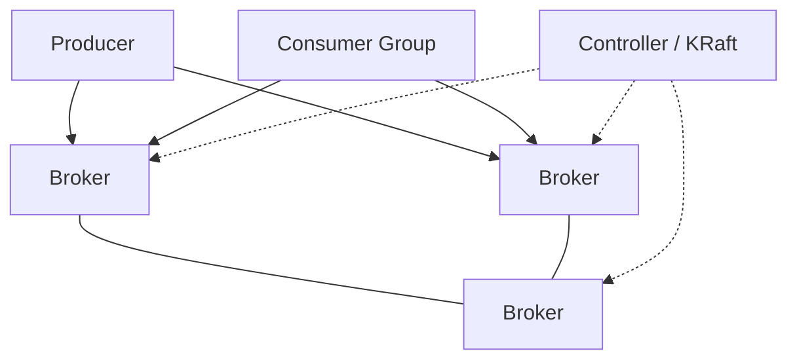
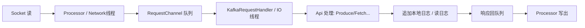

# 02 · Kafka

Kafka 定位：**高吞吐分布式日志 / 流平台**。面试重点：高性能、分区副本、消费组、事务、ZK→KRaft、部分源码流程。

---

## 架构速览

- **Topic → Partition → Segment（.log + 索引）**  
- 副本：Leader / Follower；**ISR**（同步副本集合）  
- 消费：Group 内分区互斥分配  

---

## 面试题

### Q1. Kafka 为什么性能高？

口述抓这几条：

1. **顺序写磁盘：** 追加 log，机械盘顺序写极快  
2. **零拷贝：** `sendfile` 等减少用户态拷贝（文件→网卡）  
3. **批量 + 压缩：** Producer 攒批、Broker 端批处理；压缩比高  
4. **分区并行：** 吞吐水平扩展  
5. **页缓存：** 热数据走 OS PageCache，少刷强制 fsync（可配）  
6. **拉取模型 + 长轮询：** 消费者按能力拉，Broker 压力可控  

---

### Q2. Kafka 事务消息如何实现？

用于 **Exact once 语义（幂等生产 + 事务）**，常服务「读-处理-写」或「多分区原子写」。

要点：

1. Producer 开启幂等：`enable.idempotence`，PID + 序号去重  
2. 事务：`transactional.id`，经 **Transaction Coordinator**  
3. `beginTransaction → send → commitTransaction / abort`  
4. 内部用 **事务标记（控制消息）** 与 `__transaction_state` 等内部 Topic  
5. 消费端用 `isolation.level=read_committed` 才看不到未提交消息  

与 RocketMQ「本地事务半消息」不同：Kafka 事务偏 **多分区原子写入与 EOS 流水线**，不直接替你做「本地 DB + 发消息」的二阶段，业务常还要配合 Outbox。

---

### Q3. 时间轮实现了解吗？

Kafka 用 **分层时间轮（TimingWheel）** 做延时任务（如请求超时、延迟操作），避免海量 `Timer` 任务的 O(n) 成本。

- 圆环格子 + 当前指针；任务挂到对应 tick  
- 时长超出一层 → **落到上一层时间轮**，降级再拨入  
- 与 Netty/RocketMQ 时间轮思想类似：O(1) 添加取消（摊销）  

常考点：为什么不用每个任务一个延迟队列扫描 —— 时间轮更适合大量超时。

---

### Q4. 索引设计有什么亮点？

每个分区目录下多个 **Segment**：`00000000000000000000.log` + `.index` + `.timeindex`。

| 文件 | 作用 |
| --- | --- |
| `.log` | 消息追加日志 |
| `.index` | **偏移量稀疏索引**：offset → 文件位置 |
| `.timeindex` | 时间戳 → offset，支持按时间删/查 |

**亮点：**

1. **分段：** 删除过期 = 删整段文件，高效  
2. **稀疏索引：** 索引小，可内存映射；查找先定位段再二分 + 顺序扫一小段  
3. **追加不改历史：** 简单可靠  

---

### Q5. Zookeeper 在 Kafka 中的作用？为什么抛弃？

**旧架构 ZK 职责：**

- Broker 注册、Topic/分区元数据  
- Controller 选举  
- 配置动态变更、ACL 等（随版本变化）  

**痛点：** 运维两套系统；ZK 成为元数据瓶颈与故障域；大规模分区时 ZK 压力大。

**KRaft（弃 ZK）：** 用 Kafka 自身基于 Raft 的 Controller 法定人数管理元数据，元数据成为 **内置 Topic/日志**，部署更简、扩展更好。新版本默认走向 KRaft。

---

### Q6. 控制器事件处理全流程？（源码向口述）

Controller 是集群「大脑」（ZK 时代唯一 Active Controller；KRaft 为 Controllers 法定人数）。

**典型事件流（口径）：**

1. 监听元数据变化（ZK watch / KRaft 元数据日志）  
2. 事件进入 **Controller 事件队列**（单线程有序处理，避免并发改元数据）  
3. 处理类型举例：`ReplicaStateMachine`、`PartitionStateMachine`、Broker 上下线、Leader 选举、ISR 收缩扩展、Topic 变更  
4. 计算结果通过 **请求（LeaderAndIsr / UpdateMetadata 等）** 下发给 Broker  
5. Broker 应用状态，客户端经元数据刷新感知新 Leader  

口诀：**事件串行入队 → 状态机迁移 → 下发 RPC → Broker 执行。**

---

### Q7. Broker 处理请求的全流程？（源码向口述）

1. **Acceptor** 接连接，分配给 **Processor（网络线程）**  
2. 解析出 Request 放入 **RequestChannel**  
3. **Handler 线程池** 取请求，按 API Key 分发（Produce、Fetch、Metadata…）  
4. Produce：校验 → 追加 Leader 日志 → 按 `acks` 等待副本 → 响应  
5. Fetch：读本地（零拷贝出网）→ 响应  
6. 全程可带限流、 purgatory（延迟响应，如等 ISR）  

---

### Q8. 通用可靠性在 Kafka 上怎么落？

- 生产：`acks=all`，`retries`，幂等  
- 副本：`min.insync.replicas>=2`  
- 消费：处理成功再提交 offset；关闭自动提交或谨慎提交  
- 不丢与不重不可兼得完美，用幂等收口  

---

## 关联

- [[01-基础概念与通用可靠性]] · [[04-RocketMQ]] · [[05-三大对比与选型]]
