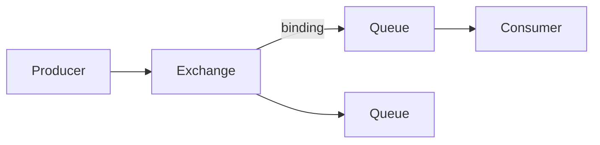

# 03 · RabbitMQ

RabbitMQ：基于 **AMQP** 的成熟 Broker，路由灵活，适合业务消息、复杂路由、中等吞吐。本章覆盖架构、可靠性、死信延迟、集群与高阶题。

---

## 面试题

### Q1. RabbitMQ 是什么？应用场景？基本架构与核心组件？

**是什么：** 开源消息中间件，实现 AMQP（也支持 MQTT/STOMP 等插件协议）。

**场景：** 订单异步、削峰、RPC 回调、延迟任务、复杂路由（主题订阅）、微服务解耦。

**核心组件：**

| 组件 | 作用 |
| --- | --- |
| Producer | 发消息到 Exchange |
| Exchange | 按规则路由 |
| Binding | Exchange 与 Queue 的绑定关系 + binding key |
| Queue | 存消息，供消费 |
| Consumer | 取消息并 ACK |
| Channel / Connection | 信道复用连接 |
| vhost | 虚拟主机，隔离权限与资源 |
| Broker / Node | 服务节点 |

---

### Q2. AMQP 协议？主要角色/概念？

**AMQP：** 应用层消息协议，规定连接、信道、交换器、队列、路由、确认等模型，解决「不同语言/厂商消息互通」的标准问题。

**角色概念：** Connection、Channel、Exchange、Queue、Binding、Routing Key、ACK、vhost、Broker。

---

### Q3. 生产者和消费者？如何声明队列？必要参数？

- **Producer：** 连 Broker，选 Exchange，带 routing key 发消息  
- **Consumer：** 订阅 Queue，收消息并 ACK/NACK  

**声明队列常见参数：**

- `durable`：队列定义是否持久  
- `exclusive`：独占连接  
- `autoDelete`：无人用时删  
- 参数 map：`x-message-ttl`、`x-max-length`、`x-dead-letter-exchange` 等  

---

### Q4. 交换机类型？routing key / binding key？长度？工作方式？路由策略？

| 类型 | 工作方式 |
| --- | --- |
| **direct** | routing key **=** binding key 才投递 |
| **topic** | 模式匹配：`*` 一字，`#` 多字 |
| **fanout** | 广播到所有绑定队列，忽略 key |
| **headers** | 按消息头匹配（少用） |

**routing key：** 发送时指定。  
**binding key：** 绑定时指定。  
**最大长度：** 均为 **255 字节**。

---

### Q5. 工作模式有哪些？

1. 简单队列：一对一  
2. Work Queues：多消费者竞争同一队列  
3. Publish/Subscribe：fanout  
4. Routing：direct  
5. Topics：topic  
6. RPC：reply-to + correlation id  

---

### Q6. 如何确保消息不丢失？持久化？确认机制？极端不丢？

**三板斧：**

1. **生产：** Publisher Confirm（或事务，更慢）；失败重发  
2. **存储：** 队列 `durable` + 消息 `deliveryMode=2`（持久）+ 镜像落地；集群用镜像/Quorum  
3. **消费：** 手动 ACK，处理成功后再 ACK；失败 NACK/requeue 或进死信  

**Confirm：** Broker 将消息路由到队列（持久则落盘策略满足）后回 ack 给生产者。  
**事务机制：** `txSelect/txCommit/txRollback`，与 Confirm 二选一，事务更重，生产更常用 Confirm。  

**极端：** Confirm + 持久化 + Quorum/镜像 + 手动 ACK + 幂等 + 磁盘与监控；仍建议至少一次语义。

---

### Q7. prefetch？未被确认的消息？批量消费？

- **prefetch（basic.qos）：** 限制 Channel/Consumer 未 ACK 的消息数，实现公平分发、背压，防一轮推太多撑爆消费者。  
- **未确认：** 连接断开会 **重新投递** 给其他消费者（可能重复）→ 要幂等。  
- **批量：** 应用层一次拉多条处理；或累积 ACK（`multiple=true`）但要小心失败边界。

---

### Q8. TTL？死信？无法路由去哪？何时进死信交换机？延迟队列？

**TTL：** 消息 TTL 或队列 `x-message-ttl`；到期未消费变死信。

**无法路由：**  
- 默认丢弃；  
- 或 mandatory + Return 回生产者；  
- 或备选交换器（Alternate Exchange）。

**进入 DLX 常见原因：**

1. 消息被 reject/nack 且 `requeue=false`  
2. TTL 过期  
3. 队列达 `x-max-length` 丢弃策略指向 DLX  

**死信队列：** 为 DLX 绑定的普通队列，用于失败隔离、延迟重试。

**延迟消息实现：**

1. TTL + DLX：过期进死信队列当「到期投递」（延迟精度与队头阻塞问题：同队列不同 TTL 会堵）  
2. **插件 `rabbitmq_delayed_message_exchange`**：延迟交换器  
3. 业务：定时轮询 / 时间轮服务  

---

### Q9. 顺序性？重复消费？堆积？最大长度？流控？

- **顺序：** 单队列单消费者；或同一业务键进同一队列且单线程消费；多消费者会乱序。  
- **重复：** 至少一次；业务幂等（见 [[01-基础概念与通用可靠性]]）。  
- **堆积：** 扩消费者、提速、限流生产、`x-max-length` + 溢出丢弃/死信、加队列分片。  
- **最大长度：** 声明参数 `x-max-length` / `x-max-length-bytes`，溢出行为 `x-overflow`（reject-publish / drop-head）。  
- **流控 Flow Control：** 内存/磁盘告警时阻塞或抑制连接发布，保护 Broker 不被打爆。

---

### Q10. vhost？持久 vs 非持久队列？

- **vhost：** 权限与资源隔离（多租户），连接时指定。  
- **持久队列：** 定义与（配合持久消息）重启后还在；非持久重启丢失。元数据持久 ≠ 每条消息已刷盘，消息也要持久。

---

### Q11. 集群模式？节点如何同步？镜像队列？Quorum？分区？高可用？

**集群：** 多个节点共享用户/拓扑元数据；**默认队列数据只在节点本地**（普通集群）。

**镜像队列（经典 HA）：** 队列在多节点镜像复制；有 master/slave；脑裂与性能有历史包袱，新版更推荐 Quorum。

**Quorum Queue：** 基于 Raft 多数派复制，更现代的高可用队列，替代镜像的主流方向。

| | 镜像队列 | Quorum Queue |
| --- | --- | --- |
| 协议 | 主从镜像 | Raft 多数 |
| 推荐度 | 遗留 | 新项目优先 |
| 场景 | 旧 HA | 可靠业务队列 |

**节点同步：** 元数据集群同步；队列内容按队列类型复制（镜像/Quorum）。  

**网络分区：** 可能脑裂；配置 `cluster_partition_handling`（pause_minority 等）；Quorum 靠多数派更清晰。  

**高可用实现：** 集群 + Quorum/镜像 + 负载均衡入口 + 持久化 + 监控；跨机房再考虑联邦/Shovel。

---

### Q12. 插件？与 Kafka 对比场景？

**常用插件：** 延迟消息、管理台 management、联邦 federation、Shovel、MQTT、一致性哈希交换器等。`rabbitmq-plugins enable xxx`。

**对比见 [[05-三大对比与选型]]：** Rabbit 灵活路由与业务消息；Kafka 日志流与大数据吞吐。

---

## 关联

- [[01-基础概念与通用可靠性]] · [[05-三大对比与选型]]
