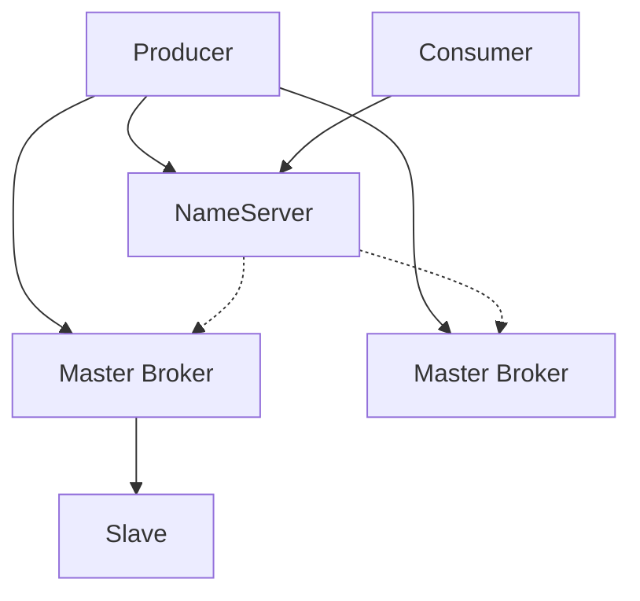
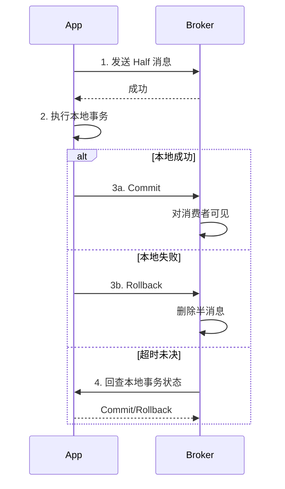

# 04 · RocketMQ

RocketMQ：阿里开源，面向业务消息与电商级交易链路，具备 **事务消息、延迟消息、堆积能力** 等特色。开发时参考了 Kafka 的日志思想，但架构与功能取向不同。

---

## 架构速览

- **NameServer：** 路由注册与发现（无选主，节点间弱一致）  
- **Broker：** 存消息；主从同步  
- **Topic / Queue：** 队列是并行与有序单元  

---

## 面试题

### Q1. 为什么不用 ZK 做注册中心，而用 NameServer？

| 点 | 说明 |
| --- | --- |
| 定位 | NameServer **只做路由**，不做强一致中心协调 |
| 简洁 | 无 ZK 运维负担；自身水平扩展，节点间互不通信或极少协调 |
| 可用性 | 单 NS 挂了，只要还有 NS，Broker 心跳上报即可；客户端可拿多 NS 地址 |
| 一致性 | 路由是 **最终一致**（心跳周期），可接受短暂脏路由 |

ZK 更重（选主、强一致），RocketMQ 刻意把元数据方案做轻。Kafka 后来用 KRaft 也是为摆脱 ZK，但实现路径不同。

---

### Q2. RocketMQ 事务消息如何实现？

经典 **半消息 + 本地事务 + 回查**：

1. 发 **Half/Prepare** 消息（消费者暂时不可见）  
2. 执行本地 DB 事务  
3. 成功则 **Commit**，失败 **Rollback**  
4. 若 Broker 一直没收到最终状态 → **反查** Producer 实现的事务监听器  

**缺点：**

1. 实现与运维复杂；要正确实现回查  
2. 半消息阶段占用资源；回查有延迟，最终一致非同步强一致  
3. 回查失败/悬挂要治理  
4. 对 Producer 可用性有依赖  

**其他事务消息实现：**

- **本地消息表 / Outbox：** 与业务同事务写「待发送」，异步任务发 MQ，最常用最稳  
- **Kafka 事务：** 偏多分区 EOS，不直接解决本地 DB  
- **最大努力通知 + 对账**  
- **Seata TCC/AT** 等分布式事务（另一条路）  

---

### Q3. 延迟消息怎么实现？

RocketMQ 支持 **定时/延迟级别**（开源版常见固定 delay level，如 1s/5s/…；新版本有定时消息增强）。

**实现口径：**

1. 延迟消息先写到 **内部延迟 Topic / Schedule 服务** 相关存储  
2. 定时线程（含时间轮思想）到期后，投递到 **真实 Topic**  
3. 消费者只订阅业务 Topic，到期才看到  

与 Rabbit「TTL+DLX」不同：RocketMQ 侧原生调度，业务更省心（注意开源级别限制 vs 商业版任意时刻）。

---

### Q4. 参考了 Kafka，架构和功能上有何区别？

| 维度 | Kafka | RocketMQ |
| --- | --- | --- |
| 元数据 | ZK → KRaft | NameServer |
| 存储 | 分区日志 Segment | CommitLog + ConsumeQueue（逻辑队列索引） |
| 吞吐 | 极大，日志/流擅长 | 高，偏业务消息 |
| 事务消息 | EOS/多分区事务 | **半消息事务** 更贴「本地事务+发消息」 |
| 延迟消息 | 无原生（需 Kafka 外系统） | **原生延迟/定时** |
| 过滤 | 有限 | SQL/Tag 过滤丰富 |
| 堆积 | 优秀 | 优秀（专为海量堆积设计） |
| 生态 | 大数据/流处理极强 | 阿里云生态、Java 业务集成多 |

**CommitLog 亮点：** 所有 Topic 混合顺序追加一条大日志，再靠 ConsumeQueue 做队列索引 —— 写磁盘更顺序，读靠索引。这是与 Kafka「按分区文件」的重要差异。

---

### Q5. 可靠性 / 顺序 / 堆积在 RocketMQ？

- 不丢：同步发送、主从、刷盘；事务消息或本地消息表  
- 顺序：同一 MessageQueue + 顺序消费  
- 堆积：扩消费组内线程与 Queue 数；优化消费；监控堆积 lag  

通用原则见 [[01-基础概念与通用可靠性]]。

---

## 关联

- [[02-Kafka]] · [[05-三大对比与选型]] · [[01-基础概念与通用可靠性]]
