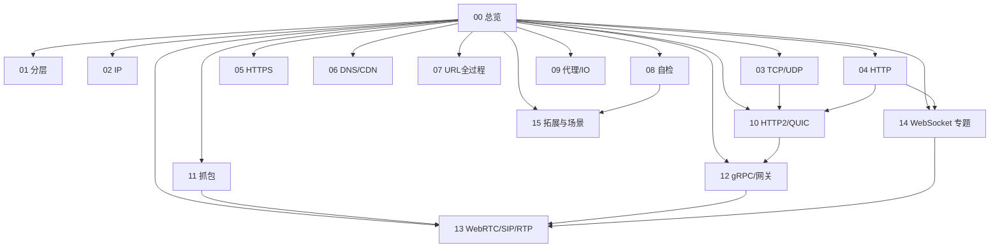

# 00 · 知识总览

面试按「知识节点」复习。流程题带 mermaid。含通用网络 + **AI 电话实时通信**专项 + **拓展场景**。

## 知识地图

| 节点 | 文件 | 内容侧重 |
| --- | --- | --- |
| 01 | [[01-网络分层模型]] | OSI / TCP/IP、封装、冲突域/广播域、端到端 |
| 02 | [[02-IP与网络层]] | IP / ARP / DHCP / NAT / 分片 / VLAN / 路由 |
| 03 | [[03-TCP与UDP]] | 握手挥手、可靠、**状态机、CUBIC/BBR** |
| 04 | [[04-HTTP]] | 报文、缓存、CORS、Cookie、Range、状态码 |
| 05 | [[05-HTTPS与安全]] | TLS、证书、鉴权、XSS/CSRF、mTLS |
| 06 | [[06-DNS与应用层]] | DNS 记录 / CDN / DoH / HTTPDNS |
| 07 | [[07-输入URL全过程]] | 综合串讲、TTFB、重定向、代理环境 |
| 08 | [[08-高频对比与场景题]] | 速记自检、场景速答 |
| 09 | [[09-代理负载与网络IO]] | 代理、epoll、backlog、排障 |
| 10 | [[10-HTTP2与QUIC]] | **帧/流、QUIC、H3** |
| 11 | [[11-抓包看图说话]] | **Wireshark 口述题** |
| 12 | [[12-gRPC与网关治理]] | **gRPC、限流熔断超时** |
| 13 | [[13-实时通信-WebRTC-SIP-RTP]] | **AI 电话：SIP/RTP/WebRTC** |
| 14 | [[14-WebSocket]] | **WebSocket 专题** |
| 15 | [[15-拓展知识与场景题]] | **安全边角、性能、云原生、综合场景** |

## 本轮加厚索引（2026-08）

### 基础加厚

- [[01-网络分层模型]]：端口/PDU/冲突域、端到端、控制面数据面  
- [[02-IP与网络层]]：NAT 类型、分片与 PMTUD、VLAN、ECMP、Anycast、ARP 欺骗  

### 应用层加厚

- [[04-HTTP]]：Cookie 属性、ETag、Range、状态码辨析、请求走私意识  
- [[05-HTTPS与安全]]：证书类型、OCSP/CT、mTLS、PFS、OAuth 交叉  
- [[06-DNS与应用层]]：记录类型、DoH/DoT、TTL、CDN 动态加速  
- [[07-输入URL全过程]]：重定向、H 版本协商、TTFB 拆解、App vs 浏览器  

### 工程与拓展

- [[09-代理负载与网络IO]]：LVS/Nginx、backlog、REUSEPORT、ET/LT、真实 IP  
- [[08-高频对比与场景题]]：对比表扩写 + 场景速答  
- **新增** [[15-拓展知识与场景题]]：SSRF、慢速攻击、Bufferbloat、K8s/Mesh、综合排障  

## 建议复习路线

**通用后端：** 01→02→03→04→05→07→09→10→11→12→08→**15**  

**AI 电话加餐：** 先 03 + **[[14-WebSocket]]** → **13** → 11（抓包）→ 12（ASR/TTS 治理）  

**考前一天：** 只刷 [[08-高频对比与场景题]] + [[15-拓展知识与场景题]] 口述。

## 题量

模块加厚 + 拓展专篇后约 **220+** 题量级（含各文件「拓展」题）。从本页链接进入即可。
