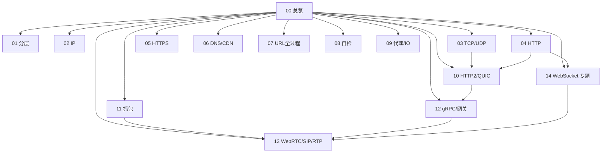

# 00 · 知识总览

面试按「知识节点」复习。流程题带 mermaid。含通用网络 + **AI 电话实时通信**专项。

## 知识地图

| 节点 | 文件 | 内容侧重 |
| --- | --- | --- |
| 01 | [[01-网络分层模型]] | OSI / TCP/IP |
| 02 | [[02-IP与网络层]] | IP / ARP / DHCP / NAT |
| 03 | [[03-TCP与UDP]] | 握手挥手、可靠、**状态机、CUBIC/BBR** |
| 04 | [[04-HTTP]] | 报文、缓存、CORS、WS 入门对比 |
| 05 | [[05-HTTPS与安全]] | TLS、鉴权、XSS/CSRF |
| 06 | [[06-DNS与应用层]] | DNS / CDN / SEO |
| 07 | [[07-输入URL全过程]] | 综合串讲 |
| 08 | [[08-高频对比与场景题]] | 速记自检 |
| 09 | [[09-代理负载与网络IO]] | 代理、epoll、排障 |
| 10 | [[10-HTTP2与QUIC]] | **帧/流、QUIC、H3** |
| 11 | [[11-抓包看图说话]] | **Wireshark 口述题** |
| 12 | [[12-gRPC与网关治理]] | **gRPC、限流熔断超时** |
| 13 | [[13-实时通信-WebRTC-SIP-RTP]] | **AI 电话：SIP/RTP/WebRTC** |
| 14 | [[14-WebSocket]] | **WebSocket 专题（握手/帧/心跳/集群/可靠）** |

## 本轮新增索引

### TCP 进阶 → [[03-TCP与UDP]]

- TCP 状态机全表  
- CUBIC vs BBR vs Reno  

### HTTP/2 与 QUIC → [[10-HTTP2与QUIC]]

- 流与帧、帧类型、HPACK、流控  
- QUIC 相对 TCP+H2 的优势、CID 连接迁移、0-RTT、H3  

### 抓包看图说话 → [[11-抓包看图说话]]

- 握手/重传/RST/ZeroWindow/HTTPS 密文  
- 页面慢瀑布图；电话场景 SIP/RTP/ICE 抓包模板  

### gRPC 与网关 → [[12-gRPC与网关治理]]

- gRPC 与 H2、四种流模式、超时重试  
- 网关、限流算法、熔断降级、超时链路、Mesh  

### AI 电话实时通信 → [[13-实时通信-WebRTC-SIP-RTP]]

- SIP 呼叫流程、SDP、与 WebRTC 桥接  
- RTP/RTCP、抖动缓冲与丢包  
- WebRTC：ICE/STUN/TURN、DTLS-SRTP、Offer/Answer  
- 单向无声/接通率排查；AI 电话全链路口述  

### WebSocket 专题 → [[14-WebSocket]]

- 握手 Upgrade / Key-Accept / ws vs wss  
- 帧结构、Mask、分片、Ping-Pong、关闭码  
- 鉴权、Origin、断线重连、应用层可靠  
- 百万连接、Nginx 反代、排障、与 SSE/长轮询选型  
- AI 电话信令协议设计  

## 建议复习路线

**通用后端：** 01→02→03→04→05→07→09→10→11→12→08  

**AI 电话加餐：** 先 03 + **[[14-WebSocket]]** → **13** → 11（抓包）→ 12（ASR/TTS 治理）

## 题量

含 WebSocket 专题后约 **160** 题量级。从本页链接进入即可。
