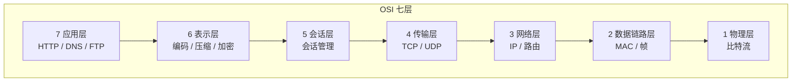
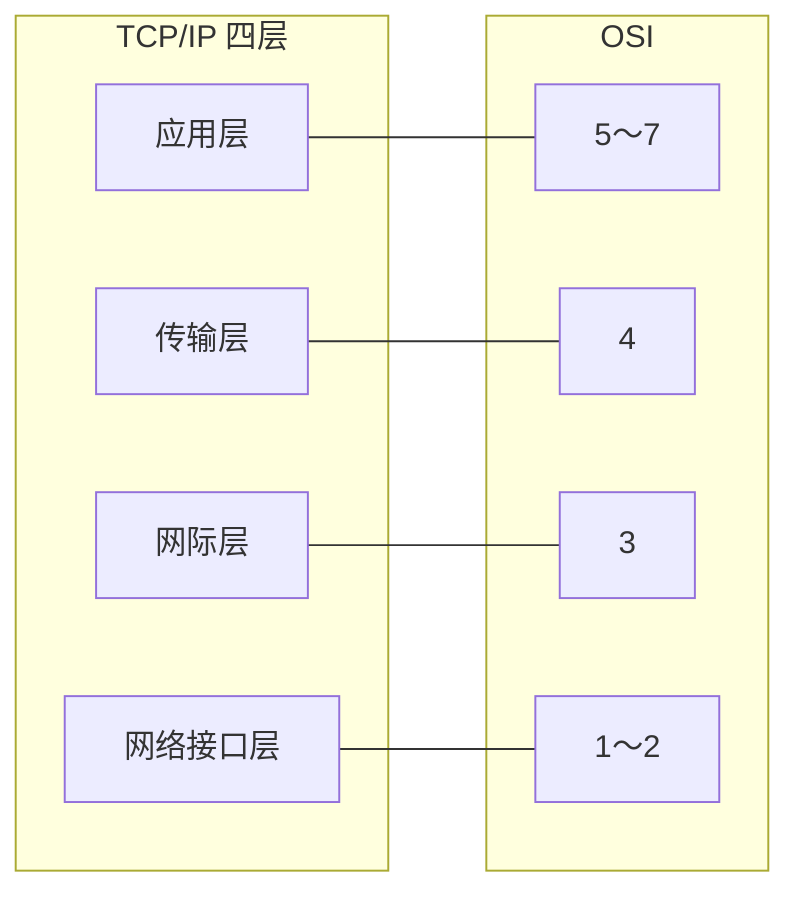
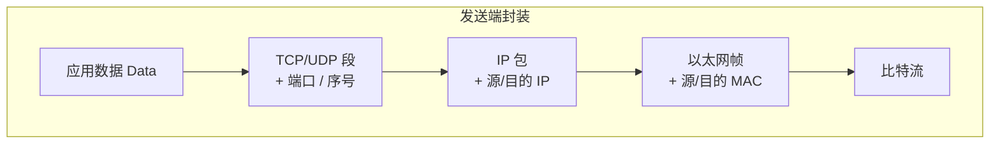
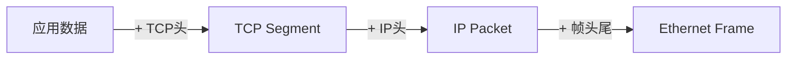

# 01 · 网络分层模型

> 节点目标：说清「为什么分层」「OSI / TCP/IP 各层干什么」「数据怎么封装」。

---

## 面试题

### Q1. OSI 七层模型是什么？

OSI 把网络通信拆成 7 层，每一层只做一类事，上层用下层的服务，下层为上层提供能力。

| 层   | 名称    | 干什么             | 典型协议 / 设备                |
| --- | ----- | --------------- | ------------------------ |
| 7   | 应用层   | 面向用户的业务协议       | HTTP、FTP、SMTP、DNS        |
| 6   | 表示层   | 数据表示、压缩、加密      | JPEG、ASCII、SSL/TLS（常归这层） |
| 5   | 会话层   | 建立、管理、拆除会话      | —                        |
| 4   | 传输层   | 端到端传输、端口、可靠/不可靠 | TCP、UDP                  |
| 3   | 网络层   | 逻辑寻址、路由转发       | IP、ICMP、路由器              |
| 2   | 数据链路层 | 相邻节点帧传输、MAC     | Ethernet、PPP、交换机         |
| 1   | 物理层   | 比特流、电气/光信号      | 网线、光纤、集线器                |
|     |       |                 |                          |

口述口诀：**应用表示会话 → 传输 → 网络 → 链路 → 物理**。

---

### Q2. TCP/IP 四层模型是什么？

工程里更常用 TCP/IP 四层（有的教材拆成五层）。和 OSI 对应关系：

| TCP/IP | 对应 OSI | 典型内容 |
| --- | --- | --- |
| 应用层 | 5～7 | HTTP、HTTPS、DNS、WebSocket、SMTP |
| 传输层 | 4 | TCP、UDP |
| 网际层（网络层） | 3 | IP、ICMP、IGMP |
| 网络接口层 | 1～2 | 以太网、Wi-Fi、ARP（常放这层或网络层） |

**五层模型**（教材常见）：应用 / 运输 / 网络 / 数据链路 / 物理 —— 把接口层再拆开，方便讲清楚。

---

### Q3. 为什么要分层？数据怎么封装？

- **解耦**：改 Wi-Fi 不用改 HTTP
- **标准化**：各层可独立演进
- **复用**：同一 IP 上可跑 TCP 或 UDP

发送时自上而下**加头封装**，接收时自下而上**剥头解封装**：

---

### Q4. 路由器和交换机分别在哪一层？

- **交换机**：主要工作在**数据链路层**，按 MAC 转发（二层交换）
- **路由器**：工作在**网络层**，按 IP 选路（三层转发）
- 三层交换机：硬件上也能做部分 IP 转发，面试说清「传统分工」即可

---

## 关联

- [[02-IP与网络层]] · [[03-TCP与UDP]] · [[00-知识总览]]
