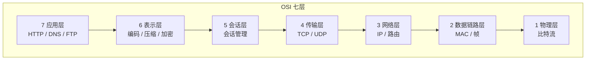
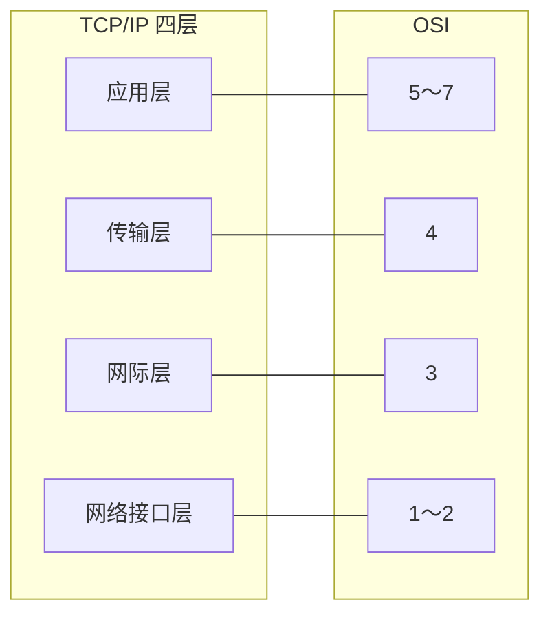
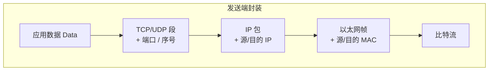
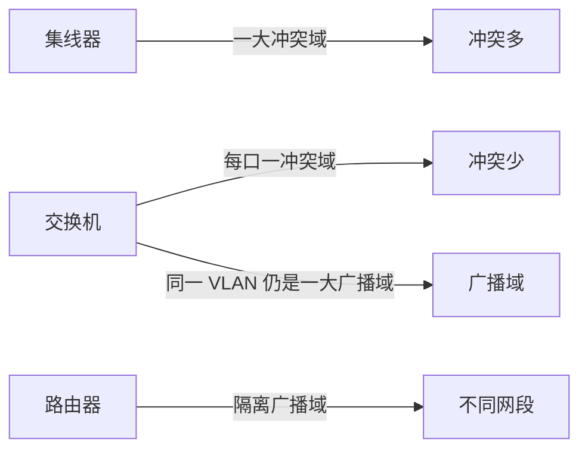

# 01 · 网络分层模型

---

## 面试题

### Q1. OSI 七层模型是什么？

OSI 把网络通信拆成 7 层，每一层只做一类事，上层用下层的服务，下层为上层提供能力。

| 层   | 名称    | 干什么             | 典型协议 / 设备                |
| --- | ----- | --------------- | ------------------------ |
| 7   | 应用层   | 面向用户的业务协议       | HTTP、FTP、SMTP、DNS        |
| 6   | 表示层   | 数据表示、压缩、加密      | JPEG、ASCII、SSL/TLS（常归这层） |
| 5   | 会话层   | 建立、管理、拆除会话      | —                        |
| 4   | 传输层   | 端到端传输、端口、可靠/不可靠 | TCP、UDP                  |
| 3   | 网络层   | 逻辑寻址、路由转发       | IP、ICMP、路由器              |
| 2   | 数据链路层 | 相邻节点帧传输、MAC     | Ethernet、PPP、交换机         |
| 1   | 物理层   | 比特流、电气/光信号      | 网线、光纤、集线器                |


口述口诀：**应用表示会话 → 传输 → 网络 → 链路 → 物理**。



---

### Q2. TCP/IP 四层模型是什么？

工程里更常用 TCP/IP 四层（有的教材拆成五层）。和 OSI 对应关系：

| TCP/IP | 对应 OSI | 典型内容 |
| --- | --- | --- |
| 应用层 | 5～7 | HTTP、HTTPS、DNS、WebSocket、SMTP |
| 传输层 | 4 | TCP、UDP |
| 网际层（网络层） | 3 | IP、ICMP、IGMP |
| 网络接口层 | 1～2 | 以太网、Wi-Fi、ARP（常放这层或网络层） |



**五层模型**（教材常见）：应用 / 运输 / 网络 / 数据链路 / 物理 —— 把接口层再拆开，方便讲清楚。

---

### Q3. 为什么要分层？数据怎么封装？

- **解耦**：改 Wi-Fi 不用改 HTTP
- **标准化**：各层可独立演进
- **复用**：同一 IP 上可跑 TCP 或 UDP

发送时自上而下**加头封装**，接收时自下而上**剥头解封装**：




---

### Q4. 路由器和交换机分别在哪一层？

- **交换机**：主要工作在**数据链路层**，按 MAC 转发（二层交换）
- **路由器**：工作在**网络层**，按 IP 选路（三层转发）
- 三层交换机：硬件上也能做部分 IP 转发，面试说清「传统分工」即可

---

### Q5. 端口号是哪一层的概念？和 IP、MAC 怎么配合？

- **端口**：传输层（TCP/UDP），标识**同一主机上的不同进程/服务**
- **IP**：网络层，标识主机（或网卡）
- **MAC**：链路层，标识同一二层域内的网卡

一句话：**MAC 送邻居，IP 送主机，端口送进程。**

五元组常指：`协议 + 源IP + 源端口 + 目的IP + 目的端口`（连接/流的标识）。

---

### Q6. PDU 是什么？各层的数据单元叫什么？

PDU（Protocol Data Unit）= 某层的「数据+该层头（有时+尾）」。

| 层 | 常见叫法 |
| --- | --- |
| 应用层 | 消息 Message / 数据 Data |
| 传输层 | 段 Segment（TCP）/ 数据报 Datagram（UDP） |
| 网络层 | 包 Packet / 数据报 |
| 数据链路层 | 帧 Frame |
| 物理层 | 比特 Bit |

---

### Q7. 网关、网桥、集线器分别在哪一层？

| 设备 | 大致层次 | 一句话 |
| --- | --- | --- |
| 集线器 Hub | 物理层 | 电信号广播，冲突域大，基本淘汰 |
| 网桥 / 二层交换机 | 数据链路层 | 按 MAC 学习转发，隔离冲突域 |
| 路由器 / 三层设备 | 网络层 | 按 IP 转发，隔离广播域 |
| 网关 Gateway | 常跨多层 | 「出这个网络的出口」；应用层网关还会改协议 |

面试别死抠名词，说清**转发依据是 MAC 还是 IP**即可。

---

### Q8. 什么是冲突域和广播域？

- **冲突域**：半双工/共享介质下，同时发会冲突的范围。交换机能缩小冲突域（每端口一个）。
- **广播域**：二层广播能到达的范围。VLAN / 路由器能隔离广播域。



---

### Q9. TCP/IP 里 ARP、ICMP 分别算哪一层？为什么有争议？

- **ICMP**：附着在 IP 上做差错/诊断，多数归**网络层**
- **ARP**：IP↔MAC，有的书归网络层，有的归链路/接口层

面试答法：**不必纠结归类，说清「它解决什么问题」更重要。** ARP 为 IP 在以太网上落地服务；ICMP 为 IP 诊断服务。

---

### Q10. 什么是端到端原则？对分层设计有什么启示？

端到端原则：能在端系统完成的功能（可靠、加密等），尽量别硬塞进网络中间。

启示：

- IP 只做尽力转发，可靠交给 TCP
- 加密常在 TLS（端到端）而不是每跳都改业务语义
- NAT / 中间盒是工程妥协，会破坏严格端到端

---

### Q11. 同一层的对等实体怎么通信？垂直方向呢？

- **水平（对等）**：两边同层通过协议对话（如两端 TCP）
- **垂直**：上层调用下层服务；下层通过 SAP（服务访问点）向上交付

发送：上层 PDU 变成下层 SDU，再加头成下层 PDU。

---

### Q12. 说说「控制平面」和「数据平面」？和分层什么关系？

现代网络常另切一刀：

| | 控制平面 | 数据平面 |
| --- | --- | --- |
| 干什么 | 算路、下发规则、协商 | 按表高速转发报文 |
| 例子 | OSPF/BGP、SDN Controller | 交换机芯片查表转发 |

和 OSI 分层正交：BGP 在应用/网络相关控制里算路，转发仍按 IP/MAC 表走数据面。后端聊服务网格、网关时也会借用这对概念。

---

## 拓展知识

### Q13. MTU、MSS、分片和分层有什么关系？（拓展）

- **MTU**：链路层一次能承载的最大 IP 包（以太常见 1500）
- **MSS**：TCP 载荷上限 ≈ MTU − IP 头 − TCP 头（常见 1460）
- 分片发生在**网络层**；TCP 通常用 MSS 协商避免自己制造分片

路径上某跳 MTU 更小 → 可能分片或 ICMP「需要分片」→ 引出 **PMTUD**。详见 [[02-IP与网络层]]、[[03-TCP与UDP]]。

---

### Q14. 为什么说「SSL/TLS 在表示层」又说「在应用和传输之间」？

OSI 理想里加密/编码属表示层；现实 TCP/IP 只有四层，**TLS 夹在 HTTP 与 TCP 之间**（有时画成应用层的一部分）。

答法：**模型是教学抽象，实现以 TCP/IP 为准；TLS 提供机密性、完整性、身份认证。**

---

### Q15. 跨网访问时，每一跳各自看什么地址？

```text
主机 → 交换机：看目的 MAC
路由器：看目的 IP，换下一跳，重写二层头
对端主机：IP 命中后交给传输层端口
```

所以抓包会看到：IP 端到端相对稳定，**每过一跳 MAC 会变**。

---

## 关联

- [[02-IP与网络层]] · [[03-TCP与UDP]] · [[15-拓展知识与场景题]] · [[00-知识总览]]
