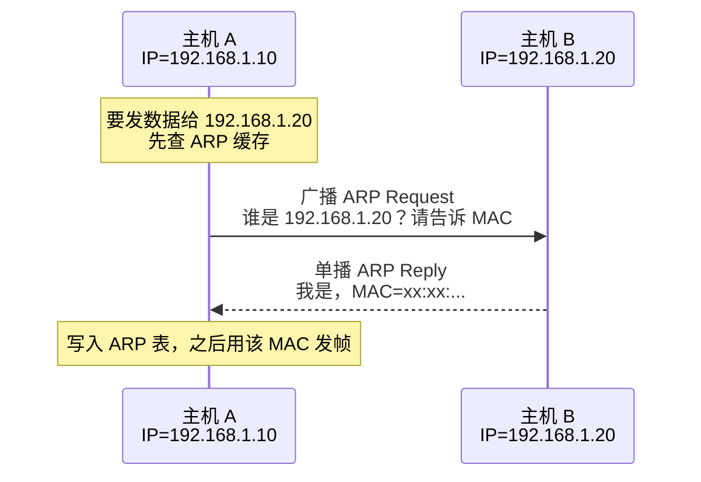
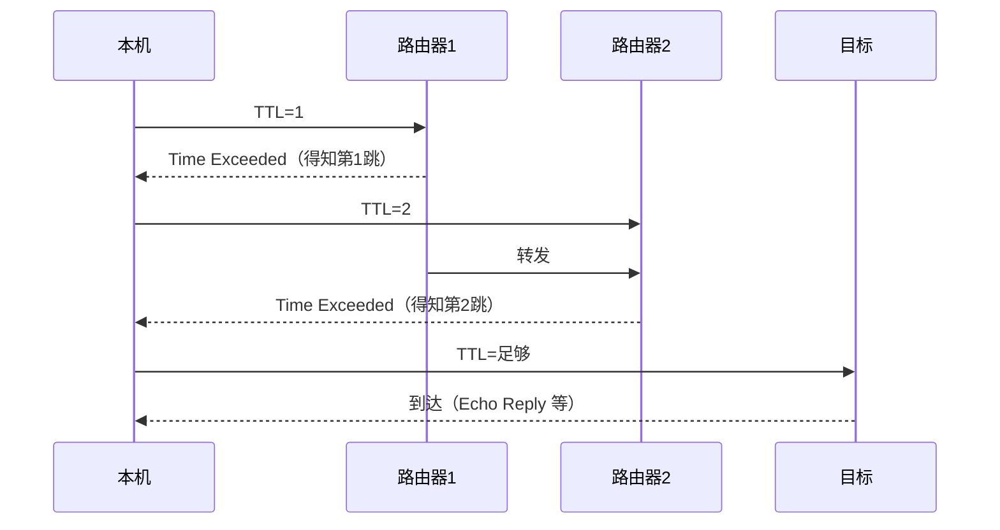
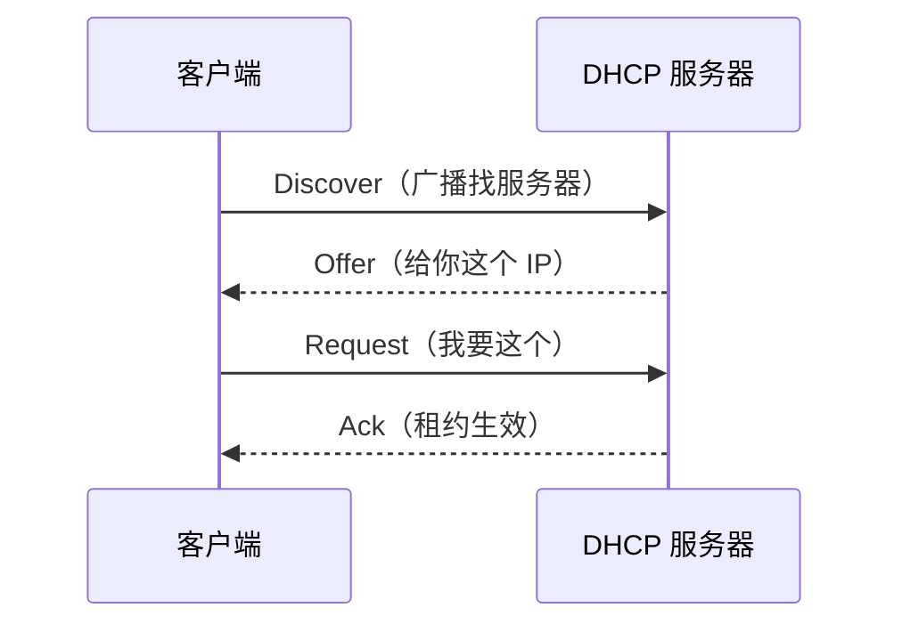

# 02 · IP 与网络层

> 节点目标：IP 寻址与转发、ARP/RARP、ICMP、NAT。

---

## 面试题

### Q1. IP 层是干什么的？为什么不可靠？

IP 负责**主机到主机的逻辑寻址**和**跨网络转发**，特点是：

- **无连接、尽力而为**：不保证送达、不保证顺序、不保证不重复
- 只管「把包往目的网络送」，可靠性交给 TCP（需要时）

这样设计是为了网络层足够简单、可扩展；不是所有应用都需要可靠（比如实时音视频）。

---

### Q2. ARP 和 RARP 分别是什么？有什么区别？

| | ARP | RARP |
| --- | --- | --- |
| 全称 | Address Resolution Protocol | Reverse ARP |
| 作用 | **已知 IP → 求 MAC** | **已知 MAC → 求 IP** |
| 典型场景 | 同局域网通信前查对端 MAC | 早期无盘工作站启动时要问「我的 IP 是什么」 |
| 现状 | 仍在广泛使用 | 基本被 **DHCP** 取代 |

**ARP 流程（同网段）：**

**跨网段注意：** ARP 问的是**下一跳（通常是网关）的 MAC**，不是最终目的主机的 MAC。

---

### Q3. ICMP 是什么？ping / traceroute 怎么工作？

ICMP 在网络层做**差错报告和诊断**，不是传业务数据。

- **ping**：发 Echo Request，对端回 Echo Reply
- **traceroute**：逐步增大 TTL，中间路由器 TTL 耗尽回 Time Exceeded，从而摸清路径

---

### Q4. 私有 IP、公网 IP、NAT？

- 私有地址：`10.0.0.0/8`、`172.16.0.0/12`、`192.168.0.0/16`
- 内网主机出公网通常靠 **NAT** 做地址/端口映射
- 优点：省公网 IP、隐藏内网；缺点：破坏端到端，P2P/部分协议麻烦

---

### Q5. IPv4 和 IPv6 有什么区别？

| | IPv4 | IPv6 |
| --- | --- | --- |
| 地址长度 | 32 位 | 128 位 |
| 表示 | 点分十进制 | 冒号十六进制 |
| 配置 | 常靠 DHCP / 静态 | 支持无状态自动配置等 |
| 分片 | 路由器可分片（现代多避免） | 通常只由源端分片 |
| 广播 | 有 | 无广播，用组播/任播 |
| NAT | 广泛依赖 | 设计上减少 NAT 依赖 |

过渡技术：双栈、隧道、翻译（知道名词即可）。

---

### Q6. 什么是 CIDR？怎么算子网？

CIDR：`IP/前缀长度`，如 `192.168.1.0/24` 表示前 24 位网络号。

- 主机数 ≈ `2^(32-前缀) - 2`（排除网络号与广播，实际还看场景）  
- `/24` → 掩码 `255.255.255.0`，约 254 可用主机  
- `/16` → `255.255.0.0`  

面试偶尔现场算：给你 IP 和掩码，判断是否同网段（看网络前缀是否相同）。

---

### Q7. DHCP 是干什么的？

DHCP 动态分配 IP、掩码、网关、DNS 等，避免手工配置。  
流程常记四步：**Discover → Offer → Request → Ack（DORA）**。

RARP 的历史角色基本被 DHCP 取代。

---

### Q8. TTL 字段的作用是什么？

IP 头里的 TTL：每过一个路由器减 1，减到 0 丢弃并常回 ICMP，用于**防止环路**。  
`traceroute` 正是利用 TTL 探测路径。

---

## 关联

- [[01-网络分层模型]] · [[03-TCP与UDP]] · [[07-输入URL全过程]]
