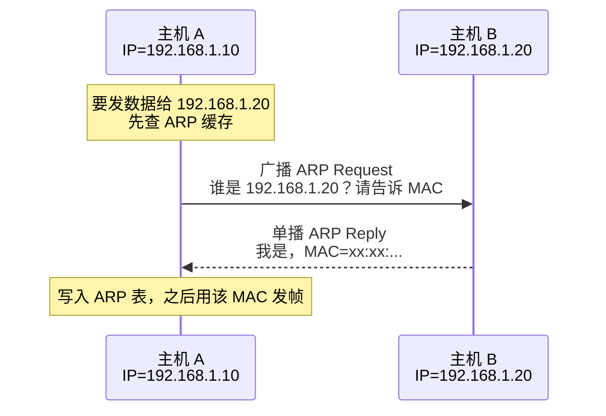
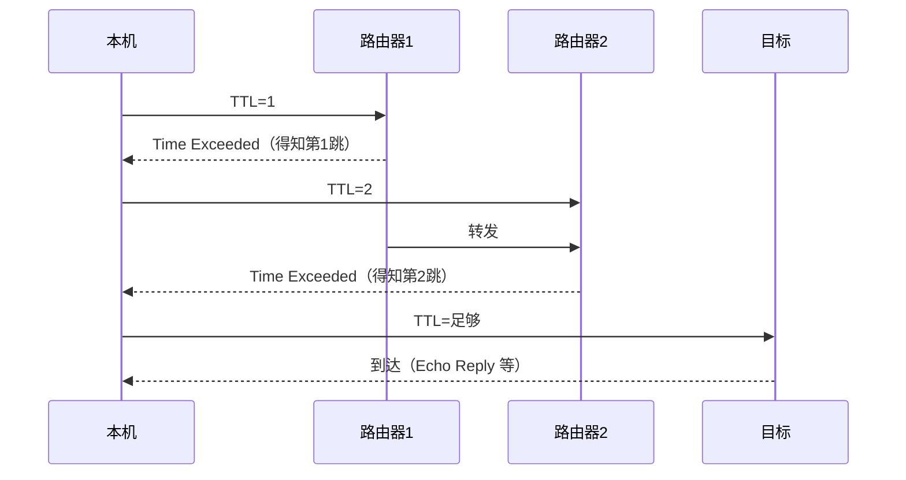
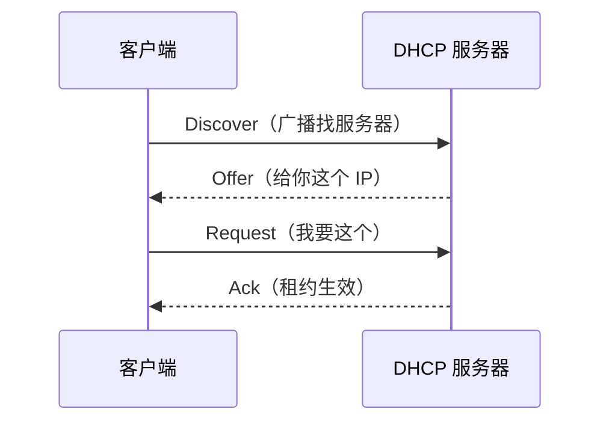

# 02 · IP 与网络层

> 节点目标：IP 寻址与转发、ARP/RARP、ICMP、NAT。

---

## 面试题

### Q1. IP 层是干什么的？为什么不可靠？

IP 负责**主机到主机的逻辑寻址**和**跨网络转发**，特点是：

- **无连接、尽力而为**：不保证送达、不保证顺序、不保证不重复
- 只管「把包往目的网络送」，可靠性交给 TCP（需要时）

这样设计是为了网络层足够简单、可扩展；不是所有应用都需要可靠（比如实时音视频）。

---

### Q2. ARP 和 RARP 分别是什么？有什么区别？

| | ARP | RARP |
| --- | --- | --- |
| 全称 | Address Resolution Protocol | Reverse ARP |
| 作用 | **已知 IP → 求 MAC** | **已知 MAC → 求 IP** |
| 典型场景 | 同局域网通信前查对端 MAC | 早期无盘工作站启动时要问「我的 IP 是什么」 |
| 现状 | 仍在广泛使用 | 基本被 **DHCP** 取代 |

**ARP 流程（同网段）：**

**跨网段注意：** ARP 问的是**下一跳（通常是网关）的 MAC**，不是最终目的主机的 MAC。

---

### Q3. ICMP 是什么？ping / traceroute 怎么工作？

ICMP 在网络层做**差错报告和诊断**，不是传业务数据。

- **ping**：发 Echo Request，对端回 Echo Reply
- **traceroute**：逐步增大 TTL，中间路由器 TTL 耗尽回 Time Exceeded，从而摸清路径

---

### Q4. 私有 IP、公网 IP、NAT？

- 私有地址：`10.0.0.0/8`、`172.16.0.0/12`、`192.168.0.0/16`
- 内网主机出公网通常靠 **NAT** 做地址/端口映射
- 优点：省公网 IP、隐藏内网；缺点：破坏端到端，P2P/部分协议麻烦

---

### Q5. IPv4 和 IPv6 有什么区别？

| | IPv4 | IPv6 |
| --- | --- | --- |
| 地址长度 | 32 位 | 128 位 |
| 表示 | 点分十进制 | 冒号十六进制 |
| 配置 | 常靠 DHCP / 静态 | 支持无状态自动配置等 |
| 分片 | 路由器可分片（现代多避免） | 通常只由源端分片 |
| 广播 | 有 | 无广播，用组播/任播 |
| NAT | 广泛依赖 | 设计上减少 NAT 依赖 |

过渡技术：双栈、隧道、翻译（知道名词即可）。

---

### Q6. 什么是 CIDR？怎么算子网？

CIDR：`IP/前缀长度`，如 `192.168.1.0/24` 表示前 24 位网络号。

- 主机数 ≈ `2^(32-前缀) - 2`（排除网络号与广播，实际还看场景）  
- `/24` → 掩码 `255.255.255.0`，约 254 可用主机  
- `/16` → `255.255.0.0`  

面试偶尔现场算：给你 IP 和掩码，判断是否同网段（看网络前缀是否相同）。

---

### Q7. DHCP 是干什么的？

DHCP 动态分配 IP、掩码、网关、DNS 等，避免手工配置。  
流程常记四步：**Discover → Offer → Request → Ack（DORA）**。

RARP 的历史角色基本被 DHCP 取代。

---

### Q8. TTL 字段的作用是什么？

IP 头里的 TTL：每过一个路由器减 1，减到 0 丢弃并常回 ICMP，用于**防止环路**。  
`traceroute` 正是利用 TTL 探测路径。

---

### Q9. NAT 有哪些类型？SNAT / DNAT / 全锥有什么区别？

| 类型 | 含义 | 场景 |
| --- | --- | --- |
| SNAT / 源 NAT | 改源 IP（常改端口） | 内网出公网 |
| DNAT / 目的 NAT | 改目的 IP/端口 | 端口映射、负载把公网导到内网 |
| NAPT / PAT | 多对一靠端口复用 | 家用路由最常见 |
| 静态 NAT | 一对一固定映射 | 内网服务器固定公网入口 |

NAT 行为差异（全锥 / 受限锥 / 对称）影响 **P2P、WebRTC 打洞**成功率；对称 NAT 最难，常要 TURN。详见 [[13-实时通信-WebRTC-SIP-RTP]]。

---

### Q10. 什么是 IP 分片？有什么问题？现代怎么避免？

IP 包超过链路 MTU 时可能被分片，对端重组。

问题：

- 任一片丢失 → 整包重传（TCP）或整包废（UDP）
- 中间设备对分片不友好（防火墙难检）
- 重组耗资源，可被分片攻击利用

现代做法：

- TCP 用 MSS / PMTUD，尽量**不分片**
- IPv6 中间路由不分片，只允许源端分片
- 应用控制 UDP 包大小（音视频尤其）

---

### Q11. 什么是 PMTUD？黑洞 MTU 怎么表现？

PMTUD（Path MTU Discovery）：发送方探路径最小 MTU，避免分片。

- 发 DF（Don't Fragment）包，遇小 MTU 路由器回 ICMP「需要分片」
- 若 ICMP 被墙掉 → **MTU 黑洞**：大包发不出、小包正常（经典排障点）

排查：降低 MTU/MSS、放开 ICMP、抓包看是否只有大包重传。

---

### Q12. 单播、组播、广播、任播有什么区别？

| | 含义 | 例子 |
| --- | --- | --- |
| 单播 Unicast | 一对一 | 普通网页访问 |
| 广播 Broadcast | 一对同网段所有 | ARP Request |
| 组播 Multicast | 一对一组订阅者 | IPTV、部分路由协议 |
| 任播 Anycast | 一对「拓扑上最近的一个同 IP」 | 根 DNS、部分 CDN/Anycast IP |

---

### Q13. 什么是 VLAN？和子网、路由什么关系？

VLAN：在二层把一台物理交换机逻辑切成多个广播域。

- 同 VLAN：二层互通（需同网段 IP）
- 跨 VLAN：一般要**三层路由**（或三层交换机 SVI）
- 和子网：常「一 VLAN 一子网」，但不是强制语法，是运维约定

---

### Q14. 静态路由和动态路由？OSPF / BGP 面试怎么一句话带过？

- **静态**：人工写死下一跳，小网简单，变更麻烦  
- **动态**：路由器互相学路

| 协议 | 一句话 |
| --- | --- |
| OSPF | 自治系统**内部**链路状态，算最短路径 |
| BGP | 自治系统**之间**选路，互联网骨干靠它，策略丰富 |

后端业务面试点到「机房出口 / Anycast / CDN 调度和 BGP 有关」即可，不必默写属性。

---

### Q15. 什么是 ECMP？和负载均衡什么关系？

ECMP（Equal-Cost Multi-Path）：到同一前缀有多条等价路径时，按哈希把流分到不同下一跳。

- 网络层「自然」的多路径
- 通常按五元组哈希，**同连接不乱序**
- 和四/七层负载互补：ECMP 在路由，LB 在代理/网关

---

### Q16. ARP 欺骗 / 缓存投毒是什么？怎么防？

攻击者在局域网回假 ARP，声称「网关 IP 是我的 MAC」→ 流量被劫持（中间人）。

防护：静态 ARP、DAI（动态 ARP 检测）、802.1X、隔离、HTTPS/证书校验降低危害。

---

### Q17. 公网访问内网服务常见有哪些方式？

1. **DNAT / 端口映射**（简单，暴露面大）  
2. **反向代理 / 网关**（七层鉴权、TLS 终结）  
3. **VPN / 专线**（整网打通）  
4. **内网穿透**（frp 等，开发调试）  
5. **零信任 / SDP**（按身份授权，而不是信任整网段）

---

### Q18. IP 头里还有哪些常考字段？

| 字段 | 作用 |
| --- | --- |
| 版本 | v4 / v6 |
| 首部长度 / 总长度 | 解析边界 |
| DSCP/ToS | QoS 优先级（了解） |
| 标识 / 标志 / 片偏移 | 分片重组 |
| TTL | 防环、traceroute |
| 协议 | 上层是 TCP/UDP/ICMP… |
| 首部校验和 | 只校 IP 头（IPv6 无此字段） |
| 源/目的 IP | 寻址 |

---

### Q19. 什么是 IGMP？和组播什么关系？

IGMP：主机向路由器声明「我要加入某组播组」。路由器据此决定是否把组播流转进该网段。  
面试知道：**组播收发需要 IGMP + 组播路由**，不是只设一个 224.x 地址就完事。

---

### Q20. 双机热备、浮动 IP 和网络层有什么关系？

VIP / 浮动 IP：心跳决定哪台机器对外宣称该 IP（常配合 ARP 免费更新）。  
业务高可用口述：DNS / Anycast / VIP / LB 四选或组合，说清故障切换粒度和会话保持。

---

## 拓展知识

### Q21. 对称 NAT 为什么让 WebRTC 难打洞？（拓展）

对称 NAT：对不同目的映射出**不同公网端口**。STUN 看到的映射，连到 TURN/对端时可能已变，直连失败率高 → 保底走 **TURN 中继**。

---

### Q22. 容器 / K8s 里的 IP 和宿主机 NAT？（拓展）

- 容器有独立网段 IP（CNI）  
- 出集群常 SNAT 成节点 IP  
- Service ClusterIP 是虚拟 IP，靠 iptables/IPVS/ eBPF 转发  
和「经典 NAT」同一思想：**地址空间重叠时靠映射联通**。

---

### Q23. anycast DNS 为什么抗 DDoS / 就近？（拓展）

同一服务 IP 在很多 PoP 宣告，流量被路由到「最近」实例；攻击流量也被分散到各地清洗。代价：排障要认清「同 IP 不同地点」。

---

## 关联

- [[01-网络分层模型]] · [[03-TCP与UDP]] · [[07-输入URL全过程]] · [[15-拓展知识与场景题]]
