# 03 · TCP 与 UDP

> 节点目标：TCP/UDP 区别、连接本质、握手挥手、可靠传输、窗口与拥塞、异常与攻击。**面试权重最高。**

---

## 面试题

### Q1. TCP 和 UDP 有什么区别？

| 维度 | TCP | UDP |
| --- | --- | --- |
| 连接 | 面向连接（先握手） | 无连接 |
| 可靠 | 可靠：确认、重传、排序、去重 | 尽力而为，可能丢、乱、重 |
| 顺序 | 保证按序交付 | 不保证 |
| 流量/拥塞控制 | 有 | 无（应用自己管） |
| 头部开销 | ≥20 字节 | 8 字节 |
| 速度/延迟 | 相对高开销 | 更轻、更低延迟 |
| 传输模式 | 字节流 | 报文（保留边界） |
| 典型场景 | HTTP/HTTPS、SSH、文件传输 | DNS、直播、游戏、QUIC |

一句话：**要可靠有序用 TCP；要实时、可接受丢包用 UDP（或上层自建可靠）。**

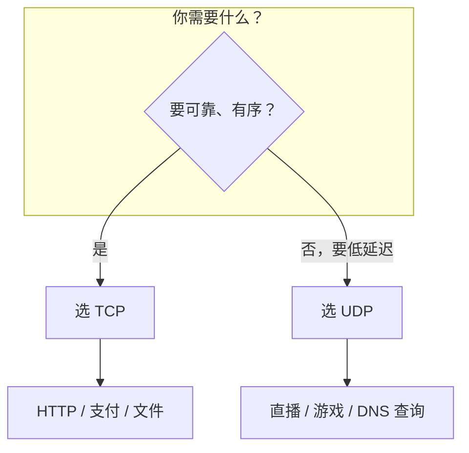

---

### Q2. 到底什么是 TCP 连接？

TCP「连接」**不是**一条物理线路，而是双方维护的一份**连接状态**（两端的套接字、序列号、窗口、缓冲区等）。

用**四元组**唯一标识一条连接：

```text
(源 IP, 源端口, 目的 IP, 目的端口)
```

- 同一台机器可以同时有很多条 TCP 连接（端口不同）
- 换网导致 IP 变化 → 四元组变了 → 旧连接失效（QUIC 对此有优化）

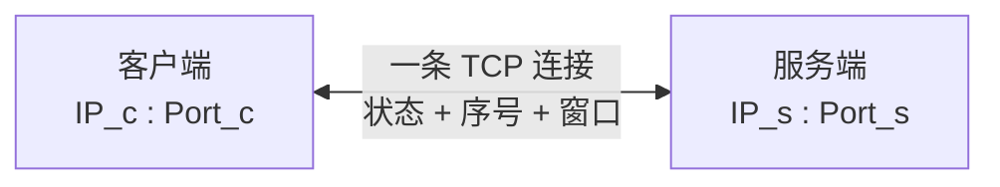

---

### Q3. TCP 是用来解决什么问题？

IP 只提供尽力转发，TCP 在传输层补齐**端到端可靠字节流**，主要解决：

1. **丢包** → 确认 + 重传  
2. **乱序** → 序号排序  
3. **重复** → 去重  
4. **发送太快撑爆接收方** → 流量控制（滑动窗口）  
5. **发送太快撑爆网络** → 拥塞控制  
6. **多应用共用 IP** → 端口复用  

---

### Q4. 为什么要 TCP，IP 层实现控制不行么？

可以在 IP 上做可靠，但工程上不合适：

1. **不是所有应用都要可靠**（音视频更怕延迟），放 IP 层会变成「强制税」
2. **端到端原则**：可靠性应由通信两端负责，中间路由器保持简单、高速转发
3. **IP 是逐跳的**，路由器数量巨大，在网络层做重传/连接状态成本极高、难扩展
4. **分层清晰**：网络层管「送到哪」，传输层管「送得好不好」

所以：**IP 负责可达，TCP 按需负责可靠。**

---

### Q5. 说说 TCP 的三次握手？

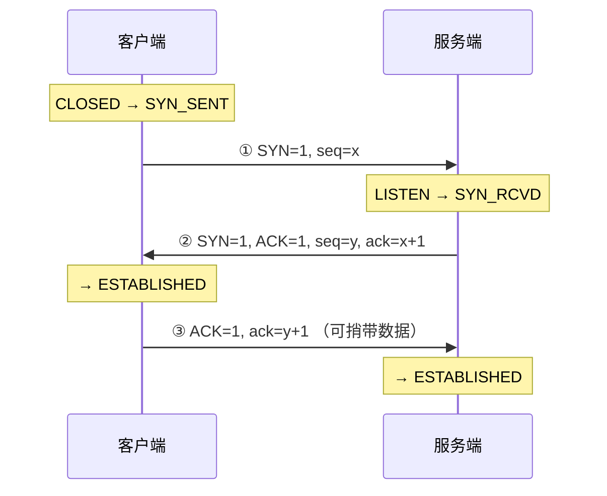

**每一步在确认什么：**

| 次 | 报文 | 确认能力 |
| --- | --- | --- |
| 1 | SYN | 客户端能发 |
| 2 | SYN+ACK | 服务端能收也能发；客户端后续确认自己能收 |
| 3 | ACK | 服务端确认客户端能收 |

**为什么必须三次，不是两次？**

1. 防止**已失效的旧 SYN** 到达服务端，造成错误连接（两次握手时服务端可能空等）
2. 双方都确认**收、发通道**正常
3. 同步双方**初始序列号 ISN**

---

### Q6. TCP 初始序列号 ISN 怎么取值的？

- ISN **不能固定从 0 开始**，否则容易被预测、遭序列号攻击，也可能和旧连接残留报文冲突
- 传统做法：基于时钟的计数器生成，随时间递增
- 现代实现：结合 **密钥/哈希、四元组、时间戳** 等生成较难预测的 ISN（如 Linux 的 secure_tcp_seq 一类思路）
- 握手时双方各自选自己的 ISN（`x` 和 `y`），之后数据序号在此基础上递增

面试答：**随机/难预测 + 随时间变化，避免攻击与旧报文干扰。**

---

### Q7. TCP 三次握手时，发送 SYN 之后就宕机了会怎么样？

分两端看：

**客户端发完 SYN 就挂了：**

- 服务端回 SYN+ACK 后收不到最终 ACK，会**重传 SYN+ACK**
- 重传若干次仍失败 → 超时放弃，释放半连接资源
- 不会一直占着（否则可被 SYN Flood 放大）

**服务端在第二次后挂了：** 客户端可能收不到 SYN+ACK，会重传 SYN，最终超时失败。

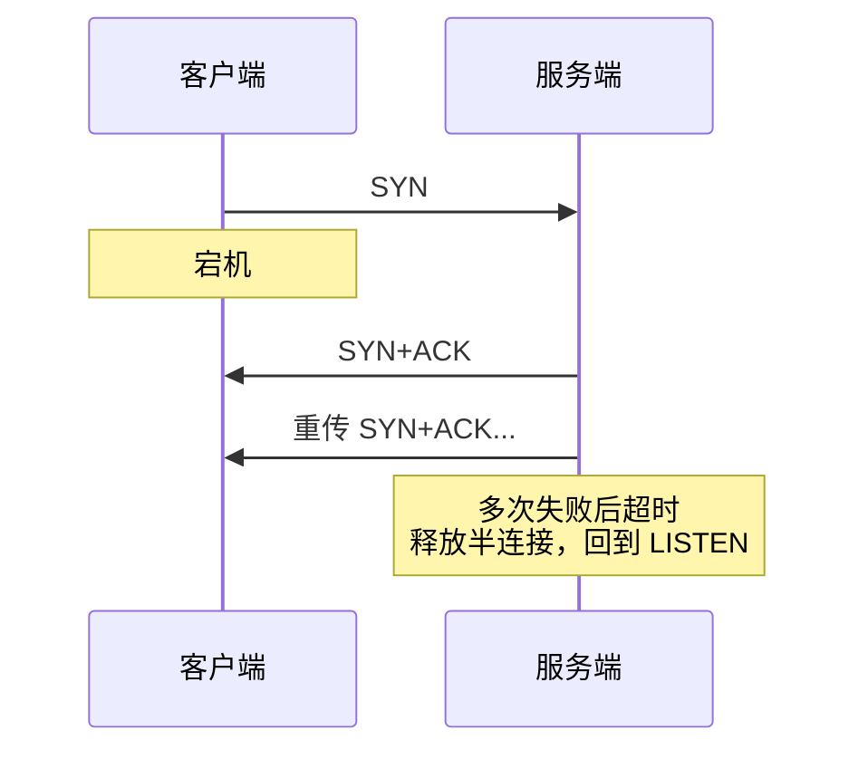

---

### Q8. 什么是 SYN Flood 攻击？

攻击者短时间发大量 **SYN**，或伪造源 IP，使服务端堆积大量 **SYN_RCVD 半连接**，队列耗尽后正常用户连不上。


**常见防护：**

- **SYN Cookie**：不急着建 TCB，把状态编码进序列号，收到合法第三次 ACK 再真正建连
- 增大半连接队列、缩短半连接超时
- 防火墙 / 限流 / 黑洞

---

### Q9. 为什么 TCP 挥手需要有 TIME_WAIT 状态？

先看四次挥手：

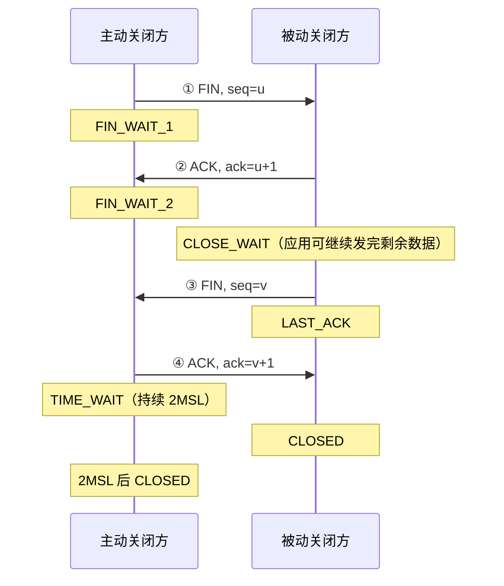

**TIME_WAIT 两个核心作用：**

1. **保证最后的 ACK 能送达**：若 ACK 丢失，被动方会重传 FIN，主动方仍在 TIME_WAIT，可再回 ACK；若直接 CLOSED，可能回 RST，被动方关不干净  
2. **让旧连接延迟报文在网络中消亡**（等够约 **2MSL**），避免序号落到新连接上造成数据错乱  

谁进 TIME_WAIT？**主动调用 close 的那一方**。

---

### Q10. 除了四次挥手，还有什么方法断开连接？

1. **正常**：四次挥手（双向各发 FIN）  
2. **同时关闭**：两边几乎同时发 FIN，走 CLOSING 等状态，仍是优雅关闭  
3. **RST 异常重置**：直接粗暴断开（见下题）  
4. **半关闭**：一方 shutdown 写方向（发 FIN），仍可读；另一方向还可继续传  
5. **应用层心跳超时后主动 close**：本质还是走挥手或 RST  
6. **SO_LINGER / abortive close**：可配置成立即 RST 断开  

优雅关闭优先挥手；出错或要立刻撕连接才用 RST。

---

### Q11. TCP 中何时会出现 RST（reset）报文？

RST 表示**异常终止连接**，常见场景：

1. 访问**未监听**的端口 → 回 RST  
2. 连接已关闭/不存在，却收到「迟到」的数据包  
3. 一方检测到协议错误、序列号完全不可接受  
4. 应用调用 **abort** 式关闭，或设置 linger 为 0 直接重置  
5. 防火墙/中间件强制掐断  

对比：FIN 是「我发完了，优雅关」；RST 是「这连接不对了，立刻撕掉」。

---

### Q12. TCP 协议是如何保证可靠传输的？

组合机制，不是单靠某一个：

| 机制 | 解决什么 |
| --- | --- |
| 序号 + 确认号 | 知道发到哪、缺了啥 |
| 校验和 | 检错 |
| 超时重传 | 丢包后重发 |
| 快速重传 | 更快发现丢包 |
| SACK | 更精确告诉「缺哪段」 |
| 排序重组 | 乱序到达后按序交付 |
| 去重 | 重传导致的重复段 |
| 滑动窗口 | 流量控制，防接收方溢出 |
| 拥塞控制 | 防网络崩溃 |

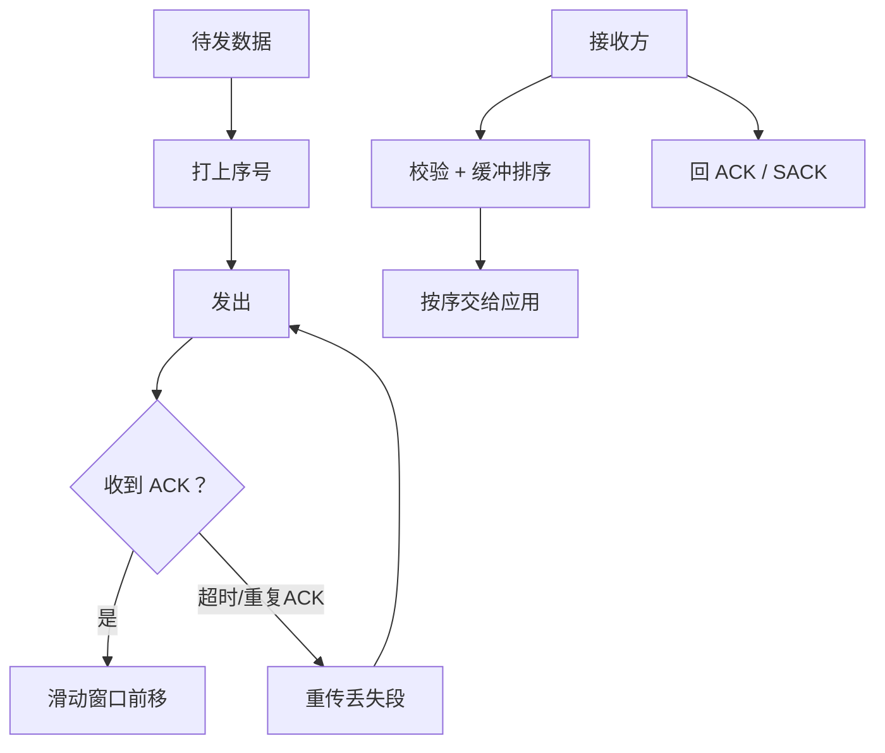

---

### Q13. TCP 超时重传机制是为了解决什么问题？

解决：**发出去的包丢了或 ACK 丢了，发送方不知道对方是否收到**。

- 启动重传定时器，超时未收到对应 ACK → 重传
- RTO（超时时间）根据 **RTT 动态估算**（太短误重传，太长恢复慢）
- 超时通常被当成**较强的拥塞信号**，拥塞窗口会降下来

---

### Q14. TCP 有超时重传为什么还需要快速重传机制？

| | 超时重传 | 快速重传 |
| --- | --- | --- |
| 触发 | RTO 到期 | 连续收到通常 **3 个重复 ACK** |
| 速度 | 要等定时器，可能很慢 | 不必等超时，更快 |
| 典型场景 | 丢包且后续包也很少（重复 ACK 不够） | 后面还有包在传，接收方不断 ACK「还在等某个序号」 |

快速重传解决的是：**丢包后别傻等到 RTO，尽早重传，降低延迟。**

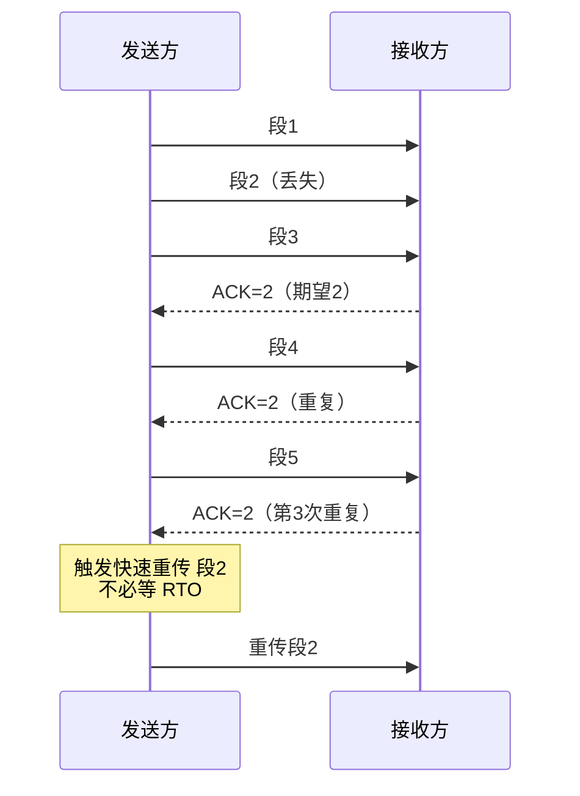

---

### Q15. TCP 的 SACK 的引入是为了解决什么问题？

传统累积 ACK 只能说「我收到了序号 N 之前的连续数据」，**中间空洞说不清**。

例如丢了 2，但 3、4、5 到了：没有 SACK 时，发送方可能不知道 3～5 已到，超时后**多余重传**。

**SACK（Selective Acknowledgment）**：在 ACK 里带上「哪些不连续块已经收到」，发送方**只补真正丢失的段**。

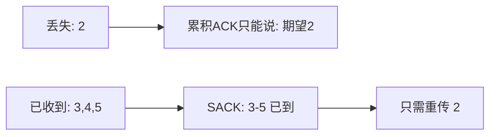

---

### Q16. TCP 滑动窗口的作用是什么？

主要做**流量控制**：让发送速度适配接收方处理能力。

- 接收方通告 **rwnd**（接收窗口）：我还能收多少
- 发送方已发送未确认的数据量 ≤ min(rwnd, cwnd)
- 窗口为 0 时停发，之后用窗口探测

同时也配合可靠传输：窗口内的数据才允许「在途」。

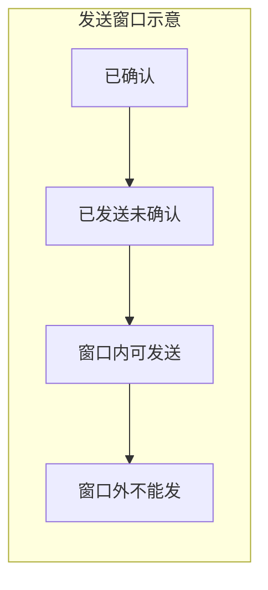

**流量控制 vs 拥塞控制：**

- 流量控制：保护**接收端**（rwnd）
- 拥塞控制：保护**网络**（cwnd）
- 实际发送窗口受两者共同约束

---

### Q17. 说说 TCP 拥塞控制的步骤？

经典 Reno 思路（面试够用）：

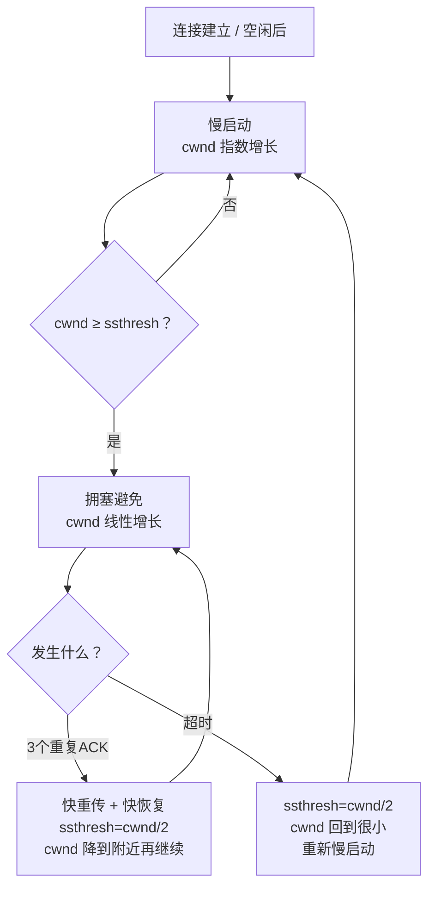

| 阶段 | 行为 |
| --- | --- |
| 慢启动 | cwnd 从很小开始，每 RTT 近似翻倍，快速探路 |
| 拥塞避免 | 到阈值后每个 RTT 大约 +1，线性试探 |
| 快重传 | 3 重复 ACK → 立刻重传丢失段 |
| 快恢复 | 避免超时那样把 cwnd 砍回「极小」，而是减半后继续 |

另有 **BBR** 等基于带宽/时延的算法，知道「现代不只看丢包」即可。

---

### Q18. TCP 的粘包和拆包能说说吗？

TCP 是**字节流**，没有应用层「消息边界」。

| 现象 | 含义 |
| --- | --- |
| 粘包 | 多次 `write` 的数据一次 `read` 读出 |
| 拆包（半包） | 一次 `write` 被多次 `read` 读完 |

原因：Nagle、接收端缓冲、MSS 分段、应用读写粒度不一致等。

**应用层解决边界：**

1. **定长消息**
2. **分隔符**（如 `\n`，要注意转义）
3. **长度前缀**：`[4字节长度][body]`（最常用）
4. 协议自带边界（HTTP 用 Content-Length / chunked）

UDP **保留报文边界**，一般不谈粘包（但会谈丢包、乱序）。

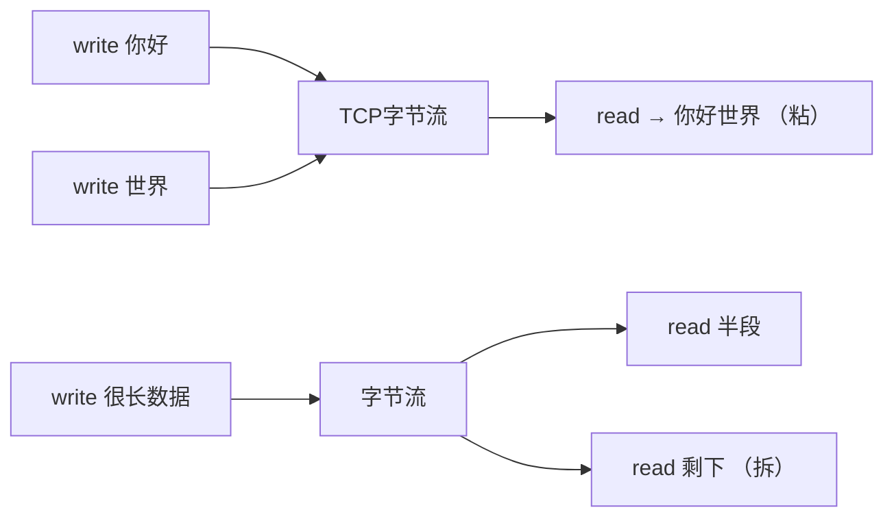

---

### Q19. 说说 TCP 的四次挥手？为什么是四次不是三次？

四次挥手完整流程见 Q9 图。核心原因：**TCP 全双工，两个方向要分别关闭**。

- 收到对方 FIN，只表示「对方不会再发了」，本端可能还有数据要发
- 所以通常先单独回 ACK，等应用发完再发自己的 FIN
- 若被动方恰好也没数据了，有的实现会把 ACK+FIN 合并，看起来像「三次」，但协议上仍是两个方向各自关闭

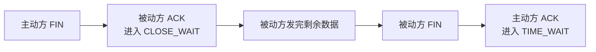

---

### Q20. TIME_WAIT 和 CLOSE_WAIT 有什么区别？大量出现说明什么？

| | TIME_WAIT | CLOSE_WAIT |
| --- | --- | --- |
| 谁处于该状态 | **主动关闭方** | **被动关闭方** |
| 含义 | 已发完最后 ACK，等 2MSL | 已收到 FIN 并回了 ACK，但**应用还没 close** |
| 大量出现 | 短连接过多、主动关闭太频繁 | **代码泄漏连接 / 没正确关闭** |

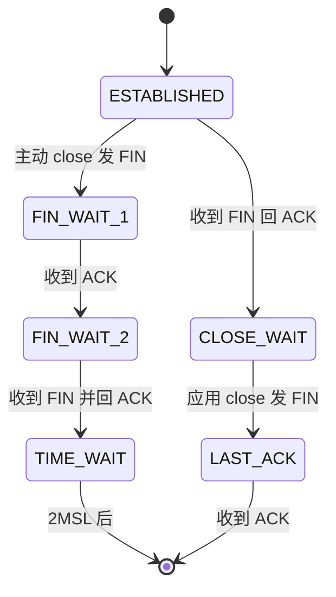

排查：`CLOSE_WAIT` 查应用；`TIME_WAIT` 查是否过度短连接，可改长连接/连接池，或谨慎调内核参数。

---

### Q21. TIME_WAIT 过多怎么处理？

1. **业务侧优先**：HTTP 长连接、连接池、减少疯狂建连断开  
2. **由客户端主动关闭**还是服务端：高并发服务端若主动关，TIME_WAIT 堆在服务端更伤  
3. 内核：`net.ipv4.tcp_tw_reuse`（复用满足条件的 TIME_WAIT）、扩大本地端口范围等（**慎用、懂原理再改**）  
4. 不要一上来就关 TIME_WAIT，它是安全保障  

---

### Q22. 什么是 TCP 半关闭？

一方调用 `shutdown(WR)`：本端不再发送，发 FIN，但**还能接收**。  
对方仍可继续发数据，直到对方也关闭。适合「我请求发完了，还要继续收响应」这类场景。

---

### Q23. 第三次握手可以携带数据吗？

可以。第三次已是 ACK，连接在客户端侧已 ESTABLISHED，可捎带数据。  
**TCP Fast Open (TFO)** 甚至允许在 SYN 里带数据（需 Cookie 支持），用于降低建连延迟。

---

### Q24. TCP Keepalive 是什么？和 HTTP Keep-Alive 有什么区别？

| | TCP Keepalive | HTTP Keep-Alive |
| --- | --- | --- |
| 层 | 传输层 | 应用层 |
| 作用 | 探活：连接空闲很久后发探测包，看对端是否还在 | **复用同一 TCP** 传多个 HTTP 请求/响应 |
| 默认 | 很多系统默认关或间隔很长（如小时级） | HTTP/1.1 默认倾向长连接 |

业务心跳（应用层 ping）往往比 TCP keepalive 更可控。

---

### Q25. 什么是 Nagle 算法？什么是延迟 ACK？为什么有时要关掉？

- **Nagle**：小包先攒一攒再发，减少小报文数量（保护网络）  
- **延迟 ACK**：不必每个段都立刻 ACK，可稍等合并 ACK  
- 两者叠加可能导致「小请求 + 等 ACK」的延迟（如写-写-读模式）  
- 低延迟场景可 `TCP_NODELAY` 关 Nagle  

---

### Q26. MSS 和 MTU 是什么关系？

- **MTU**：链路层一帧能承载的最大 IP 包净荷相关限制（以太网常见 1500）  
- **MSS**：TCP 段最大数据部分 ≈ MTU - IP 头 - TCP 头（常 1460）  
- 握手时双方通告 MSS，按较小值传，减少分片  

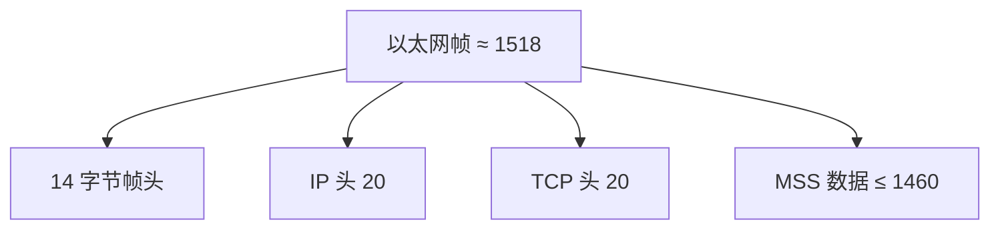

---

### Q27. UDP 一定比 TCP 快吗？什么时候用 UDP？

不一定「永远更快」，但通常**延迟更低、开销更小**（无握手、无重传等待）。适合：

1. 能接受丢包：直播、实时语音  
2. 自己做可靠：QUIC、部分游戏协议  
3. 查询类短报文：DNS  
4. 广播/组播场景  

若应用自己实现重传/拥塞，复杂度会接近再造一个 TCP。

---

### Q28. TCP 流量控制和拥塞控制有什么区别？

| | 流量控制 | 拥塞控制 |
| --- | --- | --- |
| 保护谁 | 接收方 | 网络（路由器缓冲等） |
| 信号 | 接收窗口 rwnd | 丢包、延迟、ECN 等 → 调 cwnd |
| 目标 | 别把对端缓冲区打爆 | 别把整网打爆 |

发送窗口受 `min(rwnd, cwnd)` 约束。

---

### Q29. TCP 状态机全表能画出来吗？

面试不要求背每个边角，但要能画出**主路径**并解释常见状态。

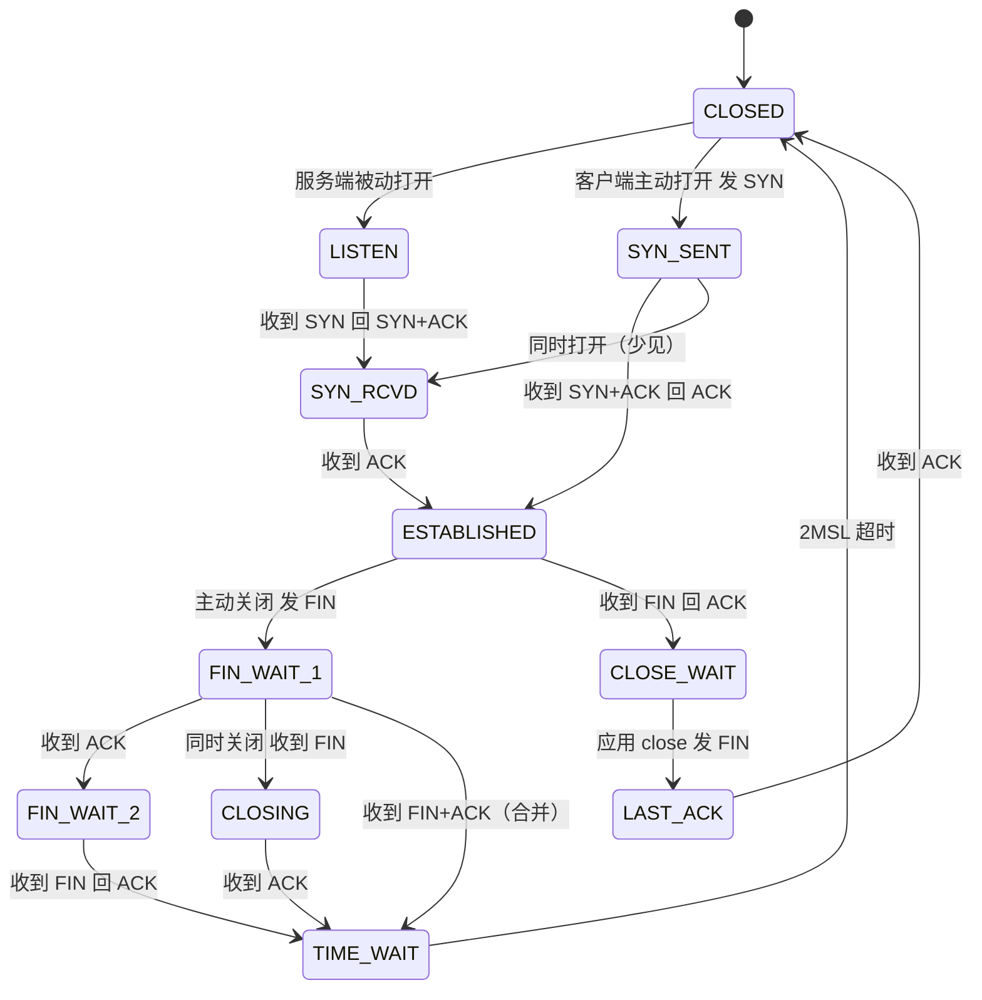

**状态速记表：**

| 状态 | 含义 |
| --- | --- |
| CLOSED | 没有连接 |
| LISTEN | 服务端监听 |
| SYN_SENT | 客户端已发 SYN |
| SYN_RCVD | 服务端已回 SYN+ACK，等最终 ACK |
| ESTABLISHED | 可传数据 |
| FIN_WAIT_1 | 主动方已发 FIN，等 ACK |
| FIN_WAIT_2 | 主动方 FIN 已被 ACK，等对方 FIN |
| CLOSE_WAIT | 被动方已 ACK 对方 FIN，等应用 close |
| CLOSING | 双方几乎同时关 |
| LAST_ACK | 被动方已发 FIN，等最后 ACK |
| TIME_WAIT | 主动方等 2MSL |

**看图说话题常考：** 抓包里大量 SYN_RECV → 半连接/攻击；大量 CLOSE_WAIT → 应用没关；大量 TIME_WAIT → 短连接。

---

### Q30. 拥塞控制里 CUBIC 和 BBR 是什么？和 Reno 有何不同？

经典 Reno（慢启动/拥塞避免/快重传/快恢复）以**丢包**为拥塞信号，在高速长肥网络上恢复偏慢、带宽利用率不理想。

#### CUBIC（Linux 长期默认之一）

- 用**三次函数（立方）**控制 cwnd 增长，不完全死跟每个 ACK  
- 对高带宽高延迟（LFP）更友好：远离饱和点时增长快，接近上次拥塞点时变缓  
- 仍主要靠**丢包**感知拥塞（也有改进变体）  


#### BBR（Bottleneck Bandwidth and RTT）

- Google 提出：**不靠丢包当主信号**  
- 持续估计两条线：  
  - **瓶颈带宽 BtlBw**（最大交付速率）  
  - **最小 RTT**（链路固有延迟）  
- 目标：让 inflight ≈ BtlBw × minRTT（带宽时延积 BDP），在**高吞吐 + 低排队延迟**间平衡  
- 阶段常提：Startup → Drain → ProbeBW → ProbeRTT  

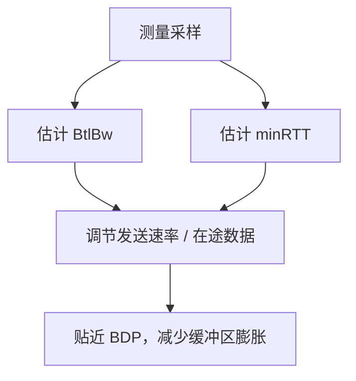

| | Reno | CUBIC | BBR |
| --- | --- | --- | --- |
| 主信号 | 丢包 | 丢包（曲线不同） | 带宽 + RTT |
| 高速长距 | 偏弱 | 更好 | 通常很好 |
| 缓冲膨胀 | 易堆队列 | 看环境 | 主动控延迟 |
| 面试怎么说 | 经典四阶段 | Linux 默认常见 | 基于 BDP 模型 |

一句话：**Reno/CUBIC 是 loss-based；BBR 是 model-based（带宽时延模型）。**

---

## 关联

- [[01-网络分层模型]] · [[02-IP与网络层]] · [[04-HTTP]] · [[08-高频对比与场景题]] · [[09-代理负载与网络IO]] · [[10-HTTP2与QUIC]] · [[11-抓包看图说话]]
