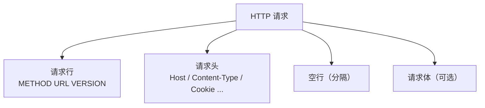
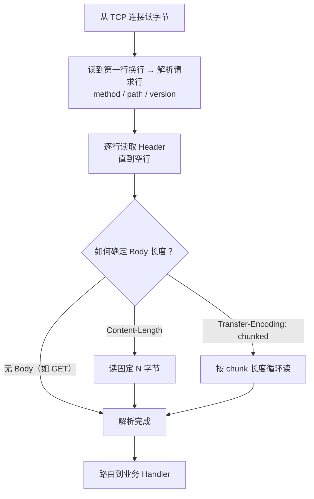
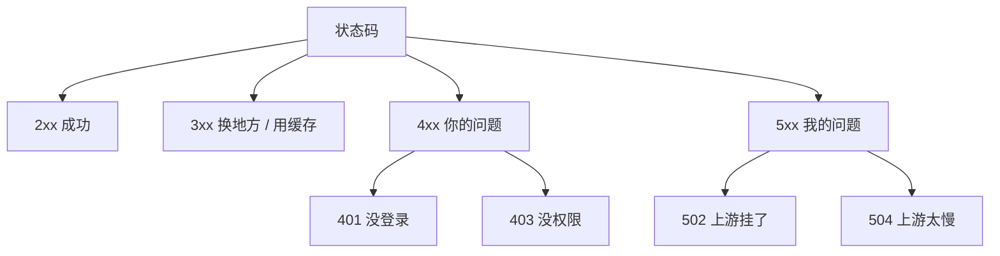
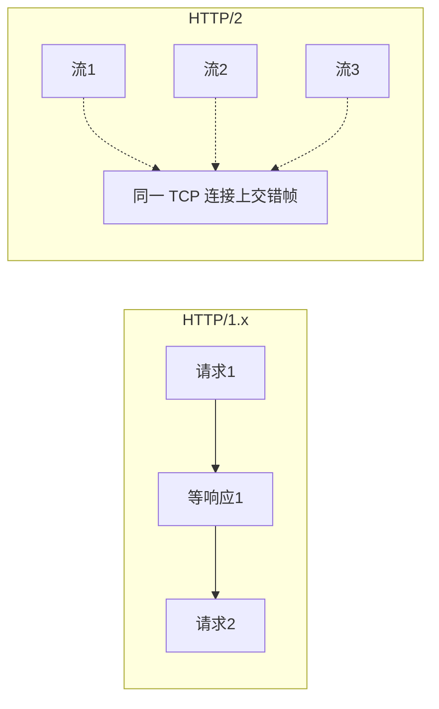
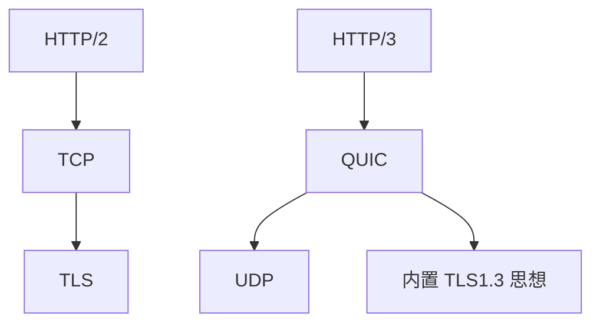
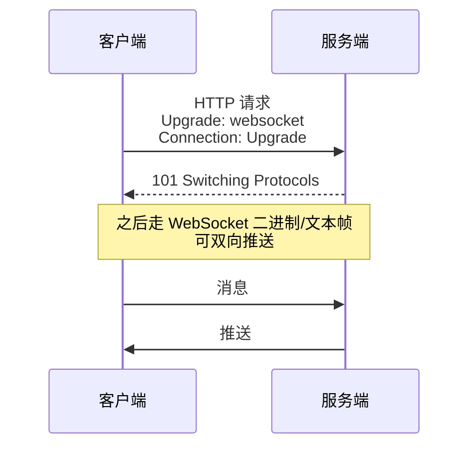
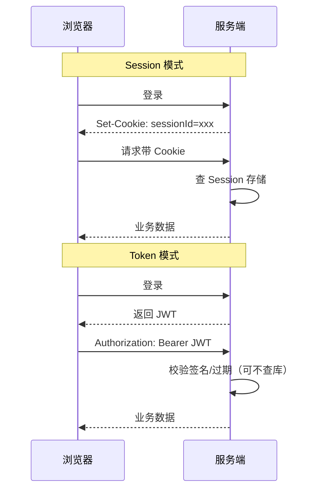
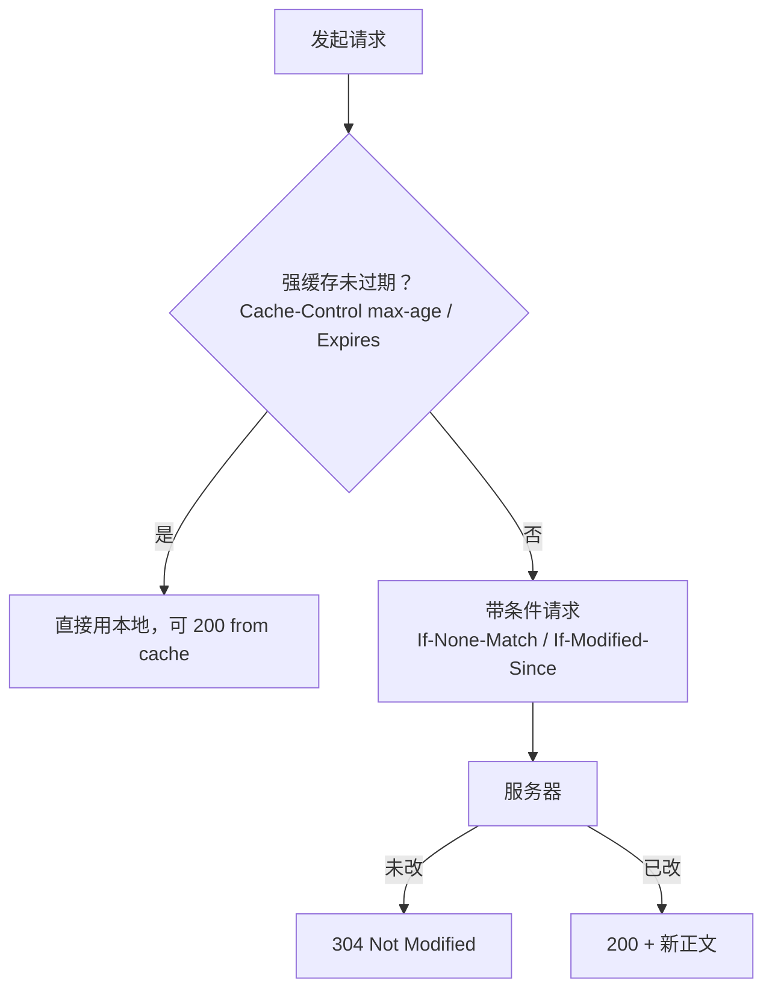
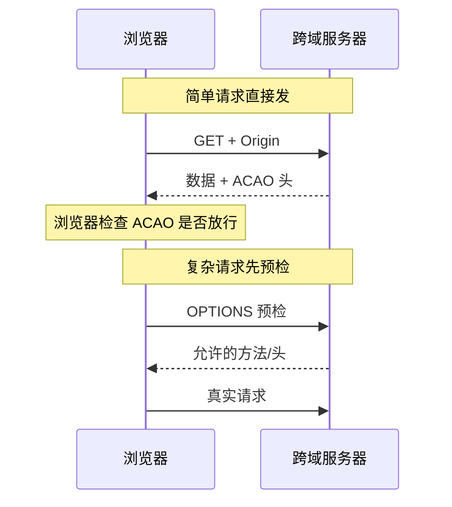

# 04 · HTTP

> 节点目标：HTTP 结构与解析、方法、状态码、版本差异、WebSocket、Cookie/Session/Token。

---

## 面试题

### Q1. HTTP 请求包含哪些内容？请求头和请求体有哪些类型？

一个 HTTP 报文由四部分组成：

```text
请求行
请求头（若干行）
空行
请求体（可选）
```

**请求行：** `方法 + URL + 协议版本`  
例：`GET /api/user?id=1 HTTP/1.1`

**常见请求头类型（按用途记）：**

| 类别 | 例子 | 作用 |
| --- | --- | --- |
| 主机与连接 | `Host`、`Connection` | 虚拟主机、keep-alive |
| 内容相关 | `Content-Type`、`Content-Length`、`Transfer-Encoding` | 体类型与长度 |
| 协商与缓存 | `Accept`、`Accept-Encoding`、`If-None-Match`、`Cache-Control` | 内容协商、缓存 |
| 认证与状态 | `Cookie`、`Authorization` | 登录态 |
| 来源与安全 | `Origin`、`Referer`、`User-Agent` | CORS、统计、风控 |

**请求体常见类型（`Content-Type`）：**

| Content-Type | 场景 |
| --- | --- |
| `application/json` | 接口 JSON |
| `application/x-www-form-urlencoded` | 表单默认 |
| `multipart/form-data` | 文件上传 |
| `text/plain` / `text/xml` | 文本、XML |
| `application/octet-stream` | 二进制 |

GET 通常无 body；POST/PUT/PATCH 常有 body。



---

### Q2. 服务端是如何解析 HTTP 请求的数据的？

本质是**按协议状态机读字节流**（TCP 无消息边界，靠 HTTP 规则切包）：



要点：

1. **请求行** → 方法、路径、版本  
2. **头部** → 键值对，空行结束  
3. **Body** → 看 `Content-Length` 或 `chunked`；HTTP/2 则是二进制帧里的 DATA 帧  
4. Web 容器（Tomcat、Nginx、Netty 编解码器）都实现了这套解析  

粘包场景下，服务端必须严格按长度/chunk 规则读，不能「一次 read 当一个请求」。

---

### Q3. HTTP 中 GET 和 POST 的区别是什么？

| 维度 | GET | POST |
| --- | --- | --- |
| 语义 | 获取资源，应安全、幂等 | 提交/创建，可能改服务器状态 |
| 参数位置 | 多在 URL Query | 多在 Body |
| 缓存 | 可被缓存、可收藏 | 一般不缓存 |
| 长度 | 受 URL 长度限制 | Body 可更大 |
| 编码 | 参数在 URL 中可见 | Body 不进地址栏 |
| 历史记录 | 完整 URL 可能留下 | Body 通常不进历史 |

注意：

- **安全性**：GET/POST 都是明文（除非 HTTPS），不是「POST 就安全」  
- REST 里还会用 PUT/DELETE/PATCH，别只会死记 GET/POST  

---

### Q4. 常见的 HTTP 状态码有哪些？

| 段 | 含义 |
| --- | --- |
| 1xx | 信息（少见，如 100 Continue） |
| 2xx | 成功 |
| 3xx | 重定向 / 缓存 |
| 4xx | 客户端错误 |
| 5xx | 服务端错误 |

**高频具体码：**

| 码 | 含义 | 面试一句话 |
| --- | --- | --- |
| 200 | OK | 成功 |
| 201 | Created | 创建成功 |
| 204 | No Content | 成功但无正文 |
| 301 | Moved Permanently | 永久重定向，SEO/缓存会记新地址 |
| 302 | Found | 临时重定向 |
| 304 | Not Modified | 协商缓存命中 |
| 400 | Bad Request | 请求格式错 |
| 401 | Unauthorized | 未认证 |
| 403 | Forbidden | 已认证但无权限 |
| 404 | Not Found | 资源不存在 |
| 405 | Method Not Allowed | 方法不允许 |
| 429 | Too Many Requests | 限流 |
| 500 | Internal Server Error | 服务端异常 |
| 502 | Bad Gateway | 网关/代理上游异常 |
| 503 | Service Unavailable | 过载或维护 |
| 504 | Gateway Timeout | 网关等上游超时 |



---

### Q5. HTTP 1.0 和 2.0 有什么区别？

| | HTTP/1.0 | HTTP/2 |
| --- | --- | --- |
| 连接 | 默认短连接 | 通常长连接 + 多路复用 |
| 格式 | 纯文本 | **二进制分帧** |
| 并行 | 多开 TCP 连接 | **一连接多流** |
| 头部 | 冗余大 | **HPACK 压缩** |
| 队头阻塞 | 严重（同连接） | 缓解应用层队头阻塞 |
| 推送 | 无 | 可 Server Push（用得少） |

HTTP/1.1 介于两者之间：默认 keep-alive，但仍是文本、易队头阻塞。



---

### Q6. HTTP 2.0 和 3.0 有什么区别？

| | HTTP/2 | HTTP/3 |
| --- | --- | --- |
| 底层 | TCP + TLS | **QUIC（基于 UDP）** |
| 队头阻塞 | 应用层改善了，**TCP 丢包仍堵整连接** | 流之间更独立，减轻队头阻塞 |
| 握手 | TCP + TLS 多轮 | QUIC 把传输与加密结合，**建连更快** |
| 连接迁移 | IP 变了连接通常断 | 支持**连接迁移**（换 Wi-Fi/4G 更稳） |
| 部署 | 已很普及 | 在增长，需 UDP/基础设施支持 |



---

### Q7. WebSocket 与 HTTP 有什么区别？

| | HTTP | WebSocket |
| --- | --- | --- |
| 模式 | 请求-响应，客户端主动拉 | **全双工**，双方都可主动推 |
| 连接 | 短或 keep-alive 复用请求 | 升级后**长连接**持续帧通信 |
| 开销 | 每请求大量头 | 握手后帧头很小 |
| 场景 | 普通网页、REST | 聊天、行情、协作、通知 |

握手仍从 HTTP 开始：



> 更深的握手细节、帧结构、心跳重连、集群推送、鉴权安全等，见专题 **[[14-WebSocket]]**（25 题）。

---

### Q8. Cookie、Session、Token 之间有什么区别？

| | Cookie | Session | Token（如 JWT） |
| --- | --- | --- | --- |
| 存哪 | 浏览器 | 服务端（SessionId 常放 Cookie） | 客户端（Header/本地存储） |
| 内容 | 小段键值 | 服务端会话数据 | 自包含声明或引用凭证 |
| 状态 | 本身只是存储机制 | **有状态**（服务端要存） | 常做成**无状态** |
| 跨域/扩展 | 受域限制 | 集群要共享 Session | 易水平扩展 |
| 典型用途 | 存偏好、存 SessionId | 登录态 | API 鉴权、SSO |



Cookie 关键属性：`HttpOnly`（防 XSS 读）、`Secure`（仅 HTTPS）、`SameSite`（缓解 CSRF）。

---

### Q9. HTTP 长连接和短连接有什么区别？

| | 短连接 | 长连接（Keep-Alive） |
| --- | --- | --- |
| 行为 | 一次请求响应后关闭 TCP | 同一 TCP 上多次请求 |
| 开销 | 反复握手/挥手/TLS，贵 | 摊薄建连成本 |
| 适用 | 极低频请求 | Web、RPC、常规 API |

HTTP/1.0 默认短连接；HTTP/1.1 默认长连接；HTTP/2 更是长时间复用。

---

### Q10. 说说 HTTP 缓存机制（强缓存 / 协商缓存）？



| 类型 | 关键头 | 结果 |
| --- | --- | --- |
| 强缓存 | `Cache-Control`、`Expires` | 不发或可直接本地命中 |
| 协商缓存 | `ETag` / `Last-Modified` | 可能 304，省带宽 |

`Cache-Control: no-store / no-cache / private / public / max-age` 面试常问含义。

---

### Q11. 什么是跨域？CORS 怎么解决？

浏览器**同源策略**：协议 + 域名 + 端口都相同才算同源。跨域请求读响应会被浏览器拦截（服务器其实可能已返回）。

**CORS**：服务端通过响应头声明允许谁访问，如：

- `Access-Control-Allow-Origin`
- `Access-Control-Allow-Methods`
- `Access-Control-Allow-Headers`
- 带 Cookie 时还要 `Allow-Credentials` 且 Origin 不能是 `*`



其他方案：同源网关反向代理、JSONP（仅老 GET，不推荐）。

---

### Q12. 301、302、307、308 有什么区别？

| 码 | 含义 | 方法是否允许变 |
| --- | --- | --- |
| 301 | 永久重定向 | 很多客户端会把 POST 改成 GET |
| 302 | 临时重定向 | 历史上也常改成 GET |
| 307 | 临时重定向 | **不允许改方法** |
| 308 | 永久重定向 | **不允许改方法** |

SEO：永久迁移用 301/308；临时跳转用 302/307。

---

### Q13. 什么是分块传输 chunked？

不知道正文总长度时（边生成边发），用 `Transfer-Encoding: chunked`：按块发送 `长度 + 数据`，最后 `0` 长度块结束。  
HTTP/2 用帧承载，不再依赖 HTTP/1.1 的 chunked 文本机制。

---

### Q14. HTTP 幂等性是什么？哪些方法幂等？

**幂等**：同一请求执行多次，对资源的副作用与执行一次相同。

| 方法 | 安全（不改资源） | 幂等 |
| --- | --- | --- |
| GET / HEAD | 是 | 是 |
| PUT / DELETE | 否 | 是 |
| POST / PATCH | 否 | 一般否 |

支付等业务要自己做幂等键，不能只靠 HTTP 方法语义。

---

### Q15. 长轮询、WebSocket、SSE 怎么选？

| | 长轮询 | WebSocket | SSE |
| --- | --- | --- | --- |
| 方向 | 模拟推送 | 全双工 | **服务端→客户端** 单向流 |
| 基于 | 普通 HTTP | 升级后的长连接 | HTTP |
| 复杂度 | 低 | 中 | 较低 |
| 场景 | 兼容差环境 | 聊天、协作、游戏 | 通知、简单推送 |

---

### Q16. 什么是 RESTful？和 HTTP 什么关系？

REST 是架构风格：资源用 URL 标识，用 HTTP 方法表达动作，用状态码表达结果，无状态交互。  
不等于「用了 JSON 就是 REST」；重点是资源建模与语义化方法。

---

### Q17. Cookie 有哪些关键属性？和安全有什么关系？

| 属性 | 作用 |
| --- | --- |
| `Domain` / `Path` | 哪些主机/路径会带上 |
| `Expires` / `Max-Age` | 持久化 vs 会话 Cookie |
| `Secure` | 只在 HTTPS 发送 |
| `HttpOnly` | JS 读不到，缓解 XSS 偷 Cookie |
| `SameSite` | `Strict/Lax/None`，缓解 CSRF |
| `Partitioned` 等 | 新隐私相关（了解即可） |

口诀：**敏感会话 Cookie 尽量 Secure + HttpOnly + SameSite。**

---

### Q18. ETag / Last-Modified 协商缓存细节？

1. 首次响应带 `ETag` 或 `Last-Modified`  
2. 再请求带 `If-None-Match` / `If-Modified-Since`  
3. 未变 → **304**，省流量；变了 → 200 + 新正文  

强缓存（`Cache-Control: max-age`）未过期**根本不发请求**；过期后才走协商。  
`ETag` 分强/弱校验；内容哈希做 ETag 常见。

---

### Q19. 什么是 HTTP Range 请求？断点续传怎么做？

客户端头：`Range: bytes=0-1023`  
服务端：`206 Partial Content` + `Content-Range`  

用途：断点续传、多线程下载、视频拖拽。  
条件：资源支持范围；注意鉴权与缓存。

---

### Q20. HTTP Pipeline 是什么？为什么少用？

HTTP/1.1 允许一条连接上连续发多个请求不等响应（流水线）。  
现实：队头阻塞、实现 buggy、代理不友好 → **基本被弃用**；改用并发连接或 HTTP/2 多路复用。

---

### Q21. Content-Length 和 Transfer-Encoding 能同时出现吗？

规范上 chunked 时不应再依赖 Content-Length 定界；实现若两者都有容易歧义，安全上曾有「请求走私」利用。  
网关/代理要统一归一化报文边界。详见 [[15-拓展知识与场景题]] 请求走私。

---

### Q22. 401、403、404、429、502、504 怎么向面试官区分？

| 码 | 一句话 |
| --- | --- |
| 401 | 未认证（没登录/Token 无效） |
| 403 | 已认证但没权限 / 拒绝 |
| 404 | 资源不存在（或故意隐藏） |
| 429 | 限流太快 |
| 502 | 网关上游无效响应 |
| 504 | 网关等上游超时 |

---

### Q23. 什么是幂等键？POST 如何做成可重试？

客户端生成唯一 `Idempotency-Key`，服务端对同一键只执行一次业务副作用。  
网络超时重试 POST 时靠它避免重复下单——**业务幂等**补 HTTP 语义不足。

---

### Q24. HTTP 内容协商 Accept 系列怎么工作？

客户端声明能力：`Accept` / `Accept-Language` / `Accept-Encoding`  
服务端选表示，可用 `Vary` 告诉缓存「按哪些头区分变体」。  
`Accept-Encoding: gzip, br` → 压缩传输，浏览器自动解。

---

### Q25. 浏览器同源下 Cookie 自动携带，跨站呢？

- 同站请求：按 Domain/Path/SameSite 规则带 Cookie  
- 跨站：受 **SameSite** 与第三方 Cookie 策略限制越来越严  
- CORS 带 Cookie 需 `credentials` + 服务端 `Access-Control-Allow-Credentials`，且 `Allow-Origin` 不能是 `*`

---

## 拓展知识

### Q26. 什么是 HTTP 请求走私（Request Smuggling）？（拓展）

前端（CDN/反代）与后端对「请求边界」解析不一致（CL/TE 歧义）时，攻击者可把下一个请求「藏」进当前请求，污染队列。  
防：统一用 HTTP/2 到源、规范化头、升级代理、拒绝歧义报文。

---

### Q27. GraphQL / gRPC-Web 和「纯 REST」在 HTTP 上的差异？（拓展）

- GraphQL：常一个 POST 端点，语义在 body；缓存/网关要另做  
- gRPC-Web：浏览器侧借 HTTP/1.1 或 H2 封装，与原生 gRPC 有代理转换  

选型别只比「好不好看」，要比**缓存、调试、流式、多语言、网关生态**。

---

## 关联

- [[05-HTTPS与安全]] · [[03-TCP与UDP]] · [[06-DNS与应用层]] · [[10-HTTP2与QUIC]] · [[15-拓展知识与场景题]]
