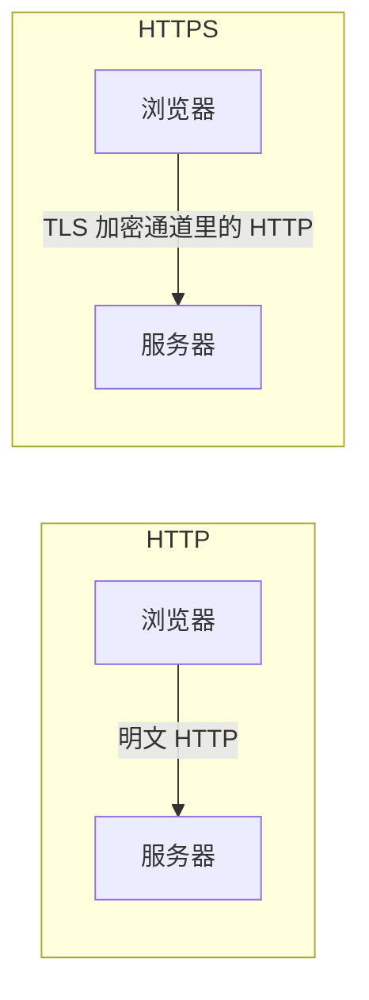
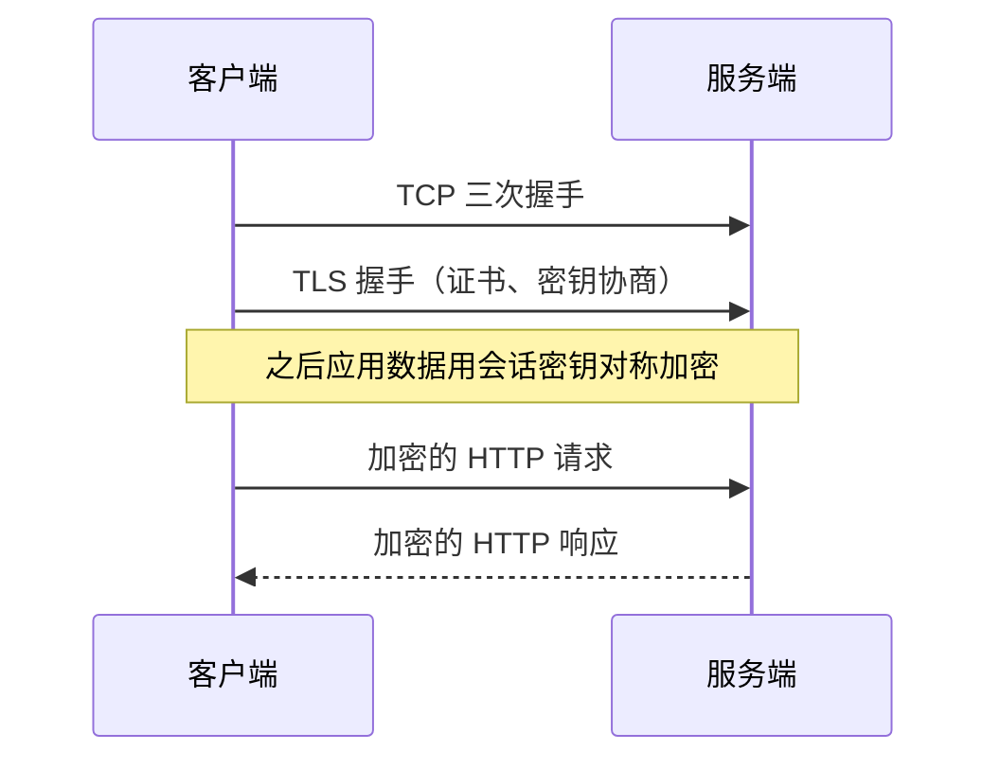
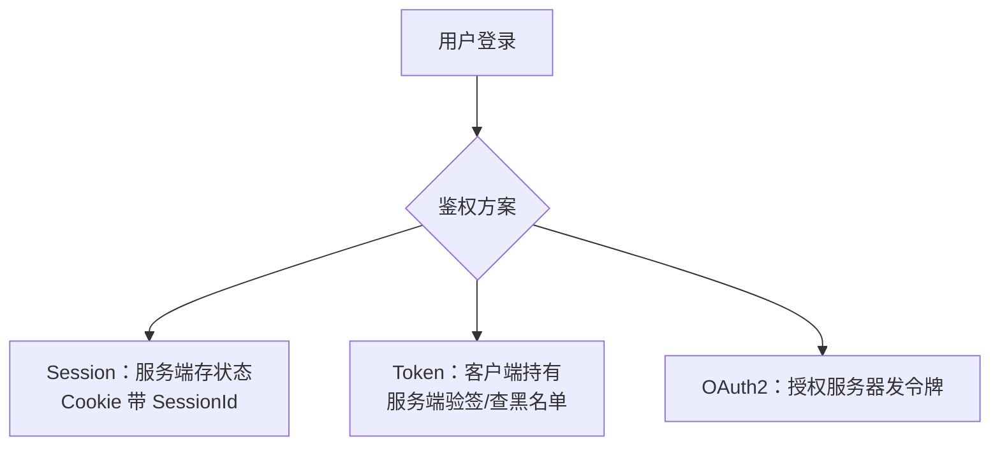
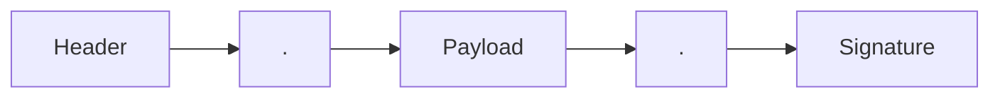
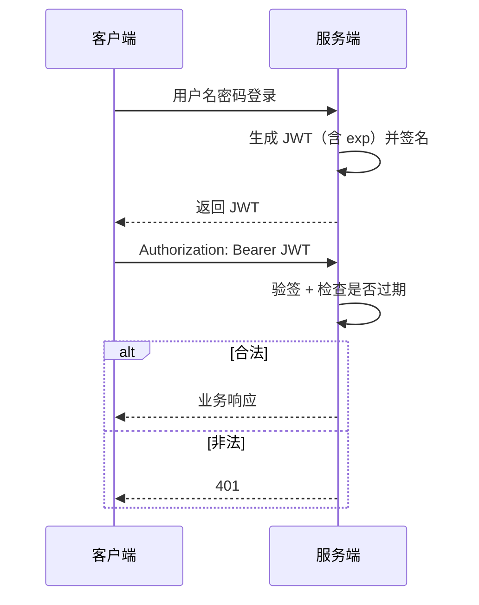
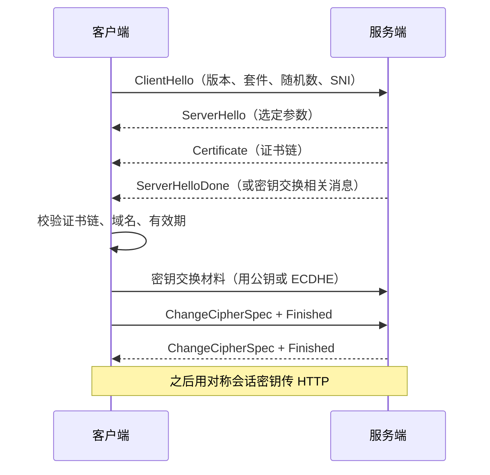
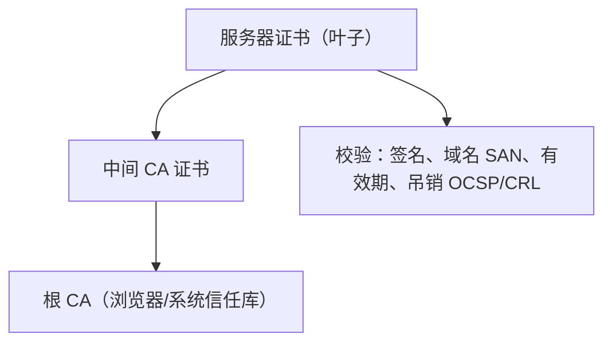
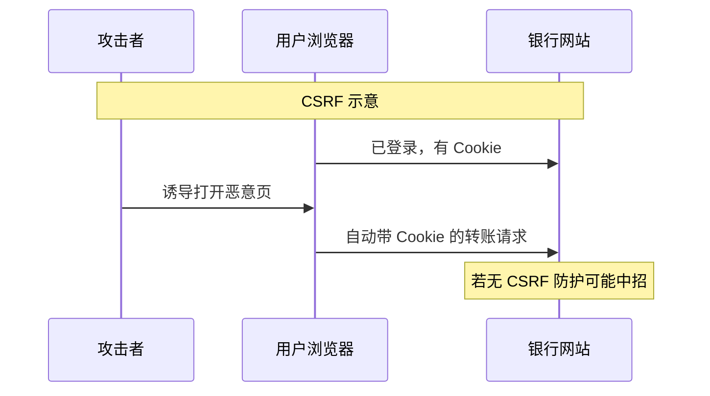

# 05 · HTTPS 与安全 / 鉴权

> 节点目标：HTTP vs HTTPS、TLS 思路、登录鉴权、JWT。

---

## 面试题

### Q1. HTTP 和 HTTPS 有什么区别？

| 维度 | HTTP | HTTPS |
| --- | --- | --- |
| 全称 | HyperText Transfer Protocol | HTTP over TLS/SSL |
| 安全性 | 明文，可被窃听、篡改、冒充 | 加密 + 完整性 + 身份认证（证书） |
| 端口 | 80 | 443 |
| 证书 | 不需要 | 需要 CA 证书（或自签，浏览器会告警） |
| 性能 | 无握手加密开销 | 多 TLS 握手与加解密（现代可接受，可会话复用） |
| SEO | 相对劣势 | 搜索引擎更倾向 HTTPS |

一句话：**HTTPS = HTTP + 加密传输通道（TLS）。**





---

### Q2. 对称加密和非对称加密在 HTTPS 里怎么配合？

- **非对称**：解决「怎么安全地商量出一把钥匙」（慢，只用于握手阶段）
- **对称**：解决「大量数据怎么加密」（快，用于业务传输）
- **证书**：证明服务器公钥可信，防中间人塞假公钥

---

### Q3. 常见的登录鉴权方式有哪些？各自的优缺点是？

| 方式 | 做法 | 优点 | 缺点 |
| --- | --- | --- | --- |
| Session + Cookie | 登录后服务端建 Session，浏览器存 SessionId | 实现简单、服务端可主动失效 | 集群要共享 Session；CSRF 风险；扩展成本 |
| Token（JWT 等） | 登录发 Token，以后请求头携带 | 易无状态扩展、跨域友好 | 注销/续期要额外设计；Token 泄露风险 |
| Basic Auth | 每次带用户名密码 Base64 | 极简单 | 不安全，几乎只适合内网/演示 |
| OAuth2 / OIDC | 授权码等流程拿访问令牌 | 适合第三方登录、开放平台 | 流程复杂 |
| SSO 单点登录 | 统一认证中心 | 多系统一次登录 | 基础设施重 |



**怎么选（面试加分）：**

- 传统同域 Web 后台 → Session-Cookie 很常见  
- 前后端分离、多端 API、微服务 → Token / OAuth2 更常见  
- 敏感操作仍建议：短过期 + 刷新令牌 + HTTPS + 绑定设备/风控  

---

### Q4. JWT Token 能说说吗？

**JWT（JSON Web Token）** 通常长这样：

```text
Header.Payload.Signature
```

三段都是 Base64URL：

1. **Header**：算法、类型，如 `{"alg":"HS256","typ":"JWT"}`  
2. **Payload**：声明（用户 id、过期时间 `exp`、签发时间等）——**默认不加密，别塞密码**  
3. **Signature**：用密钥对前两段签名，防篡改  





**优点：** 自包含、易扩展、适合分布式  
**缺点 / 注意：**

- 默认可解码 Payload → 敏感数据不要放  
- 签发后难主动作废 → 需要黑名单、短过期 + Refresh Token、版本号  
- 密钥泄露会导致伪造 → 密钥轮转、RS256 公私钥等  

---

### Q5. HTTPS 一定不会被攻击吗？

不是。HTTPS 主要保护**链路上的窃听与篡改**。仍要注意：

- 钓鱼域名（用户点了假站）  
- XSS 偷 Token、CSRF（看 Cookie 策略）  
- 用户忽略证书警告  
- 服务端自身漏洞  

相关头：`HSTS` 强制 HTTPS；Cookie 的 `HttpOnly` / `Secure` / `SameSite`。

---

### Q6. 详细说说 TLS/SSL 握手过程？

以常见思路（概念版）说明：



要点：

1. **证书**证明「公钥属于该域名」  
2. **ECDHE** 等提供前向保密（即使私钥泄露，过去会话也不易被解）  
3. **TLS 1.3** 握手轮次更少，去掉不安全老算法，更快更安全  

---

### Q7. TLS 1.2 和 TLS 1.3 有什么区别？

| | TLS 1.2 | TLS 1.3 |
| --- | --- | --- |
| 握手 | 通常更多 RTT | 更少 RTT，可 1-RTT，甚至 0-RTT（有重放风险要谨慎） |
| 算法 | 残留一些老套件 | 大幅删减，强制现代 AEAD |
| 前向保密 | 看协商 | 设计上更强调 |
| 兼容 | 仍广泛 | 新部署优先 |

---

### Q8. 数字证书和证书链是怎么校验的？



- 浏览器信任根 CA，逐级验签到叶子  
- 还要核对证书里的域名是否匹配当前访问域名  
- 自签证书：链不在信任库 → 告警  

---

### Q9. 什么是中间人攻击？HTTPS 如何防御？

中间人（MITM）夹在客户端与服务端之间，转发并窥探/篡改。

HTTPS 防御关键：

1. 证书链校验失败则告警  
2. 用户**不要忽略**证书警告  
3. HSTS 强制 HTTPS，减少降级劫持  
4. 证书固定（Pinning）在部分 App 使用（运维成本高）  

若用户连了恶意 Wi‑Fi 并安装了攻击者根证书，仍可能被代理解密——信任根是安全模型的一部分。

---

### Q10. XSS 和 CSRF 是什么？怎么防？

| | XSS | CSRF |
| --- | --- | --- |
| 全称 | Cross Site Scripting | Cross Site Request Forgery |
| 本质 | 注入恶意脚本，在用户浏览器执行 | 诱导已登录用户的浏览器**自动带 Cookie** 发请求 |
| 危害 | 偷 Cookie/Token、改页面、钓鱼 | 在用户不知情下执行转账、改密码等 |
| 防御 | 输出转义、CSP、HttpOnly、避免危险 API | SameSite Cookie、CSRF Token、关键操作二次验证、不靠 Cookie 的纯 Header Token |



---

### Q11. 什么是同源策略？和 CORS、CSRF 关系？

同源策略限制「不同源页面」随意读对方响应、操作对方 DOM。  
- CORS：服务端**显式放行**跨域读  
- CSRF：攻击的是「浏览器会自动带 Cookie」这一点，同源策略挡不住跨站**发请求**（只挡随意读响应），所以要另做 CSRF 防护  

---

### Q12. HSTS 是什么？

`Strict-Transport-Security`：告诉浏览器在一段时间内**只允许 HTTPS** 访问该站，降低首次被降级到 HTTP 劫持的风险。

---

### Q13. 证书有哪些类型？DV / OV / EV / 通配符？

| 类型 | 含义 |
| --- | --- |
| DV | 域名验证，自动化（Let's Encrypt）最常见 |
| OV / EV | 组织验证，显示公司信息（EV 地址栏提示已弱化） |
| 通配符 | `*.example.com` |
| 多域名 SAN | 一张证多个 Host |

面试重点：**浏览器校验链 + 域名匹配 + 有效期**，不是 EV 光环。

---

### Q14. 什么是证书透明 CT？OCSP / CRL？

- **CRL**：吊销列表，体积大、更新慢  
- **OCSP**：在线查单证是否吊销；可用 **OCSP Stapling** 由服务器捎带结果减延迟  
- **CT**：证书公开日志，便于发现误发/假证  

---

### Q15. 什么是双向 TLS（mTLS）？

客户端也出示证书，服务端校验客户端身份。  
常用于微服务网格、开放银行、设备接入。代价：证书签发与轮换运维重。

---

### Q16. 对称算法、哈希、密钥交换常见名词？

| 类别 | 例子 | 作用 |
| --- | --- | --- |
| 对称 | AES-GCM | 会话数据加密+完整性 |
| 哈希 | SHA-256 | 摘要、HMAC、证书签名校验链路 |
| 密钥交换 | ECDHE | 前向保密的临时密钥协商 |
| 签名 | RSA / ECDSA | 证明确实持有证书私钥 |

现代套件优先 **AEAD（如 AES-GCM）+ ECDHE + 前向保密**。

---

### Q17. 什么是前向保密 PFS？

即使长期私钥将来泄露，也**解不开过去的会话**（因用了临时 ECDHE 密钥）。  
TLS 1.3 强制 PFS；TLS 1.2 要选对套件。

---

### Q18. Session Ticket / Session ID 复用有什么风险？

复用减少握手 RTT，但 Ticket 密钥若泄露可解密历史；要轮换 Ticket Key，控制生命周期。TLS 1.3 的 PSK/0-RTT 另有重放风险（见 [[10-HTTP2与QUIC]]）。

---

### Q19. OAuth2 / OIDC 和 JWT 什么关系？（网络交叉）

- OAuth2：授权框架（拿到 Access Token 访问资源）  
- OIDC：在 OAuth2 上加身份层（ID Token）  
- JWT：Token **编码格式**之一  

HTTPS 保护传输；还要防 Token 泄露、固定重定向 URI、正确 `state`/`nonce`。

---

### Q20. 点击劫持、开放重定向了解吗？

- **点击劫持**：用透明 iframe 骗点 → `X-Frame-Options` / CSP `frame-ancestors`  
- **开放重定向**：登录后跳到用户可控 URL → 钓鱼；校验白名单域名  

---

## 拓展知识

### Q21. 证书过期 / 链不完整线上怎么排？（拓展）

症状：浏览器红标、Java `PKIX`、curl `SSL certificate problem`。  
查：完整链是否缺中间证、系统时间、SNI 是否指对虚拟主机、是否自签未信任。

---

### Q22. HTTPS 卸载（TLS 终结）在哪做比较好？（拓展）

常见：边缘 CDN / 网关终结 TLS，内网 mTLS 或明文（视安全模型）。  
利：证书集中、卸载 CPU；弊：内网被嗅探风险、要信任机房网络。零信任倾向**尽量全路径加密**。

---

## 关联

- [[04-HTTP]] · [[07-输入URL全过程]] · [[10-HTTP2与QUIC]] · [[15-拓展知识与场景题]]
