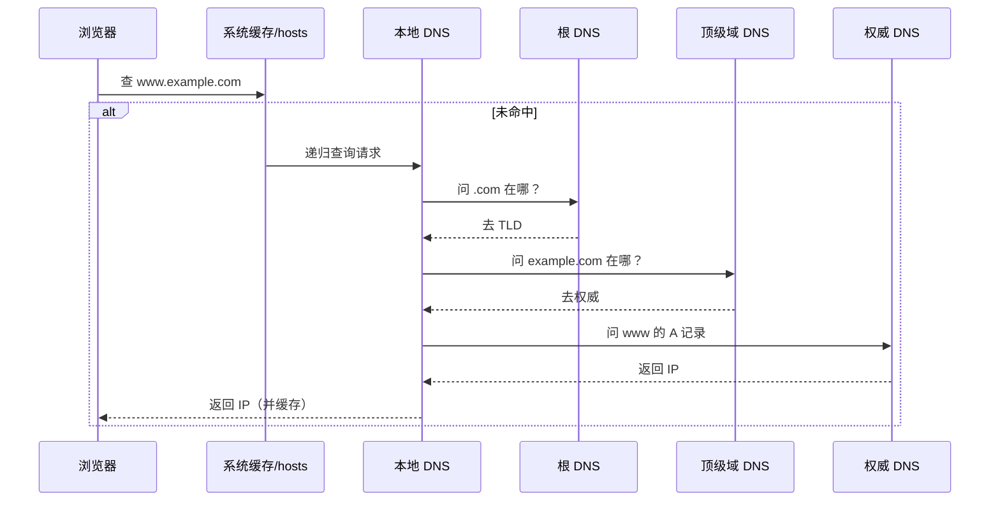
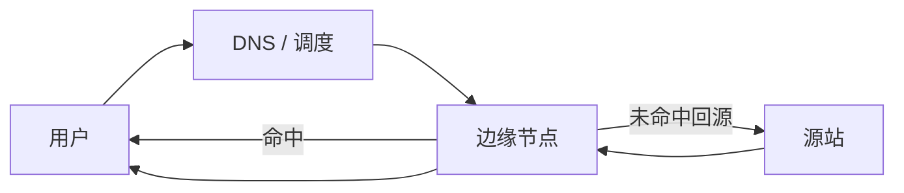
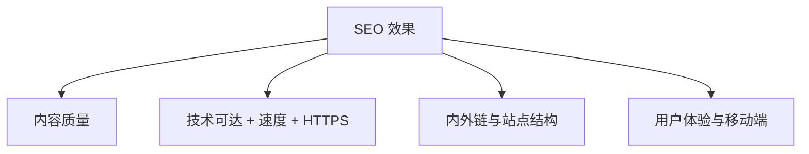

# 06 · DNS、CDN 与 SEO

> 节点目标：DNS 解析、CDN 加速、SEO 基础（你列表里的应用层相关题）。

---

## 面试题

### Q1. 简单谈谈你对 DNS 的理解？

DNS（Domain Name System）把**人能记的域名**解析成**机器能用的 IP**。

- 应用层协议；查询常用 **UDP 53**（应答过大或区传送等用 TCP）
- 分层命名：根 → 顶级域（`.com`）→ 权威域（`example.com`）
- 有多级**缓存**（浏览器、系统、本地 DNS、运营商），靠 **TTL** 控制过期

**解析流程（口述版）：**

**常见记录：** A（IPv4）、AAAA（IPv6）、CNAME（别名）、MX（邮件）、NS、TXT。

---

### Q2. 简单谈谈你对 CDN 的理解？

CDN（Content Delivery Network）把内容缓存到**离用户更近的边缘节点**，就近访问，降低延迟、减轻源站压力。

**关键点：**

1. **调度**：按地域、运营商、负载把用户导到合适节点（常结合 DNS）  
2. **缓存**：静态资源（JS/CSS/图/视频）命中率是核心  
3. **回源**：未命中或过期时回源站拉  
4. **收益**：加速、抗流量、一定防御能力  

动态接口也能用 CDN/边缘，但策略更复杂（缓存键、是否可缓存）。

---

### Q3. SEO 是什么？高低取决因素是什么？如何优化？

**SEO（Search Engine Optimization）**：搜索引擎优化，让页面在搜索结果里更靠前、获得更多自然流量。

**排名常见相关因素（简化）：**

| 类别 | 因素 |
| --- | --- |
| 内容 | 是否解决用户问题、原创度、完整性、更新 |
| 技术 | 可爬取、站点速度、移动适配、HTTPS、结构化数据 |
| 结构 | 标题/描述/标题层级、URL 清晰、内链 |
| 权威 | 外链质量、品牌、站点权重 |
| 体验 | 跳出、停留、Core Web Vitals（LCP/CLS 等） |

**常见优化手段：**

1. **内容**：围绕关键词写有价值内容，避免堆砌  
2. **标题与 meta**：`title`、`description` 准确吸引点击  
3. **性能**：压缩资源、CDN、缓存、图片优化  
4. **可爬性**：`robots.txt`、sitemap、少用纯前端无降级渲染（或 SSR）  
5. **移动与安全**：响应式、HTTPS  
6. **外链与内链**：合理结构，优质外链  
7. **301**：域名/路径永久迁移时用对状态码  

网络面试里 SEO 通常点到：**HTTPS、速度、可访问性、服务端渲染/预渲染对爬虫更友好**。

---

### Q4. DNS 递归查询和迭代查询有什么区别？

| | 递归 | 迭代 |
| --- | --- | --- |
| 谁累 | 被问的服务器帮你问到底 | 被问的只给你「下一跳去哪」 |
| 典型 | 浏览器 ↔ 本地 DNS：本地 DNS 帮你递归 | 本地 DNS ↔ 根/TLD/权威：多为迭代 |

客户端通常只问本地 DNS 一次；本地 DNS 去外面「辗转问人」。

---

### Q5. 什么是 DNS 劫持 / 污染？怎么缓解？

- **劫持**：解析结果被篡改，返回错误 IP（运营商、恶意软件、中间人等）  
- **污染**：伪造 DNS 应答抢先到达  

缓解：换可信 DNS、**DoH/DoT**（加密 DNS）、HTTPDNS、HTTPS 证书校验（假站证书对不上会告警）、App 可证书锁定。

---

### Q6. 什么是 HTTPDNS？

应用直接用 HTTP/HTTPS API 向服务商请求解析，**绕过本地 DNS**，可防部分劫持，还能做精准调度。  
代价：要实现缓存、兜底、服从权威 TTL 等。

---

### Q7. DNS 负载均衡是怎么做的？

同一域名配置多个 A 记录，按策略返回不同 IP（轮询、就近、按运营商）。  
特点：简单；粒度粗；TTL 导致切换不及时；无法感知后端真实健康（除非配合健康检查改 DNS）。  
更细的负载常在四层/七层代理做。

---

### Q8. CDN 回源和缓存刷新了解吗？

- **回源**：边缘未命中或过期，向源站（或上级）拉内容  
- **缓存键**：通常 URL + 部分头；查询串、Cookie 配置不当会导致命中率低  
- **刷新/预热**：发布新版本后 purge；大促前预热热点  

---

## 关联

- [[04-HTTP]] · [[07-输入URL全过程]] · [[09-代理负载与网络IO]] · [[00-知识总览]]
