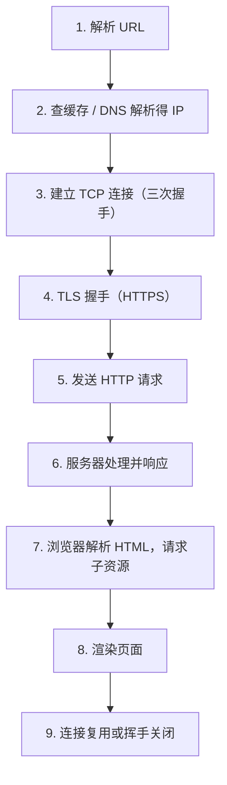
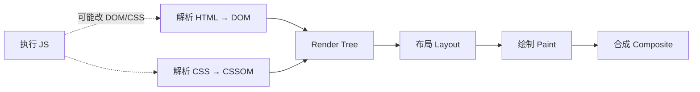
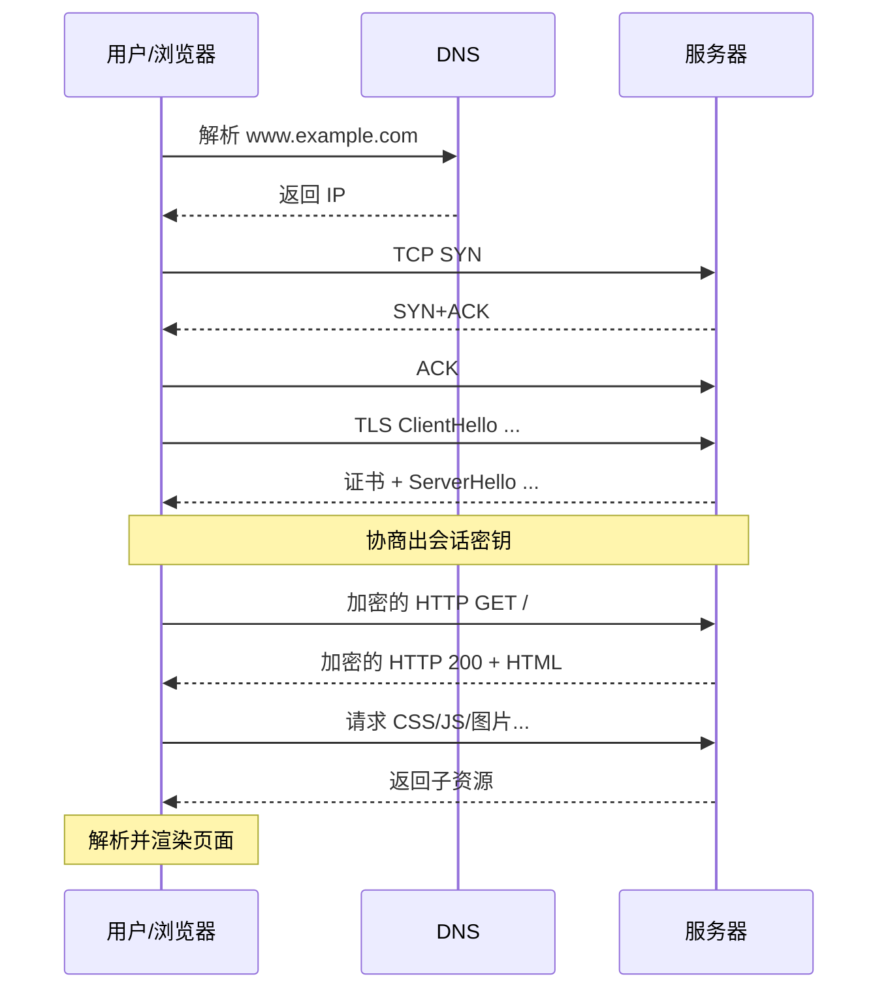

# 07 · 从输入网址到页面显示

> 节点目标：综合串讲题。把 DNS / TCP / TLS / HTTP / 渲染串成一条可口述的时间线。

---

## 面试题

### Q1. 从网络角度来看，用户从输入网址到网页显示，期间发生了什么？

以访问 `https://www.example.com/` 为例。

#### 总览（先背这个）



#### 分步详解

**① 解析 URL**

- 协议：`https` → 端口默认 443  
- 主机：`www.example.com`  
- 路径：`/`；`#hash` 一般不发给服务器  

**② DNS 解析得到 IP**

浏览器缓存 → 系统缓存 / hosts → 本地 DNS →（未命中则）根 / 顶级 / 权威。  
若用了 CDN，拿到的可能是**边缘节点 IP**。详见 [[06-DNS与应用层]]。

**③ 建立 TCP 连接**

四元组确定连接；三次握手。同网段 ARP 解析下一跳 MAC；跨网段先找网关。详见 [[03-TCP与UDP]]、[[02-IP与网络层]]。

**④ TLS 握手（仅 HTTPS）**

校验证书、协商会话密钥，之后 HTTP 在加密通道中传输。详见 [[05-HTTPS与安全]]。

**⑤ 发 HTTP 请求**

```text
GET / HTTP/1.1
Host: www.example.com
...
```

**⑥ 服务端响应**

状态码 + 头 + HTML 正文（或 301/302 重定向，则可能重新 DNS/连接）。

**⑦ 加载子资源**

解析 HTML 时遇到 CSS/JS/图片，再发请求：

- HTTP/1.1：可能多条 TCP  
- HTTP/2：同连接多路复用  
- HTTP/3：走 QUIC  

**⑧ 渲染（前端向，点到即可）**



**⑨ 连接结束**

Keep-Alive 则复用；否则四次挥手关闭。

#### 带时序的网络视角



#### 面试加分追问怎么接

| 追问 | 答法方向 |
| --- | --- |
| 哪一步最慢 | 看情况：DNS、建连+TLS、首字节 TTFB、大资源、渲染阻塞 |
| 如何加速 | DNS 预解析、CDN、HTTP/2/3、缓存、连接复用、SSR、资源压缩 |
| 为什么要 HTTPS | 防窃听篡改、身份认证、SEO/浏览器策略 |
| 重定向会怎样 | 再走一轮（可能再次 DNS），注意 301/302 差异 |

---

### Q2. 如果中间有 301 重定向到另一个域名，全过程有何变化？

1. 第一次请求拿到 `301` + `Location: https://new.example.com/`  
2. 浏览器对**新域名**可能再次 DNS  
3. 再走 TCP（+TLS）+ 请求  
4. 永久重定向常被浏览器缓存，下次直接去新地址  

性能：多一次 RTT 级成本；SEO/书签要用对 301 vs 302。

---

### Q3. 浏览器如何决定用 HTTP/1.1、HTTP/2 还是 HTTP/3？

- 先按习惯连（常 TCP 443 + TLS）  
- ALPN 协商出 `h2` 或 `http/1.1`  
- 若响应/`Alt-Svc` 宣告 h3，后续可尝试 **QUIC UDP 443**  

不是「输入 URL 就指定 H3」，而是**协商与升级**。详见 [[10-HTTP2与QUIC]]。

---

### Q4. 从输入 URL 到首字节（TTFB）慢，怎么拆？

| 区间 | 可能原因 |
| --- | --- |
| DNS | 递归慢、TTL 未命中、污染 |
| TCP/TLS | 丢包重传、远距离 RTT、证书链大 |
| 服务端处理 | 排队、慢查、冷启动 |
| 网关 | 反代超时、上游拥塞 |

工具：浏览器 Network 瀑布图、`curl -w`、服务器 access 耗时、抓包。

---

### Q5. 为什么有时「第二次打开同一网站快很多」？

- DNS / TLS Session / TCP 连接复用  
- 强缓存命中静态资源  
- HSTS、Socket Pool  

对比「无痕首次」才能量冷启动成本。

---

### Q6. 公司代理 / VPN 环境下全过程有什么不同？

- 系统代理：HTTP 走明文代理；HTTPS 常 **CONNECT 隧道**  
- 抓包代理（Charles）：需信任其证书，等于合法中间人  
- VPN：先虚拟网卡改路由，再 DNS/访问可能走企业内网解析（Split DNS）

---

### Q7. 移动 App 访问 API 和浏览器打开网页差在哪？

| | 浏览器 | App |
| --- | --- | --- |
| DNS | 系统 + 浏览器缓存 | 系统或 HTTPDNS |
| 连接 | 连接池、H2 | OkHttp 等自管池 |
| 证书 | 系统信任库 | 可 Certificate Pinning |
| 渲染 | HTML/CSS/JS | 无，纯 API JSON |

口述仍是：**解析 → 建连 →（TLS）→ 发请求 → 处理响应**。

---

## 拓展知识

### Q8. 关键路径上的「连接池、域名分片」老优化还要吗？（拓展）

HTTP/1.1 时代多域名分片提高并行；HTTP/2/3 单连接多路后**反而少分片更好**（减少建连与竞赛）。  
现代优化重心：减少请求数、缓存、CDN、压缩、优先级、Server 侧 TTFB。

---

### Q9. Service Worker / 浏览器缓存会插入到哪一步？（拓展）

在「发网络请求」前可能被 SW 拦截：直接本地响应或改写请求。  
面试主链路仍讲网络；提到 SW 可体现你知道现代 Web 缓存层次。

---

## 关联

- [[01-网络分层模型]] · [[02-IP与网络层]] · [[03-TCP与UDP]]
- [[04-HTTP]] · [[05-HTTPS与安全]] · [[06-DNS与应用层]] · [[15-拓展知识与场景题]]
