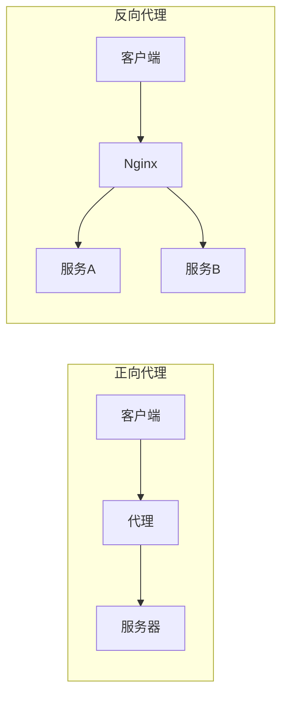
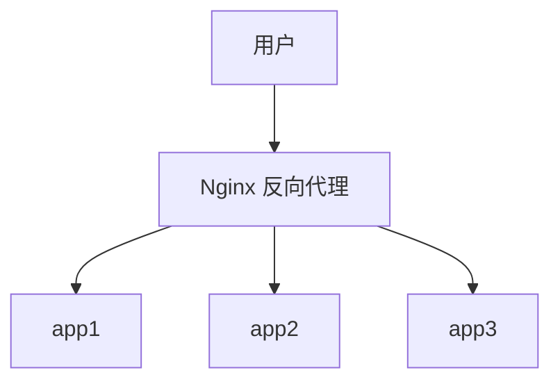
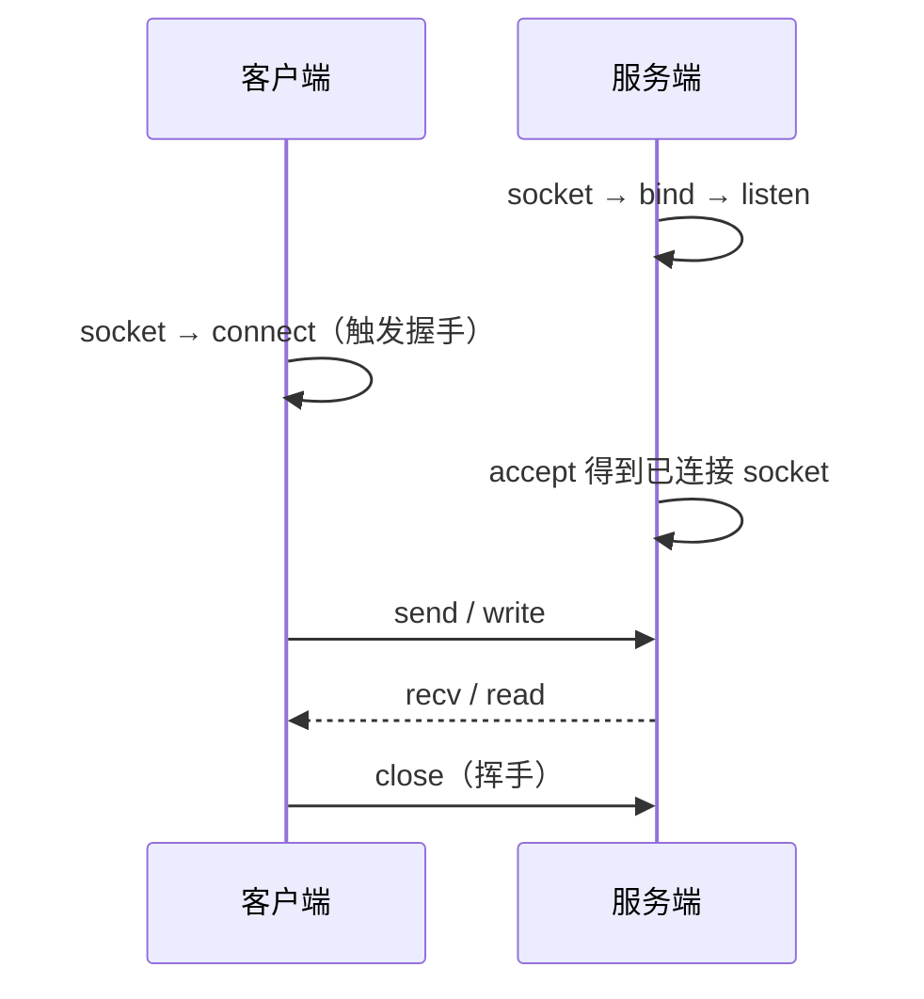
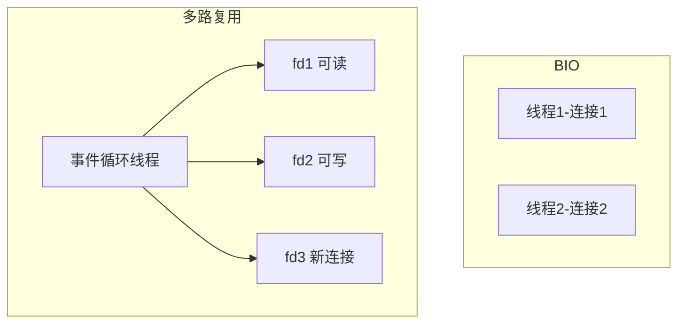
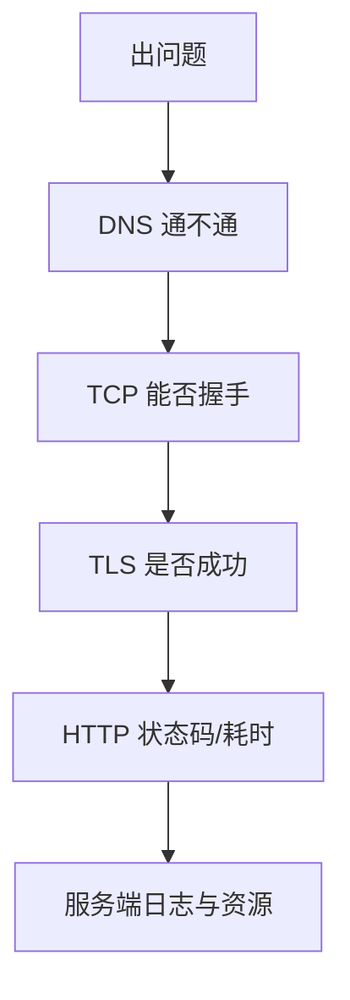

# 09 · 代理、负载均衡与网络 IO

> 节点目标：正向/反向代理、Nginx、负载均衡、Socket 与 IO 多路复用（后端高频交叉题）。

---

## 面试题

### Q1. 正向代理和反向代理有什么区别？

| | 正向代理 | 反向代理 |
| --- | --- | --- |
| 代理谁 | **客户端** | **服务端** |
| 谁知道 | 客户端知道代理，服务器不一定知道真实客户端 | 客户端以为在访问代理，不知道后面真实服务器 |
| 典型 | 科学上网、公司上网代理、抓包工具 | Nginx、API 网关、CDN 边缘 |

---

### Q2. Nginx 反向代理和负载均衡常见策略？

常见策略：

| 策略 | 说明 |
| --- | --- |
| 轮询 round-robin | 依次分发 |
| 加权轮询 | 机器性能不同给不同权重 |
| IP Hash | 同 IP 落到同机器（简单会话保持） |
| 最少连接 | 把请求给连接数少的 |
| 一致性哈希 | 缓存场景减少抖动 |

还可做：SSL 终止、限流、缓存、静态资源、黑白名单、灰度。

---

### Q3. 四层负载和七层负载有什么区别？

| | 四层（L4） | 七层（L7） |
| --- | --- | --- |
| 依据 | IP/端口（TCP/UDP） | HTTP URL、Header、Cookie 等 |
| 性能 | 通常更高 | 能看懂应用内容，更灵活 |
| 例子 | LVS、云 SLB 的 TCP 模式 | Nginx HTTP、Traefik、Envoy |

---

### Q4. 什么是 Socket？一次网络通信大致怎样？

Socket 是对传输层通信端点的抽象（IP + 端口 + 协议）。

---

### Q5. BIO、NIO、IO 多路复用有什么区别？

| 模型 | 特点 |
| --- | --- |
| BIO | 一连接一线程，阻塞在 read；连接多时线程爆 |
| NIO | 非阻塞，可配合多路复用 |
| IO 多路复用 | 一个线程监听多个 fd 就绪事件，再读写 |

---

### Q6. select、poll、epoll 有什么区别？

| | select | poll | epoll（Linux） |
| --- | --- | --- | --- |
| fd 数量 | 有上限（如 1024） | 无硬性同样上限问题 | 适合海量 fd |
| 效率 | 每次传全量 fd 集合，O(n) 扫描 | 类似 | 事件就绪回调/队列，更接近 O(活跃数) |
| 使用 | 跨平台老接口 | 改进 select | 高并发服务器主流 |

面试一句话：**C10K 问题靠多路复用；Linux 高并发常用 epoll。**

---

### Q7. 什么是零拷贝？有什么用？

减少用户态/内核态之间、以及内核缓冲之间的重复拷贝，降低 CPU 开销。  
场景：静态文件发送（`sendfile`）、Kafka、Nginx 静态资源等。  
网络面试点到：**少拷贝 → 更高吞吐**。

---

### Q8. 如何设计一个简单的应用层协议？

1. 明确消息边界（长度前缀最稳）  
2. 消息头：魔术数、版本、类型、长度、序列号  
3. 正文 + 校验（CRC）  
4. 约定心跳、重传、幂等、压缩可选  
5. 记得处理粘包半包  

---

### Q9. 网络问题怎么排查？（常场景题）

分层排查：

1. **本地**：进程在听端口吗？`lsof`/`netstat`/`ss`  
2. **连通**：ping（看 ICMP）、traceroute  
3. **端口**：telnet/nc 能否连上  
4. **DNS**：解析是否正确  
5. **TLS/证书**：过期、域名不匹配  
6. **应用**：超时、线程池打满、慢查询  
7. **抓包**：tcpdump / Wireshark 看握手、重传、RST  

---

### Q10. 带宽、吞吐、延迟、QPS 有什么区别？

| 概念 | 含义 |
| --- | --- |
| 带宽 | 链路容量上限（管有多粗） |
| 吞吐 | 实际单位时间传了多少 |
| 延迟/RTT | 一来一回要多久 |
| QPS/TPS | 每秒请求/事务数 |

长肥管道（高带宽高 RTT）要靠大窗口、多路复用等才能吃满带宽。

---

### Q11. LVS、Nginx、网关怎么分工？

| 组件 | 层 | 特点 |
| --- | --- | --- |
| LVS / IPVS | 四层 | 高性能转发，一般不看 HTTP |
| Nginx / Envoy | 七层为主 | 反代、TLS、限流、改头 |
| API 网关 | 七层+业务 | 鉴权、路由、协议转换、治理 |

常见链：`DNS → CDN/LB → 网关 → 服务`。

---

### Q12. 会话保持（粘滞）怎么做？有什么坑？

- Cookie / Header 粘滞  
- IP Hash（NAT 后 IP 可能都一样）  
- 一致性哈希  

坑：某实例挂了会话丢；扩缩容哈希扰动；不如**服务无状态 + 集中 Session/JWT**。

---

### Q13. listen backlog、半连接队列、accept 队列是什么？

- **SYN 队列（半连接）**：收到 SYN 还未完成三次握手  
- **Accept 队列**：已建立待 `accept`  
- backlog 影响队列长度；打满 → 丢 SYN / 连接失败（与 SYN Flood 相关）

调优与监控：`ss -s`、`netstat -s`、内核参数 `tcp_max_syn_backlog` 等。

---

### Q14. SO_REUSEADDR / SO_REUSEPORT 有什么用？

- **REUSEADDR**：TIME_WAIT 时尽快再绑同端口等（细节因 OS 而异）  
- **REUSEPORT**：多进程/线程绑同一端口，内核分发连接，提高接受性能  

---

### Q15. 边缘触发 ET 和水平触发 LT（epoll）？

| | LT | ET |
| --- | --- | --- |
| 行为 | 可读就一直通知 | 只在状态变化时通知 |
| 编程 | 简单 | 必须一次性读尽，易漏 |

Nginx 等常用 ET + 非阻塞追求性能。

---

### Q16. 什么是惊群？怎么缓解？

多进程阻塞在 `accept`/`epoll_wait`，一连接来全部被唤醒。  
缓解：`SO_REUSEPORT`、新内核已改善、或用专用 accept 锁策略。

---

### Q17. 健康检查如何影响负载均衡？

主动探活（HTTP/TCP）摘掉坏节点；检查过频增压，过慢故障切换慢。  
注意：检查路径应轻量；区分「进程在」和「依赖挂了仍 200」。

---

### Q18. 内网服务调用要不要 TLS？

视威胁模型：传统机房常明文 + 网络安全域；零信任 / 跨云建议 **mTLS**。  
权衡：CPU、证书轮换、可观测（明文好抓包）。

---

## 拓展知识

### Q19. 连接池打满怎么表现？怎么治？（拓展）

表现：新请求排队、超时、线程阻塞在借连接。  
治：限流、超时、池大小与下游并发匹配、快速失败、扩容下游、排查泄漏未归还。

---

### Q20. 四层 LB 透传客户端 IP？七层呢？（拓展）

- 四层：TOA/Proxy Protocol/直通  
- 七层：`X-Forwarded-For` / `Forwarded`，注意**防伪造**（只信可信跳）

---

## 关联

- [[03-TCP与UDP]] · [[04-HTTP]] · [[06-DNS与应用层]] · [[12-gRPC与网关治理]] · [[11-抓包看图说话]] · [[15-拓展知识与场景题]]
