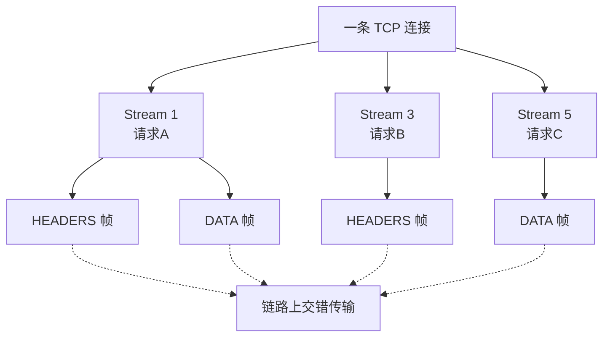
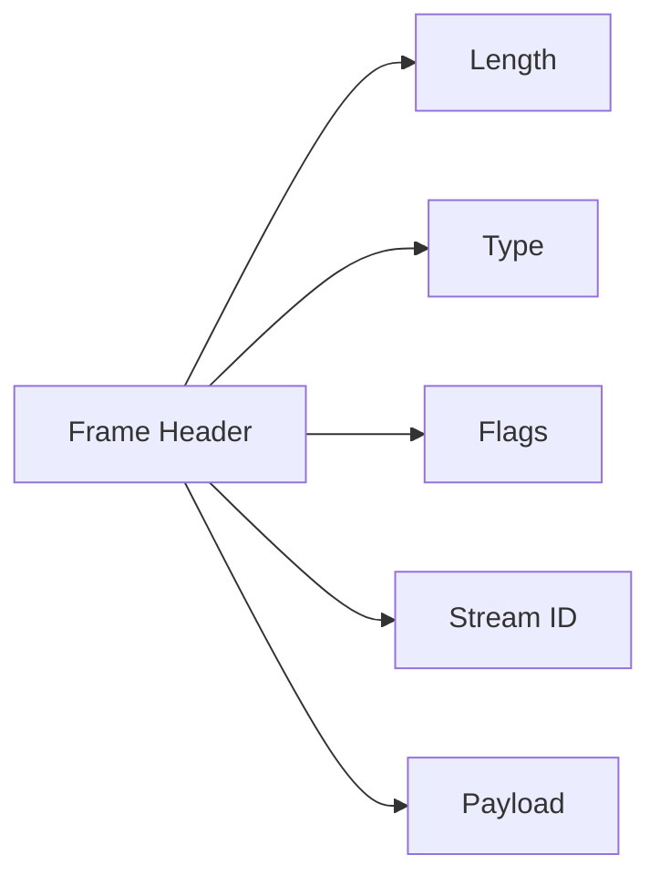
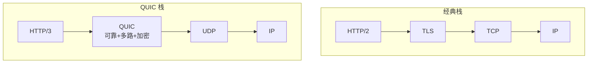
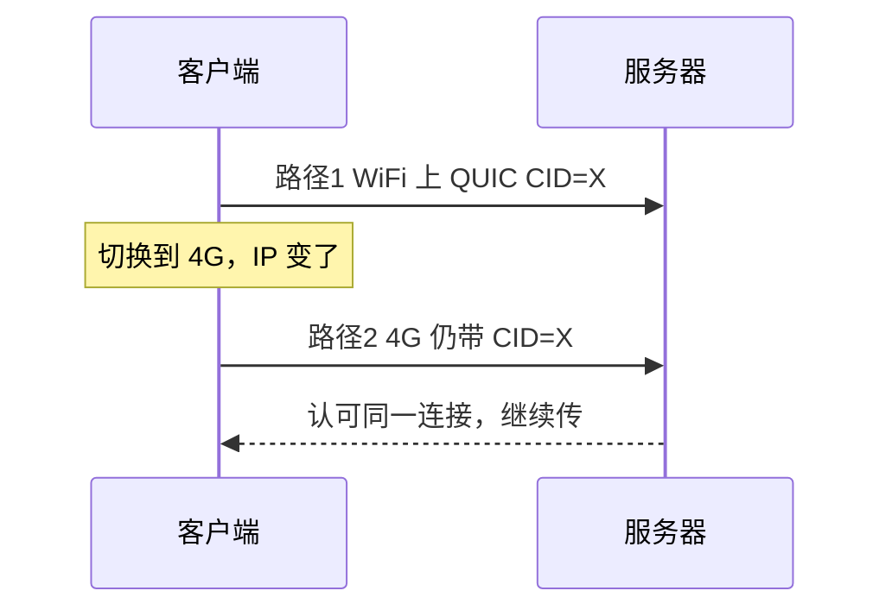

# 10 · HTTP/2 帧与流、QUIC 细节

> 节点目标：把「HTTP/2 比 1.1 快在哪」「HTTP/3/QUIC 又解决了什么」讲到帧/流级别。

---

## 面试题

### Q1. HTTP/2 的「流（Stream）」和「帧（Frame）」是什么？

- **连接 Connection**：一条 TCP（通常 + TLS）  
- **流 Stream**：连接上的一个双向逻辑信道，有 **Stream ID**（奇数客户端发起，偶数服务端）  
- **帧 Frame**：通信最小单位，所有消息都拆成帧在一条连接上**交错发送**  

**多路复用**：不再像 HTTP/1.1 那样「一个响应堵死后面」，应用层队头阻塞被缓解。  
**但仍受 TCP 限制**：TCP 丢一个包，整连接可能停等 → TCP 层队头阻塞还在。

---

### Q2. HTTP/2 常见帧类型有哪些？

| 帧类型 | 作用 |
| --- | --- |
| DATA | 消息正文 |
| HEADERS | 头部（可开新流） |
| PRIORITY | 流优先级（H2 早期） |
| RST_STREAM | 取消/重置某条流 |
| SETTINGS | 连接参数协商 |
| PUSH_PROMISE | 服务端推送预告 |
| PING | 测 RTT / 保活 |
| GOAWAY | 优雅关掉连接 |
| WINDOW_UPDATE | **流控**窗口更新 |
| CONTINUATION | 超长头的后续 |

帧头概念字段：Length、Type、Flags、Stream Identifier。

---

### Q3. HTTP/2 头部压缩 HPACK 是什么？

HTTP/1 每次重复传大量头（Cookie、User-Agent）。  
HPACK：静态表 + 动态表 + 霍夫曼编码，让重复头变成**短索引**。  
注意：动态表是连接级状态，中间人/共享连接时有安全与隔离考量（面试提一句即可）。

---

### Q4. HTTP/2 流控怎么做？

类似 TCP 窗口，但是：

- 有**连接级**窗口 + **流级**窗口  
- 用 `WINDOW_UPDATE` 帧增加窗口  
- 防止某个大下载把别的流饿死，也防接收方被淹没  

---

### Q5. Server Push 是什么？为什么现在用得少？

服务端预判浏览器还要 CSS/JS，主动 PUSH。  
现实中缓存命中难猜、浪费带宽，很多场景被 **103 Early Hints** 等替代，面试知道「有这能力但落地少」。

---

### Q6. QUIC 是什么？和 TCP+TLS+HTTP/2 比解决了啥？

**QUIC** 跑在 **UDP** 上，把传输可靠、多路复用、加密（TLS1.3 思想）揉在一起。HTTP/3 以 QUIC 为传输。

| 痛点 | TCP+H2 | QUIC/H3 |
| --- | --- | --- |
| 建连 | TCP RTT + TLS RTT | 通常更少 RTT，可 1-RTT/0-RTT |
| 队头阻塞 | TCP 丢包堵整连接 | **按流恢复**，一流丢包少影响其它流 |
| 换网 | 四元组变了连接死 | **Connection ID**，支持连接迁移 |
| 用户态演进 | TCP 在内核，升级慢 | 用户态实现，迭代快 |
| 中间设备 | TCP 被各种「优化」改写 | UDP 有时被墙/限速（部署成本） |

---

### Q7. QUIC 的 Connection ID 和连接迁移？

TCP 用四元组标识连接；移动网络从 Wi‑Fi 切 4G 时 IP 变 → 连接断。  
QUIC 用 **Connection ID**：路径变了只要 CID 还在，连接可迁移，电话场景切网更稳。

---

### Q8. QUIC 里 Stream 和 TCP 字节流有何不同？

- QUIC 原生多路 **独立流**，每流自己的序号与重传  
- 一流丢包不阻塞其它流的交付（相对 TCP+H2 的巨大优势）  
- 也有单向流/双向流；HTTP/3 在其上映射请求  

---

### Q9. 0-RTT 是什么？有什么风险？

TLS1.3/QUIC 允许用以前会话参数**首包就带应用数据**，降延迟。  
风险：**重放攻击**（0-RTT 数据可能被重放）→ 只适合幂等读，支付等不要用 0-RTT。

---

### Q10. HTTP/3 报文还是「请求行+头」那种文本吗？

不是 HTTP/1 文本。HTTP/3 用**二进制帧**（QPACK 压头，不同于 H2 的 HPACK），跑在 QUIC 流上。  
对应用开发者仍像「请求/响应」，对报文格式已完全不同。

---

### Q11. UDP不可靠为何可以作为HTTP3.0的基础?
实际上,QUIC并没有依赖UDP的任何特性(除了端口和[校验和)。
它其实是在应用层重新实现了一遍TCP的核心功能:
- 序列号与确认应答(ACK),保证数据不丢。
- 滑动窗口与拥塞控制,保证网络不堵。
核心区别在于TCP是操作系统内核实现的,改动极难(需要升级系统)。而QUIC是应用层代码,Google想怎么改就怎么改,迭代速度极快。
核心优势可以总结为"快、稳、狠"
1. 快!极速建连:0-RTT (Zero Round Trip Time)
QUIC极其激进。如果是第一次连接,它把"握手"和"密钥协商"合并了(1-RTT)。如果是老客户(Resumption),客户端会
缓存上一次的Config/Token,下次连接时,直接在第一个包里就带上加密后的业务数据发给服务端。
像TCP+TLS至少需要2-3个回合才能开始发数据,QUIC见面第一句话就是正事。
2. 连接迁移(Connection Migration)
TCP是基于四元组(源IP、源端口、目标IP、目标端口)来识别连接的。你拿着手机下楼,从Wi-Fi切换到4G,你的源IP
变了,TCP连接立刻断开,必须重新握手,视频就会卡顿。
而QUIC不看IP,它给每个连接发一个唯一的Connection ID(CID)。不管你的IP怎么变(Wi-Fi->4G->5G),只要你包
里的CID没变,服务端就知道"哦、还是刚才那个家伙"、通信继续,完全无感。
3. 无队头阻塞
QUIC在单条连接中实现了多流(Multi-Stream)。每个流有独立的序列号和滑动窗口。如果StreamA的包丢了,只会影响StreamA,StreamB照样路包。这在弱网(丢包率高)环境下,能让网页加载速度提升20%以上。
4. 用户态拥塞控制
TCP的拥塞控制算法(如Cubic,BBR)是写在操作系统内核里的。想升级算法?你得让用户重装Windows/Linux系统,这太难了。
而QUIC是应用层协议(运行在用户态)。Google想改算法,只需需要更新Chrome浏览器或者App即可,无需动操作系统。
这让QUIC的迭代速度比TCP快了100倍。
它还可以针对不同的App(直播或者网页)使用不同的拥塞控制策喷。
5. 强制TLS 1.3
QUIC不仅加密了Payload(数据体),甚至连Packet Number(包号)和大部分Header都加密了。
这让中间设备,比如路由器、运营商防火墙无法窥探你的流量特征,也防止了"协议僵化"(中间设备瞎改包头)。
6. 双层流量控制
QUIC借鉴了HTTP/2,实现了连接级(Connection)和流级(Stream)两层流量控制。它可以精确控制每个流分配多少带
宽,防止某个大文件下载占满所有带宽,导致小图片加载不不出来。

### Q12. QUIC用UDP实现可靠传输,那它的重传机制和TCP有什么不同?
TCP重传用的是相同的序列号,接收端收到重传包没法区分是新包还是老包的重传,RTT估算容易出错。QUIC的做
法是每个包都用单调递增的Packet Number,哪怕是重传的数据,PacketNumber也是新的。这样接收端能精确到断是不是
重传包,RTT计算更准确,拥塞控制的反馈也更及时。

### Q13. 提问:QUIC的0-RTT有什么安全风险?
0-RTT的数据没有前向保密性,因为用的是上次会话的密钥。如果攻击者录下了0-RTT的包,以后拿到了!服务器的私
钥,就能解密这些历史数据。还有一个问题是重放攻击,攻击者可以把0-RTT的请求重新发一遍,服务端没法区分是客户端品
发的还是攻击者重放的。所以0-RTT只适合发送幂等请求,比比如GET,POST这种有副作用的操作不能放0-RTT里

### Q14. 提问:HTTP/3已经出来好几年了,为什么普及率还不如HTTP/2?
回答:几个原因。首先UDP流量经常被运营商限速甚至丢弃,企业防火墙也默认不开UDP443端口,部署起来阻力大。其
次QUIC协议复杂,服务端实现难度比TCP高不少,CPU开销也更大,因为加解密和拥塞控制都在用户态跑。还有就是中间
件支持不够,很多老的负载均衡、WAF、CDN节点还不支持(QUIC。不过趋势是明确的,Cloudflare、Google、Facebook
这些大厂已经全面铺开了。

### Q15. 提问:QUIC的连接迁移这么好,为什么TCP不也加个类似的功能?
TCP是内核协议,改起来牵一发动全身,要兼容全球几十亿台设备,任何改动都得保证向后兼容。四元组识别连接这
事定死在协议里三四十年了,想加个Connection ID字段,所有的中间设备、操作系统都得升级,根本推不动。QUIC就没这这
个包袱,它在应用层跑,服务端和客户端统一升就完事了,中间设备只看到UDP流量,压根不需要理解QUIC。

## 关联

- [[04-HTTP]] · [[03-TCP与UDP]] · [[11-抓包看图说话]] · [[12-gRPC与网关治理]]
