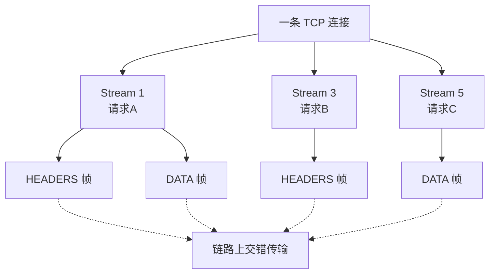
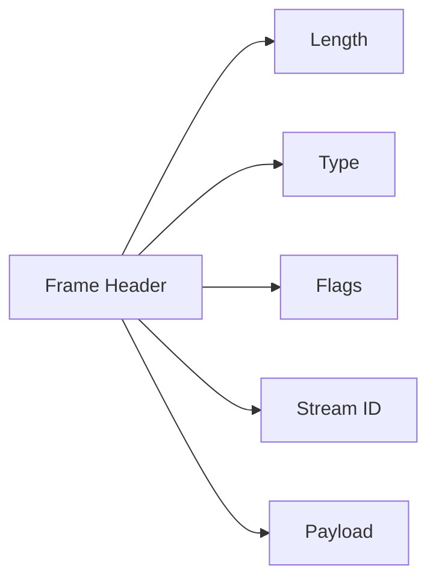
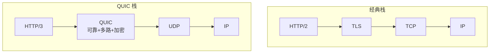
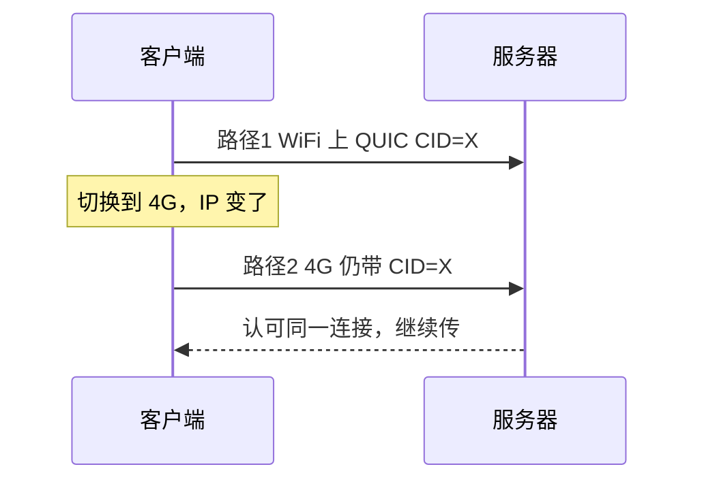

# 10 · HTTP/2 帧与流、QUIC 细节

> 节点目标：把「HTTP/2 比 1.1 快在哪」「HTTP/3/QUIC 又解决了什么」讲到帧/流级别。

---

## 面试题

### Q1. HTTP/2 的「流（Stream）」和「帧（Frame）」是什么？

- **连接 Connection**：一条 TCP（通常 + TLS）  
- **流 Stream**：连接上的一个双向逻辑信道，有 **Stream ID**（奇数客户端发起，偶数服务端）  
- **帧 Frame**：通信最小单位，所有消息都拆成帧在一条连接上**交错发送**  

**多路复用**：不再像 HTTP/1.1 那样「一个响应堵死后面」，应用层队头阻塞被缓解。  
**但仍受 TCP 限制**：TCP 丢一个包，整连接可能停等 → TCP 层队头阻塞还在。

---

### Q2. HTTP/2 常见帧类型有哪些？

| 帧类型 | 作用 |
| --- | --- |
| DATA | 消息正文 |
| HEADERS | 头部（可开新流） |
| PRIORITY | 流优先级（H2 早期） |
| RST_STREAM | 取消/重置某条流 |
| SETTINGS | 连接参数协商 |
| PUSH_PROMISE | 服务端推送预告 |
| PING | 测 RTT / 保活 |
| GOAWAY | 优雅关掉连接 |
| WINDOW_UPDATE | **流控**窗口更新 |
| CONTINUATION | 超长头的后续 |

帧头概念字段：Length、Type、Flags、Stream Identifier。

---

### Q3. HTTP/2 头部压缩 HPACK 是什么？

HTTP/1 每次重复传大量头（Cookie、User-Agent）。  
HPACK：静态表 + 动态表 + 霍夫曼编码，让重复头变成**短索引**。  
注意：动态表是连接级状态，中间人/共享连接时有安全与隔离考量（面试提一句即可）。

---

### Q4. HTTP/2 流控怎么做？

类似 TCP 窗口，但是：

- 有**连接级**窗口 + **流级**窗口  
- 用 `WINDOW_UPDATE` 帧增加窗口  
- 防止某个大下载把别的流饿死，也防接收方被淹没  

---

### Q5. Server Push 是什么？为什么现在用得少？

服务端预判浏览器还要 CSS/JS，主动 PUSH。  
现实中缓存命中难猜、浪费带宽，很多场景被 **103 Early Hints** 等替代，面试知道「有这能力但落地少」。

---

### Q6. QUIC 是什么？和 TCP+TLS+HTTP/2 比解决了啥？

**QUIC** 跑在 **UDP** 上，把传输可靠、多路复用、加密（TLS1.3 思想）揉在一起。HTTP/3 以 QUIC 为传输。

| 痛点 | TCP+H2 | QUIC/H3 |
| --- | --- | --- |
| 建连 | TCP RTT + TLS RTT | 通常更少 RTT，可 1-RTT/0-RTT |
| 队头阻塞 | TCP 丢包堵整连接 | **按流恢复**，一流丢包少影响其它流 |
| 换网 | 四元组变了连接死 | **Connection ID**，支持连接迁移 |
| 用户态演进 | TCP 在内核，升级慢 | 用户态实现，迭代快 |
| 中间设备 | TCP 被各种「优化」改写 | UDP 有时被墙/限速（部署成本） |

---

### Q7. QUIC 的 Connection ID 和连接迁移？

TCP 用四元组标识连接；移动网络从 Wi‑Fi 切 4G 时 IP 变 → 连接断。  
QUIC 用 **Connection ID**：路径变了只要 CID 还在，连接可迁移，电话场景切网更稳。

---

### Q8. QUIC 里 Stream 和 TCP 字节流有何不同？

- QUIC 原生多路 **独立流**，每流自己的序号与重传  
- 一流丢包不阻塞其它流的交付（相对 TCP+H2 的巨大优势）  
- 也有单向流/双向流；HTTP/3 在其上映射请求  

---

### Q9. 0-RTT 是什么？有什么风险？

TLS1.3/QUIC 允许用以前会话参数**首包就带应用数据**，降延迟。  
风险：**重放攻击**（0-RTT 数据可能被重放）→ 只适合幂等读，支付等不要用 0-RTT。

---

### Q10. HTTP/3 报文还是「请求行+头」那种文本吗？

不是 HTTP/1 文本。HTTP/3 用**二进制帧**（QPACK 压头，不同于 H2 的 HPACK），跑在 QUIC 流上。  
对应用开发者仍像「请求/响应」，对报文格式已完全不同。

---

## 关联

- [[04-HTTP]] · [[03-TCP与UDP]] · [[11-抓包看图说话]] · [[12-gRPC与网关治理]]
