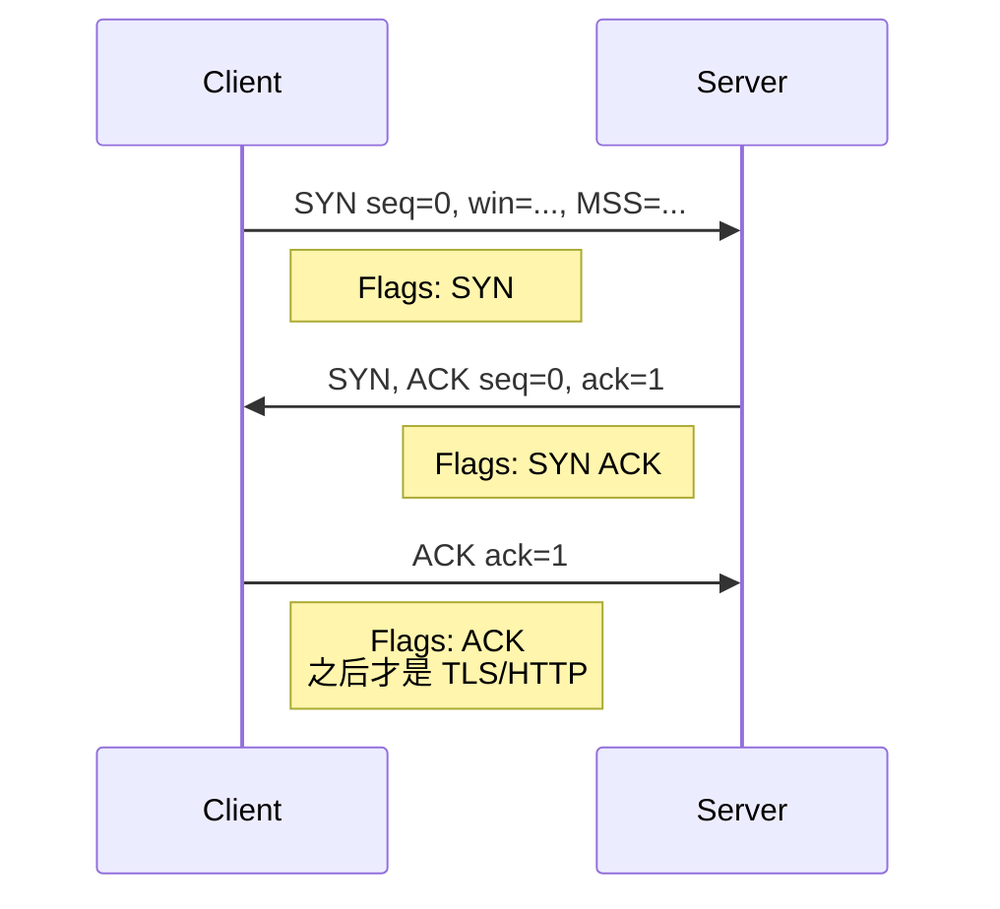
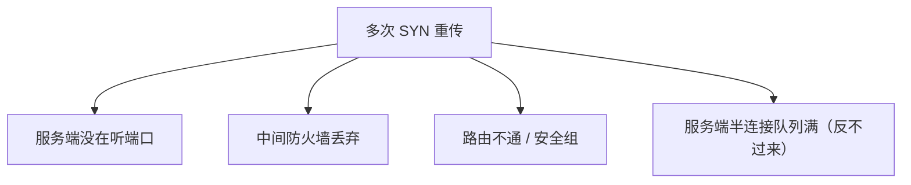
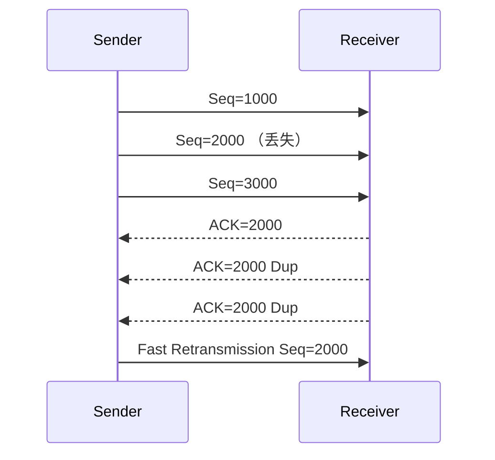
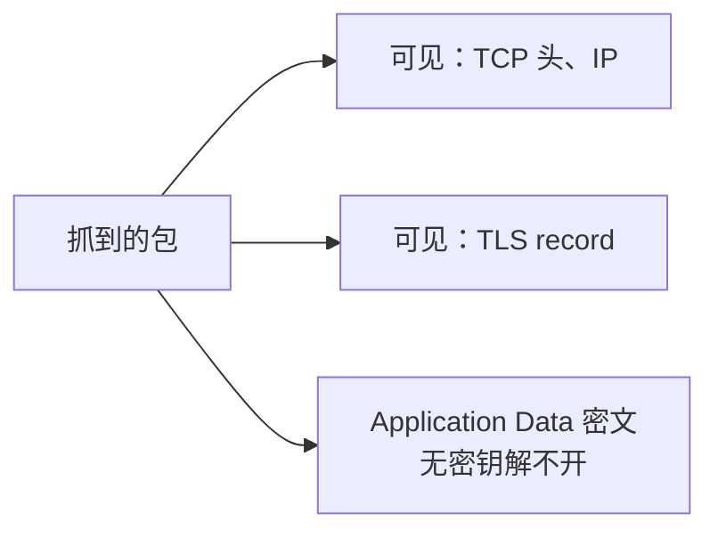
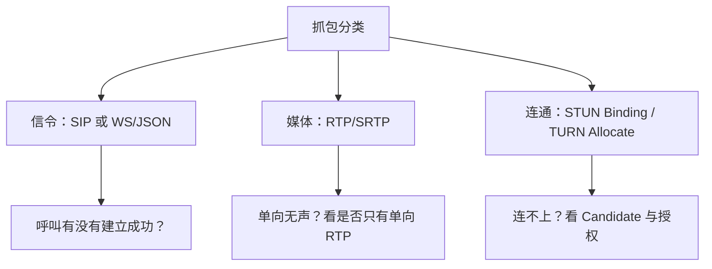
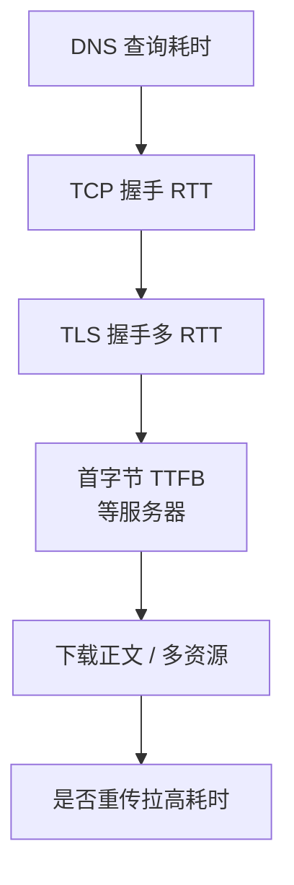

# 11 · 抓包看图说话

> 节点目标：面试官丢一段 tcpdump/Wireshark 现象，你能分层解释。自己练习时用 Wireshark 对照。

---

## 面试题

### Q1. 正常 TCP 三次握手在抓包里长什么样？

看图要点：

1. 前两个包 **SYN / SYN-ACK** 长度通常很小  
2. Options 里常见：MSS、WS（窗口扩大）、SACK_PERM、TS  
3. 第三次后才出现 Application Data  

---

### Q2. 抓包看到大量重复的 SYN，没有 SYN-ACK，可能什么问题？

口述：客户端在重试握手；先查端口监听、安全组、是否 SYN Flood、是否听错 IP。

---

### Q3. 看到 SYN-ACK 重传，第三次 ACK 没有，说明什么？

服务端在等最终 ACK（或客户端已挂/路径回程不通）。对应「发完 SYN 宕机 / 回程丢包」。半连接会占资源，严重时像 SYN Flood。

---

### Q4. 如何从抓包判断 TCP 重传？快重传还是超时重传？

| 现象 | 更像 |
| --- | --- |
| 同一序号段再次出现，且间隔 ≈ RTO | 超时重传 |
| 出现多个 Duplicate ACK 后立刻重传同一序号 | 快重传 |
| SACK 块显示空洞，随后补洞 | SACK 选择性重传 |

Wireshark 常标黑/红：`TCP Retransmission`、`Fast Retransmission`、`Dup ACK`。

---

### Q5. 抓包里突然出现 RST，怎么解读？

常见：

1. 访问无监听端口 → 立即 RST  
2. 连接已关，迟到包到达 → RST  
3. 应用/中间件强行掐连接  
4. 防火墙策略拒绝  

对比 FIN：有 FIN 交换是优雅关；**单方面 RST 是异常撕连接**。

---

### Q6. TIME_WAIT / CLOSE_WAIT 在抓包或 ss 里怎么对应？

- 抓包：主动方发完最后 ACK 后一段时间内，若再来 FIN 会再回 ACK（仍在 TIME_WAIT）  
- `ss -ant`：看状态计数更直接  
  - `CLOSE-WAIT` 多 → 进程没 close  
  - `TIME-WAIT` 多 → 短连接/主动关闭频繁  

---

### Q7. HTTPS 抓包只能看到 Application Data 怎么办？

TLS 加密后 Wireshark 默认看不到 HTTP 明文。

可用：

1. 浏览器导出 `SSLKEYLOGFILE`，Wireshark 配密钥日志解密  
2. 服务端抓本地明文（如应用日志）  
3. 公司合规代理（需信任企业 CA）  

面试强调：**加密是预期现象，不是抓包坏了。**

---

### Q8. 如何从抓包看 HTTP/1.1 慢在哪？队头阻塞？

同连接上：请求1 响应慢，请求2 的响应迟迟不出现 → 应用层队头阻塞。  
HTTP/2 会看到同一 TCP 上多 stream 帧交错；若仍整连接停顿，看是否 TCP 层重传。

---

### Q9. 零窗口 ZeroWindow 是什么意思？

接收方通告 `win=0`：我缓冲区满了，你先别发。  
随后有 `Window Update`。若长期 ZeroWindow，说明**接收应用读得太慢**（或处理阻塞）。

---

### Q10. 给一套「电话/实时音视频」相关抓包口述模板

AI 电话场景常混合：

| 流量 | 特征 |
| --- | --- |
| SIP | 文本信令，INVITE/100/180/200/ACK/BYE，端口常 5060/TLS 5061 |
| RTP | UDP，负载是音视频媒体，端口动态，包小且密 |
| WebRTC | STUN/TURN（连通性）、DTLS、SRTP，UDP 为主 |
| WebSocket | 先 HTTP Upgrade，再二进制/文本帧（信令通道常见） |

排障顺序：**信令是否 200 OK → ICE 是否成功 → RTP 是否双向有包 → 是否大量丢包/乱序。**

---

### Q11. 一道综合看图题：页面打开慢，抓包怎么讲？

口述结构：把瀑布图拆成 DNS / Connect / SSL / Wait / Receive，哪段最长就优化哪段（换 DNS、HTTP/2、CDN、减 TTFB、查丢包）。

---

## 关联

- [[03-TCP与UDP]] · [[05-HTTPS与安全]] · [[10-HTTP2与QUIC]] · [[13-实时通信-WebRTC-SIP-RTP]]
