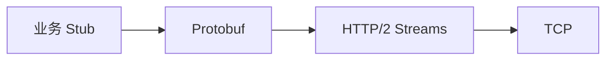
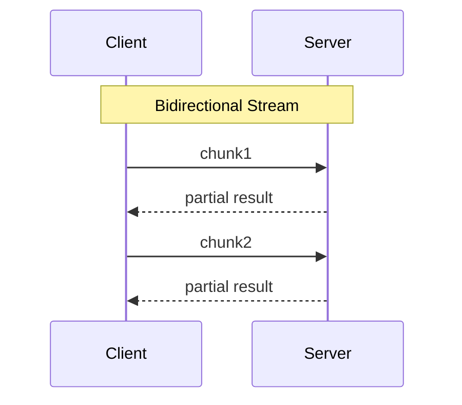
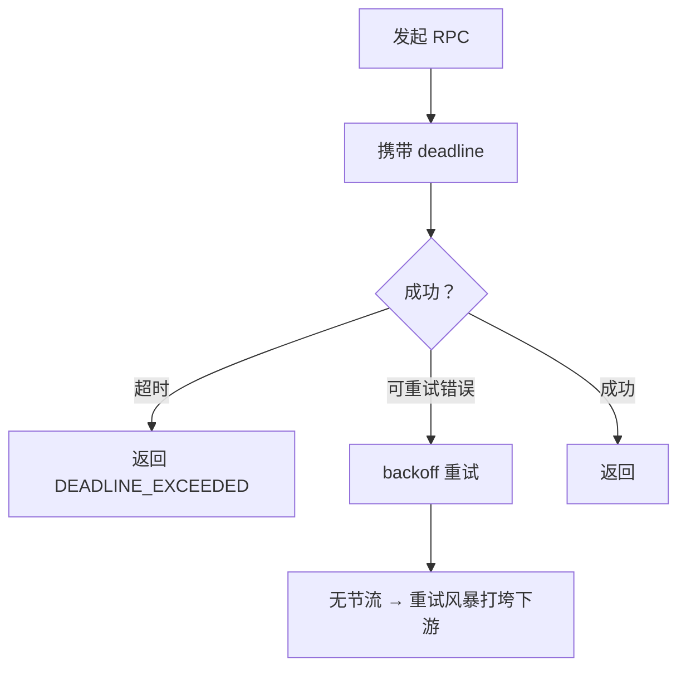
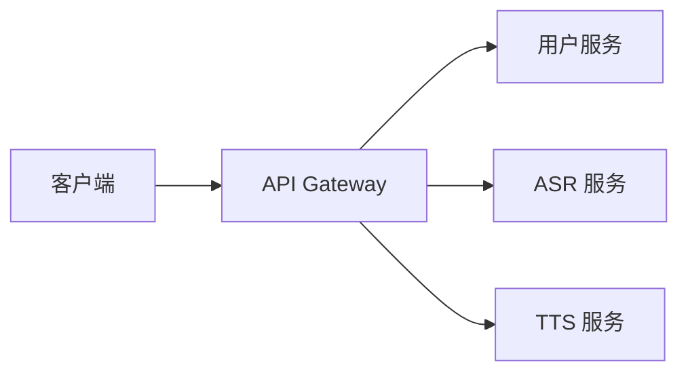
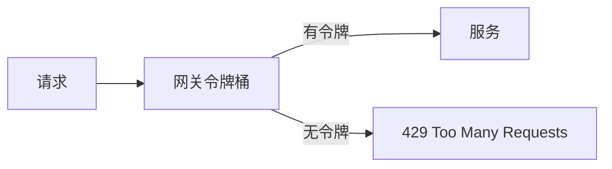
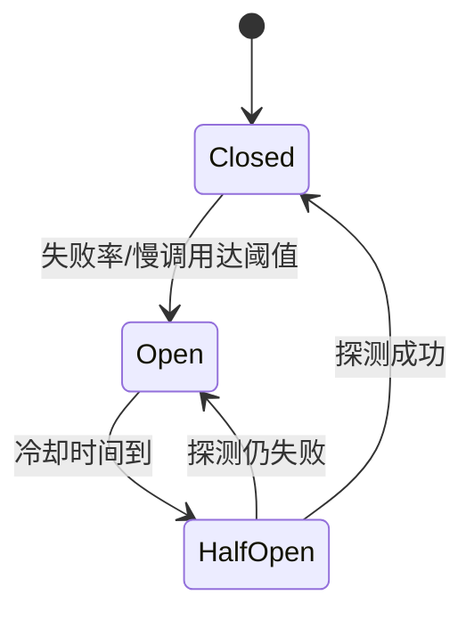
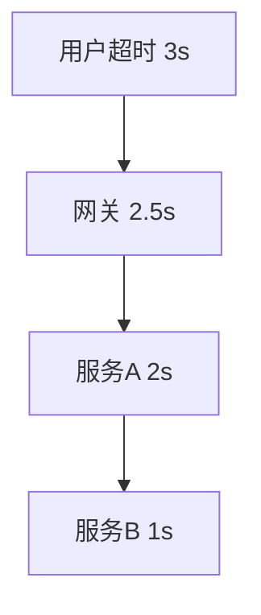

# 12 · gRPC 与网关限流熔断（网络交叉）

> 节点目标：RPC/网关治理题里，能讲清和 HTTP/2、连接、超时、负载的关系——后端 + AI 服务编排常考。

---

## 面试题

### Q1. gRPC 是什么？和 HTTP/JSON 比有什么不同？

gRPC：Google 的 RPC 框架，默认：

- 协议：**HTTP/2**  
- 序列化：**Protobuf**（二进制）  
- 接口：IDL（`.proto`）生成多语言代码  

| | gRPC | REST/JSON |
| --- | --- | --- |
| 传输 | HTTP/2 多路复用 | HTTP/1.1 或 H2 |
| 载荷 | Protobuf，小而快 | JSON，可读 |
| 流式 | 原生 unary/server/client/bidi stream | 要自己设计 |
| 浏览器 | 需 gRPC-Web | 天生友好 |
| 调试 | 要工具 | curl 方便 |

---

### Q2. gRPC 四种通信模式？

| 模式 | 含义 | 场景 |
| --- | --- | --- |
| Unary | 一请求一响应 | 普通查询 |
| Server streaming | 一请求，服务端多响应 | 下发大结果、推送 |
| Client streaming | 客户端多请求，一响应 | 上传聚合 |
| Bidirectional | 双向流 | 对话、实时协作 |

AI 电话相关：部分链路用双向流传识别中间结果/TTS 分片（也可用 WS，看架构）。

---

### Q3. gRPC 为什么依赖 HTTP/2？和网络有什么关系？

1. **多路复用**：一个 TCP 上多 RPC，减少连接数  
2. **头部压缩、二进制帧**：低开销  
3. **流控**：防止大流饿死小流  
4. 代价：连接管理、队头阻塞仍受 TCP 影响；代理要支持 H2；调试比 JSON 难  

---

### Q4. gRPC 超时、取消、重试要注意什么？

- **Deadline**：必须设超时，避免线程/连接被慢调用拖死  
- **取消**：客户端取消应传播，释放服务端资源  
- **重试**：只对幂等；要配 backoff、限次数，防重试风暴  
- **连接**：channel 复用；注意 DNS/负载均衡（客户端 LB vs 中间代理）  

---

### Q5. 什么是 API 网关？和反向代理什么关系？

网关 ≈ 面向 API 的**统一入口**：鉴权、路由、限流、熔断、协议转换、观测。  
常基于 Nginx/Envoy/自研，本质仍是七层反向代理 + 治理策略。

---

### Q6. 限流是什么？常见算法？和网络层有何关系？

限流：保护系统，超过阈值拒绝/排队/降级。

| 算法 | 特点 |
| --- | --- |
| 固定窗口 | 实现简单，窗口边界可被打穿 |
| 滑动窗口 | 更平滑 |
| 漏桶 leaky bucket | 平滑出站速率 |
| 令牌桶 token bucket | 允许一定突发，常用 |

网络交叉：

- 可在 **Nginx/网关/服务端** 多层限流  
- 打满时返回 **429**；注意 TCP 连接仍可能占着 → 配合连接数限制  
- 分布式限流用 Redis 等，本身又引入网络 RTT  

---

### Q7. 熔断是什么？和限流、降级的区别？

| 机制 | 目的 |
| --- | --- |
| 限流 | 限制流量进入，保护自己 |
| 熔断 | 下游持续失败时**快速失败**，避免雪崩 |
| 降级 | 失败时返回兜底（缓存、默认值、简化逻辑） |

熔断状态机：

网络视角：下游超时、连接失败、RST、DNS 失败都应计入失败；**超时设置过长**会拖垮线程池，看起来像「网络没事但服务挂了」。

---

### Q8. 超时怎么设才合理？（交叉题高频）

原则：**端到端超时 > 下游超时之和要留余量，但单层不能无限大。**

错误示范：每层 10s，层层叠加用户等到崩溃。  
电话场景：ASR 首包时延、TTS 首帧时延应用**更紧的 SLA**，与普通 HTTP 批量任务不同。

---

### Q9. 舱壁隔离、连接池和网络有什么关系？

- **连接池过大**：打爆下游；过小：排队超时  
- **舱壁**：不同依赖用不同线程池/连接池，防一个慢 IO 占满全部  
- 对 gRPC：每个下游一个 channel/池，设最大并发流  

---

### Q10. 服务网格（Service Mesh）和网络治理？

Envoy sidecar 把重试、mTLS、限流、观测下沉到代理。  
面试点到：治理从业务代码外移到数据面；代价是多一跳延迟与复杂度。

---

## 关联

- [[09-代理负载与网络IO]] · [[10-HTTP2与QUIC]] · [[04-HTTP]] · [[13-实时通信-WebRTC-SIP-RTP]]
