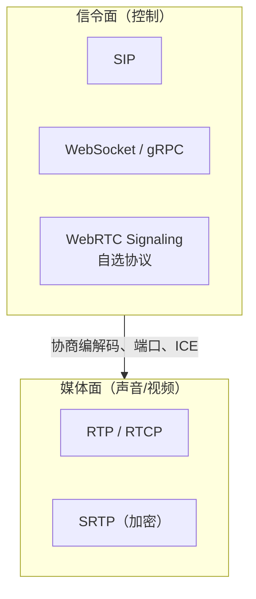
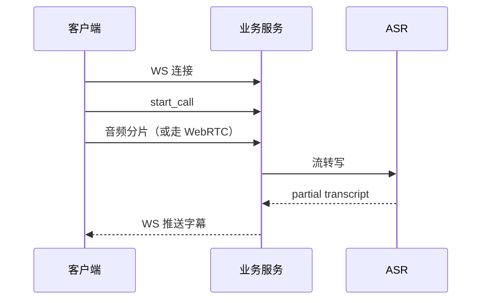
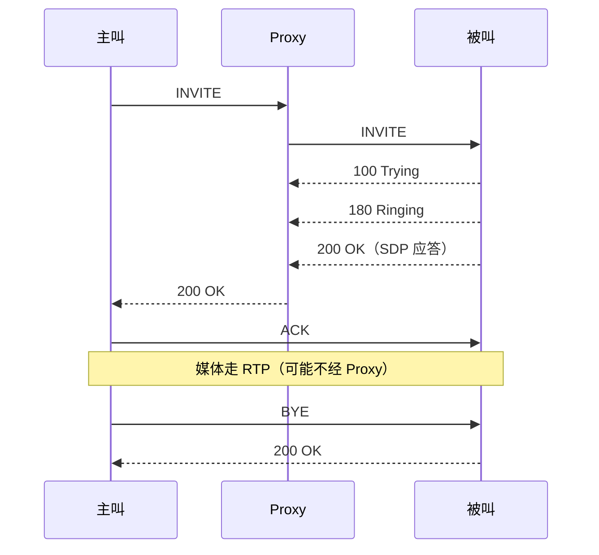
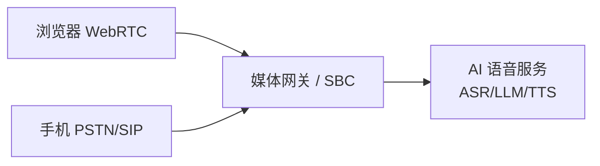
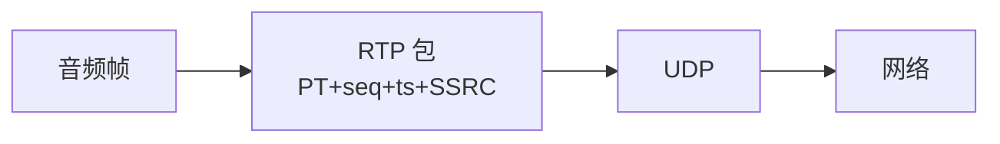
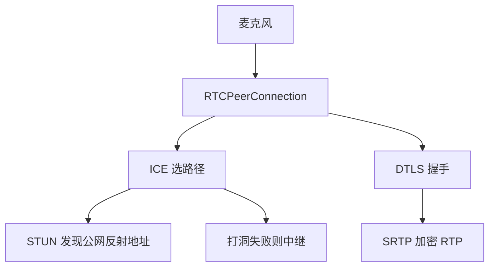
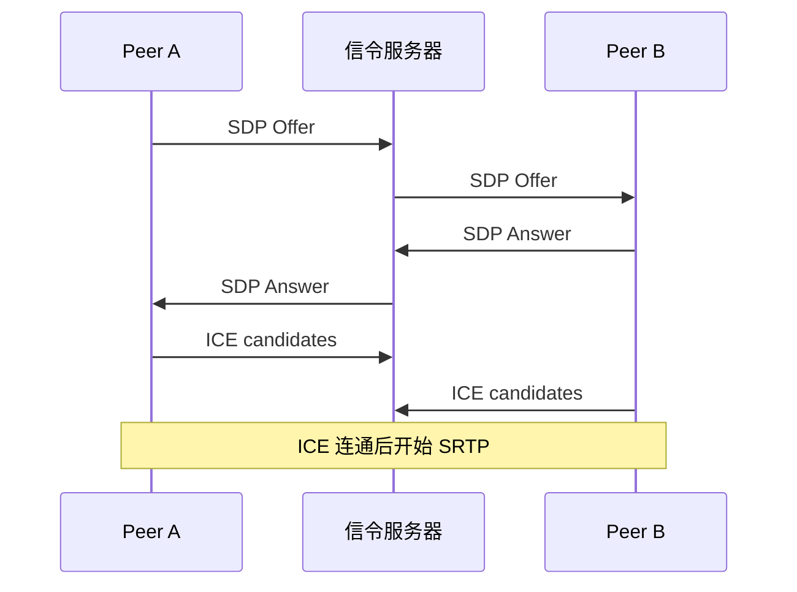
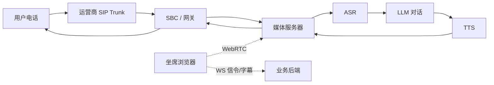

# 13 · 实时通信 · WebRTC / SIP / RTP / WebSocket

> 面向 **AI 电话 / 语音对话**：信令怎么建呼、媒体怎么传、和 WebSocket 怎么分工。面试按「信令面 + 媒体面」讲。

---

## 总览：电话系统两张面

一句话：**信令负责呼叫与协商，RTP 负责把声音送出去。** WebSocket 多做信令/文本事件，不适合直接当高实时媒体主通道（除非特殊封装）。

---

## 面试题 · WebSocket（电话场景摘要）

> 完整 25 题专题见 **[[14-WebSocket]]**（握手/帧/Mask/心跳/重连/集群/可靠/安全）。此处只保留电话场景要点。

### Q1. WebSocket 在 AI 电话里通常干什么？

常见职责：

1. 浏览器/客户端 ↔ 业务后端的**信令**（开通话、挂断、ASR 中间结果、情绪事件）  
2. 推送实时字幕、坐席辅助  
3. 少数方案用二进制帧传音频（可行但要自己做抖动缓冲、丢包处理，一般不如 WebRTC）  

### Q2. WebSocket 断线怎么处理？

- 心跳（ping/pong）探测死连接  
- 指数退避重连  
- 会话恢复：callId + 序号，避免重复扣费/重复播报  
- 网关超时、Nginx `proxy_read_timeout` 要调  

细节展开：[[14-WebSocket#Q14 断线重连怎么设计？（高频）]]  

---

## 面试题 · SIP

### Q3. SIP 是什么？在电话里扮演什么角色？

**SIP（Session Initiation Protocol）**：应用层**信令协议**，用来发起、修改、结束会话（邀请通话、振铃、接听、挂断）。  
**不管**媒体本身怎么编码传输——媒体通常交给 **RTP**。

常见方法：

| 方法 | 含义 |
| --- | --- |
| INVITE | 发起呼叫 |
| ACK | 确认最终响应 |
| BYE | 挂断 |
| CANCEL | 取消未建立的呼叫 |
| REGISTER | 终端注册到 Registrar |
| OPTIONS | 查询能力 |

### Q4. 一次 SIP 呼叫基本流程？

要点：

1. SIP 消息体里常带 **SDP**：协商编解码、IP/端口、RTP/AVP 等  
2. 信令可经 Proxy，**媒体常端到端或经媒体服务器**（录音、合桥、AI 接入点）  
3. 状态码风格像 HTTP：1xx 临时，2xx 成功，4xx/5xx 失败  

### Q5. SIP 和 WebRTC 什么关系？

- 运营商/PBX 世界：SIP + RTP  
- 浏览器世界：WebRTC（信令自选 + ICE + DTLS-SRTP）  
- AI 电话平台常做**桥接**：WebRTC ↔ SIP（SBCs / Media Gateway），一边接网页/App，一边接电话网  

---

## 面试题 · RTP / RTCP

### Q6. RTP 是什么？为什么电话媒体用它？

**RTP（Real-time Transport Protocol）**：在 UDP 上传实时音视频。

提供：

- 负载类型（编码）  
- **序号**、**时间戳**（抖动缓冲、同步）  
- SSRC 标识源  

不保证可靠：实时宁可丢包也不要「等重传导致延迟爆炸」——这点和 TCP 哲学相反。

### Q7. RTCP 干什么？

**RTCP**：控制与质量反馈（丢包率、抖动、RTT 估计），不传媒体本身。  
发送方可根据反馈做码率自适应（与 WebRTC GCC 等拥塞控制相关）。

### Q8. RTP 丢包、乱序、抖动怎么处理？

| 问题 | 手段 |
| --- | --- |
| 抖动 | **Jitter Buffer** 平滑到达时间 |
| 乱序 | 按序号重排，超时则弃 |
| 丢包 | PLC 丢包隐藏、FEC、NACK 选择性重传（WebRTC）、降低码率 |
| 延迟 | 缓冲越大越稳但通话越「慢」，要权衡 |

AI 电话：ASR 对连续音频敏感，前面常有抖动缓冲与重采样；TTS 播报也要注意时钟漂移。

---

## 面试题 · WebRTC

### Q9. WebRTC 是什么？核心模块有哪些？

浏览器/终端间**实时音视频**能力，无需插件。核心：

1. **MediaStream**：采集麦/摄像头  
2. **RTCPeerConnection**：连对端、传媒体  
3. **信令**：标准不规定，可用 WS/HTTP/SIP 传 SDP  
4. **ICE（STUN/TURN）**：打洞过 NAT  
5. **DTLS + SRTP**：加密媒体  

### Q10. SDP Offer/Answer 是什么？

双方交换 **SDP**：我支持什么编码（Opus/PCMU…）、是否收发、ICE candidate 等。  
常见：一端 `createOffer` → 信令发给对端 → `createAnswer` → 再交换 candidate。

### Q11. STUN 和 TURN 区别？

| | STUN | TURN |
| --- | --- | --- |
| 作用 | 告诉你「外网看你的地址」帮助打洞 | 打洞失败时**中继**转发媒体 |
| 延迟/成本 | 低 | 高（流量走服务器） |
| 何时用 | 大多数对称 NAT 前先试 | 企业网/严格 NAT 保底 |

AI 电话接坐席/浏览器时，**TURN 可用性**往往决定接通率。

### Q12. WebRTC 和裸 WebSocket 传音频怎么选？

| | WebSocket 传音频 | WebRTC |
| --- | --- | --- |
| NAT 穿越 | 靠你们服务器中转 | ICE/TURN 体系成熟 |
| 抖动/丢包 | 自己造 | 引擎内置 |
| 设备回音消除等 | 自己做 | WebRTC 栈较成熟 |
| 控制信令 | 很合适 | 需另开信令通道 |
| 接电话网 | 要网关 | 常经媒体网关转 SIP/RTP |

**实践**：信令/字幕走 WS；实时通话媒体优先进 WebRTC 或 SIP+RTP。

### Q13. WebRTC 拥塞控制和 TCP 有何不同？

TCP 重传保可靠；实时音视频用 **GCC 等**根据延迟/丢包调码率，目标是**低延迟可懂**，不是字节必达。  
这和 [[03-TCP与UDP]] 里 BBR「控延迟」思想有点像，但应用在媒体码率，不是字节流可靠。

### Q14. AI 电话链路怎么口述（综合题）？

面试要点：

1. **SIP** 进线、振铃、挂断、转接  
2. **RTP** 媒体进入 AI pipeline  
3. 坐席侧 **WebRTC**，业务事件 **WebSocket**  
4. 质量：丢包、抖动、单向通话、ICE 失败、编解码不匹配（如电话侧 G.711 ↔ Opus 转码）  
5. 治理：网关限流、熔断 ASR/TTS、超时与降级（见 [[12-gRPC与网关治理]]）  

### Q15. 单向无声 / 接通率低怎么从网络侧查？

| 现象 | 可能原因 |
| --- | --- |
| 有信令 200，无RTP | 媒体端口被墙、SDP 地址错误、单向 NAT |
| 只有单向 RTP | 路由/防火墙单向、ICE 选错 candidate |
| 周期性卡顿 | 抖动大、CPU 转码慢、带宽不足 |
| 内网 OK 外网差 | 缺 TURN、运营商对 UDP 不友好 |
| WS 字幕断 | 代理超时、心跳缺失、重连无会话恢复 |

抓包思路见 [[11-抓包看图说话#Q10 给一套「电话/实时音视频」相关抓包口述模板]]。

---

## 对比速记

| 技术 | 层/角色 | AI 电话里 |
| --- | --- | --- |
| SIP | 信令 | 呼入呼出、转接、挂断 |
| SDP | 会话描述 | 编解码与地址协商 |
| RTP/RTCP | 媒体+质量 | 语音流与质量反馈 |
| WebRTC | 浏览器实时栈 | 坐席/App 通话 |
| WebSocket | 应用数据通道 | 信令、字幕、控制事件 |
| gRPC 流 | 后端 RPC | ASR/TTS 服务间流转 |

---

## 关联

- [[04-HTTP]] · [[03-TCP与UDP]] · [[11-抓包看图说话]] · [[12-gRPC与网关治理]] · [[00-知识总览]]
