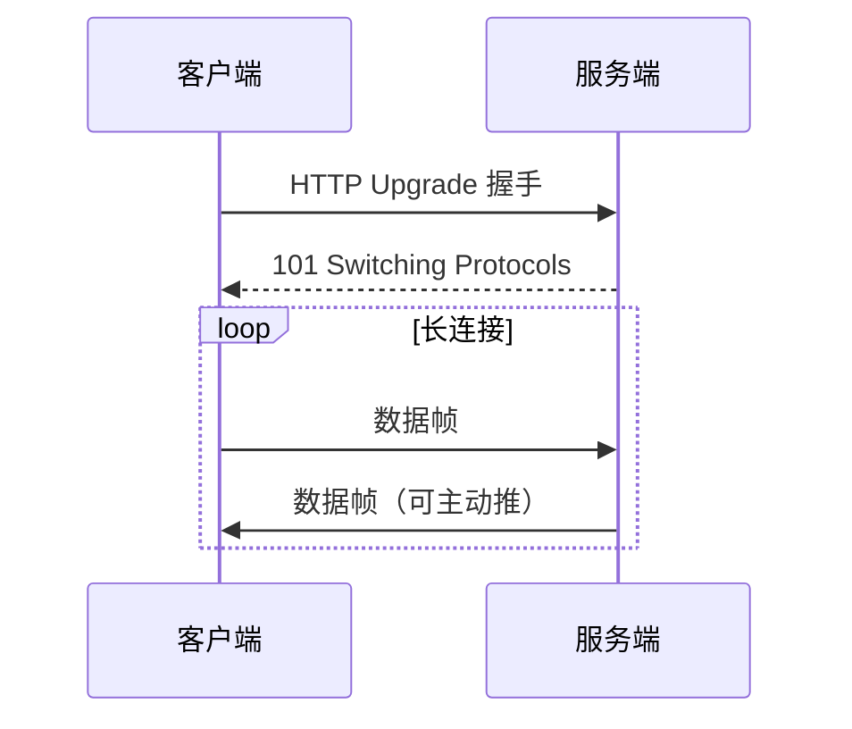
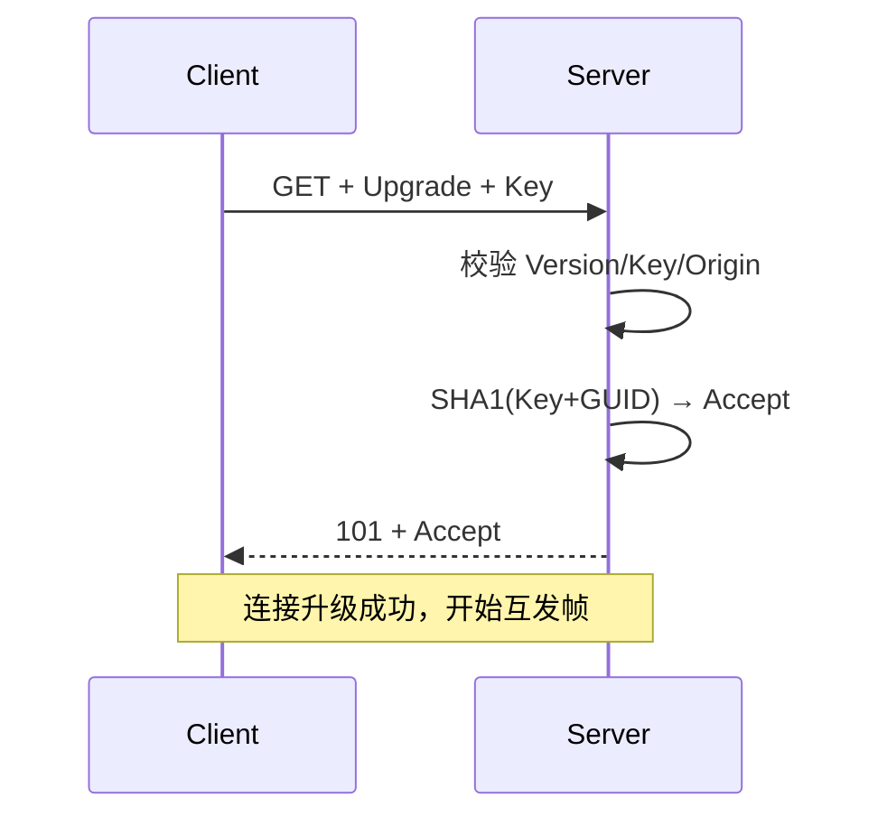
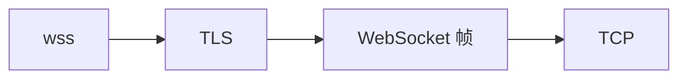
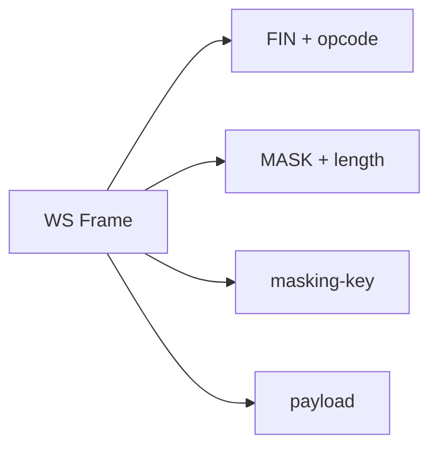
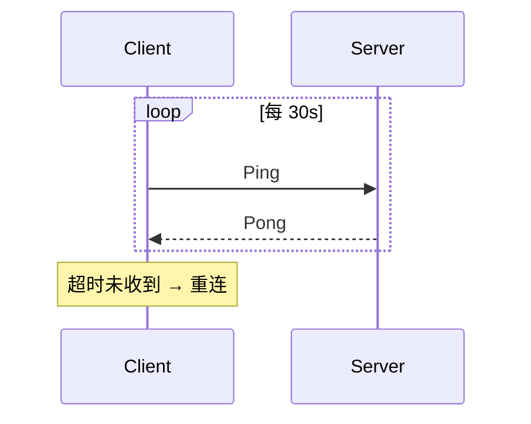
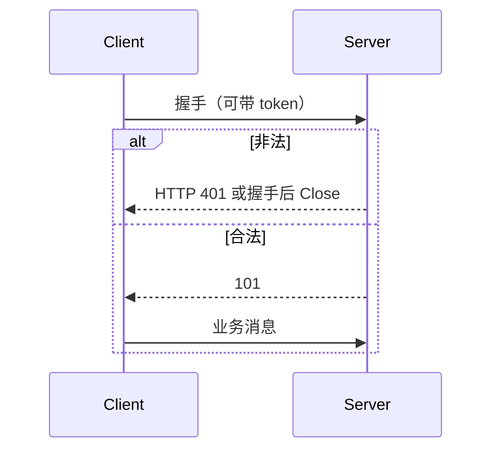
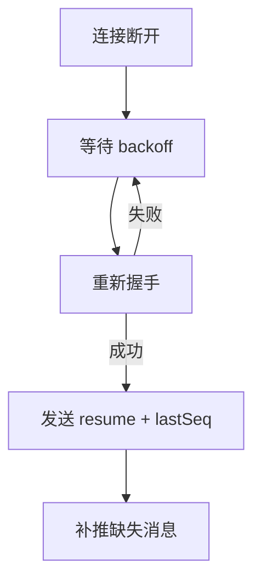
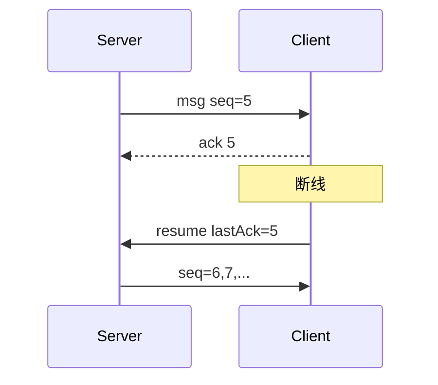
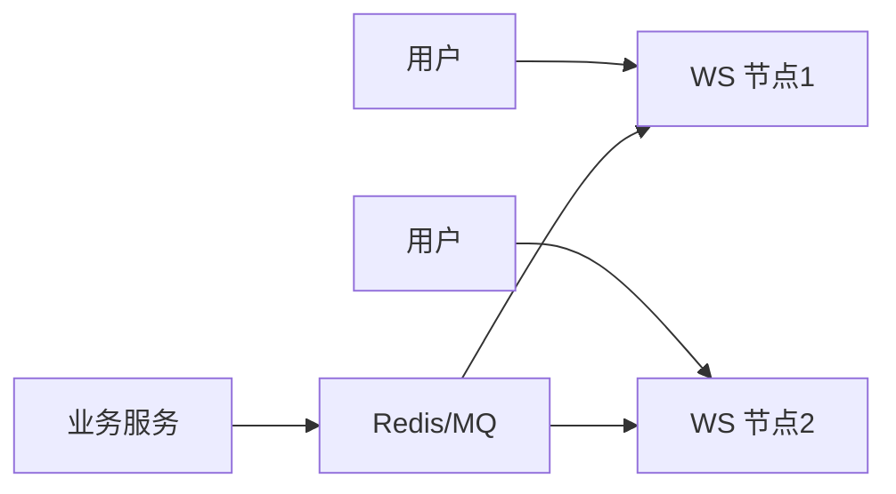
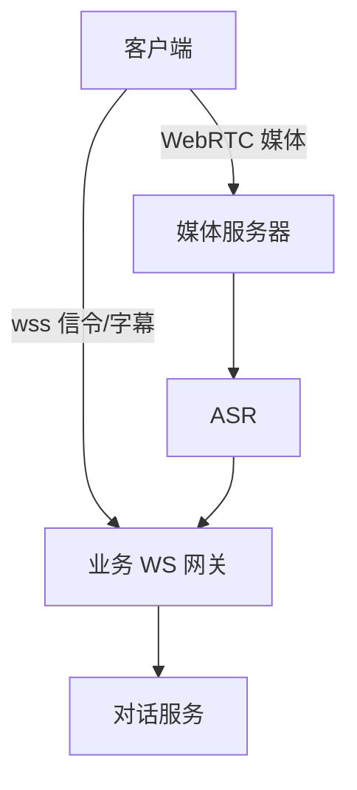

# 14 · WebSocket 面试专题

> 后端 / AI 电话高频。按「是什么 → 握手 → 帧 → 心跳断线 → 工程实践 → 对比选型」准备。

---

## 面试题

### Q1. WebSocket 是什么？解决什么问题？

WebSocket 是基于 TCP 的**全双工、长连接**应用层协议（RFC 6455）。

HTTP 短板：请求-响应，服务端难主动推；轮询浪费。  
WebSocket：一次握手后双方随时互发，适合聊天、字幕、协作、行情、AI 电话信令。



---

### Q2. WebSocket 和 HTTP 有什么区别？

| | HTTP | WebSocket |
| --- | --- | --- |
| 方向 | 请求-响应为主 | **全双工** |
| 连接 | 短或 keep-alive 复用请求 | **持久连接** |
| 开销 | 每请求大量头 | 握手后帧头很小（2～14 字节级） |
| 推送 | 需轮询/长轮询/SSE | 原生服务端推 |
| 协议标识 | `http://` `https://` | `ws://` `wss://` |

关系：握手阶段借用 HTTP，之后**不再是 HTTP 语义**，而是 WebSocket 帧。

---

### Q3. 详细说说 WebSocket 握手过程？

本质：**HTTP 协议升级（Upgrade）**。

客户端请求关键头：

```http
GET /chat HTTP/1.1
Host: example.com
Upgrade: websocket
Connection: Upgrade
Sec-WebSocket-Key: <随机 Base64>
Sec-WebSocket-Version: 13
Sec-WebSocket-Protocol: chat  (可选子协议)
Origin: https://example.com
```

服务端响应：

```http
HTTP/1.1 101 Switching Protocols
Upgrade: websocket
Connection: Upgrade
Sec-WebSocket-Accept: <计算值>
Sec-WebSocket-Protocol: chat
```

`Sec-WebSocket-Accept` =  
`Base64( SHA1( Sec-WebSocket-Key + 固定 GUID ) )`  
GUID：`258EAFA5-E914-47DA-95CA-C5AB0DC85B11`



面试要点：用 Accept 证明「对方真懂 WS」，防普通 HTTP 服务器误升级。

---

### Q4. 为什么握手要 Sec-WebSocket-Key / Accept？

1. 证明对端实现了 WS，不是随便回 200 的普通服务器  
2. 降低缓存代理把升级响应当普通 HTTP 缓存的风险  
3. **不是**加密，安全靠 **WSS（TLS）**

---

### Q5. ws 和 wss 有什么区别？

| | ws:// | wss:// |
| --- | --- | --- |
| 传输 | 明文 TCP | TLS 上的 WebSocket |
| 类似 | HTTP | HTTPS |
| 生产 | 仅内网慎用 | **默认应用 wss** |

握手仍是 HTTP(S) Upgrade；wss 先 TLS 再 Upgrade。



---

### Q6. WebSocket 数据帧结构了解吗？

帧 = 头 + 负载。关键字段：

| 字段 | 含义 |
| --- | --- |
| FIN | 是否最后一片（支持分片） |
| opcode | 帧类型：文本/二进制/关闭/ping/pong |
| MASK | 客户端→服务端必须掩码 |
| Payload length | 可 7 位 / 16 位 / 64 位扩展 |
| Masking-key | 4 字节掩码键 |
| Payload | 数据 |

常见 opcode：

| 值 | 类型 |
| --- | --- |
| 0x1 | 文本 Text |
| 0x2 | 二进制 Binary |
| 0x8 | 关闭 Close |
| 0x9 | Ping |
| 0xA | Pong |



---

### Q7. 为什么客户端发往服务端的帧必须 Mask？

协议强制：防「代理缓存投毒」等中间人把 WS 流量伪装成 HTTP 请求影响共享代理。  
服务端→客户端**不要求**掩码。  
注意：Mask **不是加密**。

---

### Q8. 文本帧和二进制帧怎么选？

| | Text | Binary |
| --- | --- | --- |
| 内容 | UTF-8 文本 | 任意字节 |
| 场景 | JSON 信令、字幕 | Protobuf、音频分片、图片 |
| 注意 | 必须合法 UTF-8 | 更适合高密度数据 |

AI 电话：控制/字幕常用 Text(JSON)；若 WS 传音频分片多用 Binary。

---

### Q9. 什么是 WebSocket 分片（Fragmentation）？

大正文可拆成多帧：首帧带 opcode，后续 continuation（opcode=0），最后 FIN=1。  
接收方重组。用于控制单帧大小、边产边发。

---

### Q10. Ping / Pong 心跳是干什么的？

- 探测连接是否还活着（半开连接：一端以为连着，另一端已断）  
- 可带小应用数据  
- 收到 Ping 应回 Pong  

应用层也可自建 `{"type":"heartbeat"}`，和协议层 Ping 可并存。



---

### Q11. WebSocket 如何关闭连接？

发 **Close 帧**（可带状态码与原因）→ 对端回 Close → TCP 再挥手。  
常见码：1000 正常、1001 离开、1008 策略违规、1009 太大、1011 服务端错误。  
粗暴 `TCP RST`/杀进程会导致对端异常感知，应尽量优雅 Close。

---

### Q12. WebSocket 是无状态的吗？如何做鉴权？

连接本身有状态（连着谁）。业务会话常要鉴权：

1. **握手时**：`?token=` 或 `Authorization` 头（浏览器 WS API 对自定义头支持有限，常把 token 放 Query / 首条消息）  
2. **连接后首包**：发 login，校验失败则 Close  
3. **定期校验**：token 过期踢下线  



---

### Q13. 浏览器 WebSocket 有跨域问题吗？

握手带 `Origin`，服务端应校验白名单，防恶意站点冒用用户浏览器连你的 WS。  
这和 CORS 不完全同一套头，但**同样要做 Origin 校验**。

---

### Q14. 断线重连怎么设计？（高频）

1. 心跳检测失败 / onclose / onerror → 触发重连  
2. **指数退避** + 随机 jitter，防重连风暴  
3. 最大重试次数 / 熔断提示  
4. **会话恢复**：callId、lastSeq，服务端补推缺失事件  
5. 区分：网络闪断 vs 服务端主动踢（别狂重连）  



AI 电话：重连后要恢复「是否在通话中、字幕序号」，避免重复播报/重复计费。

---

### Q15. 如何保证消息可靠（不丢、不重、有序）？

WS 只保证 TCP 层尽量可靠，**不等于业务可靠**（进程崩、没 ACK、重连空隙）。

常见做法：

| 需求 | 手段 |
| --- | --- |
| 不丢 | 应用层 ACK、消息持久化、未确认重发 |
| 不重 | 消息 ID 幂等去重 |
| 有序 | 每连接单调 seq；乱序缓冲 |
| 断线缺口 | lastSeq + 补推 / 拉取 |



---

### Q16. 服务端怎么存百万级 WebSocket 连接？

1. **IO 模型**：Netty / Node / Go netpoll 等 NIO，别一连接一线程阻塞 BIO  
2. **连接元数据**：userId → channel 映射（本机 ConcurrentHashMap + 集群路由）  
3. **集群推送**：用户可能连在节点 A，消息从节点 B 来 → Redis Pub/Sub、MQ广播、粘性网关  
4. **资源**：心跳、空闲超时、最大连接、消息队列限长防 OOM  
5. **水平扩展**：无状态计算 + 有状态网关分层  



---

### Q17. Nginx 反代 WebSocket 要注意什么？

- `proxy_http_version 1.1`  
- `Upgrade` / `Connection` 头正确转发  
- `proxy_read_timeout` 等调大，否则空闲被掐  
- 支持 sticky（会话保持）便于补推落在同节点（或用中心化推送）  

---

### Q18. WebSocket 常见问题排查？

| 现象 | 方向 |
| --- | --- |
| 握手 404/500 | 路径、服务没开 WS |
| 握手成功秒断 | 鉴权失败、Origin 拒绝、代理超时 |
| 偶发断 | 负载均衡空闲超时、手机锁屏、NAT 老化 |
| 收不到推送 | 连错节点、Pub/Sub 未通、userId 映射丢 |
| 消息乱/粘 | 你在上层当 TCP 用错；WS 有帧边界，但仍要约定 JSON 边界 |

抓包：先看到 HTTP 101，再是 WS 帧；wss 需密钥才能解。

---

### Q19. 长轮询、SSE、WebSocket 怎么选？

| | 长轮询 | SSE | WebSocket |
| --- | --- | --- | --- |
| 方向 | 模拟推 | **服务器→客户端** | **双工** |
| 协议 | HTTP | HTTP | WS |
| 复杂度 | 低 | 低 | 中 |
| 二进制 | 一般 | 文本为主 | 原生支持 |
| 适用 | 兼容差 | 通知、行情只读 | 聊天、游戏、通话信令、协同 |

只要客户端也要频繁上行 → 优先 WS。只读推送 → SSE 往往更简单。

---

### Q20. WebSocket 能代替 TCP 自定义协议吗？

浏览器里基本是**唯一**可选的长连接双工方案（除 WebRTC 数据通道）。  
服务端到服务端更常用 gRPC/自定义 TCP；WS 多用于**端到网关**。  
WS 有帧与掩码开销，极致性能场景未必最优。

---

### Q21. WebSocket 与 HTTP/2、HTTP/3 关系？

- H2/H3 改善 HTTP 多路与性能，**不取代** WS 的双工长连接模型  
- 存在基于 H2 的替代探索，但现状仍是 WS 主流  
- 可同时：页面用 H2/H3 拉资源，实时通道用 WS/WSS  

---

### Q22. 安全方面要注意什么？

1. **只用 wss**  
2. **校验 Origin**  
3. 鉴权 + 权限（别连上就能订所有主题）  
4. 限流：连接数、消息频率、帧大小  
5. 防协议走私/代理配置错误  
6. 输入校验，防注入到下游  

---

### Q23. AI 电话场景里 WebSocket 怎么用比较合理？

| 通道 | 建议 |
| --- | --- |
| 通话媒体 | WebRTC / SIP+RTP |
| 通话控制、字幕、坐席辅助、LLM 事件 | **WebSocket** |
| 服务间 ASR 流 | gRPC stream / 内部 MQ |

详见 [[13-实时通信-WebRTC-SIP-RTP]]。



---

### Q24. 如何设计一个简单的 WS 业务协议？

```json
{ "type": "subtitle", "callId": "c1", "seq": 12, "payload": { "text": "你好" } }
```

约定：

1. `type` 分发  
2. `seq` + ACK  
3. 大小限制、压缩可选（注意 CPU）  
4. 版本字段 `ver` 便于兼容  

---

### Q25. Spring / Netty 实现 WS 面试怎么答？

- Spring：`@ServerEndpoint` 或 WebFlux；注意多实例会话同步  
- Netty：`HttpServerCodec` → `HttpObjectAggregator` → `WebSocketServerProtocolHandler` → 业务 Handler  
- 要点：空闲检测 `IdleStateHandler`、背压、写缓冲、线程模型  

---

## 速记

> 握手用 HTTP 升级 → 101 → 二进制帧全双工；心跳探活；应用层做鉴权、ACK、重连恢复；生产必须 wss；集群靠网关+Pub/Sub；电话里 WS 做信令字幕，媒体交给 WebRTC/RTP。

## 关联

- [[04-HTTP]] · [[13-实时通信-WebRTC-SIP-RTP]] · [[11-抓包看图说话]] · [[09-代理负载与网络IO]] · [[00-知识总览]]
